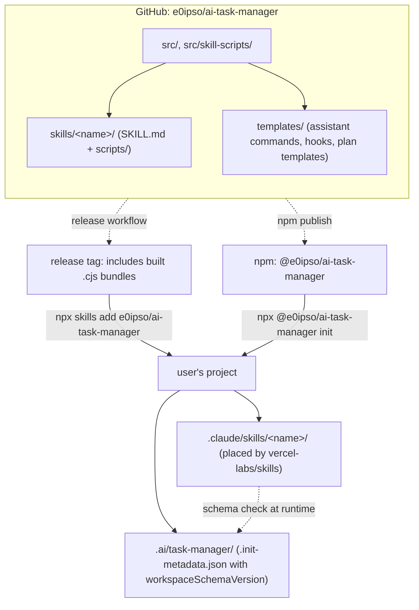
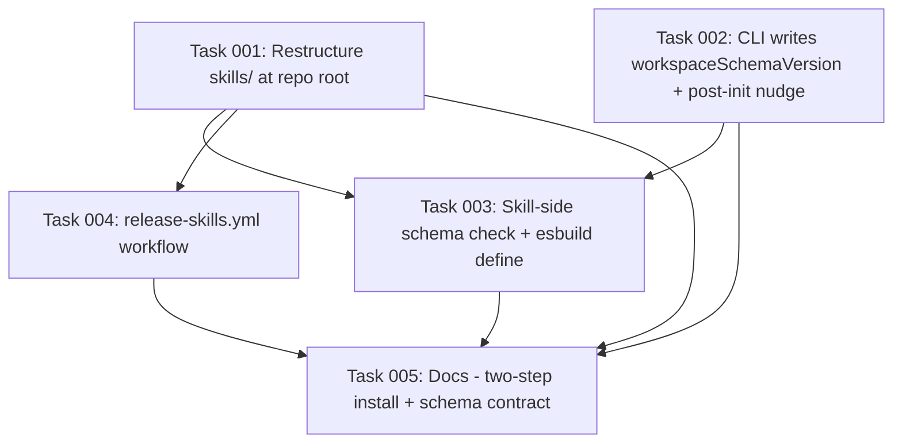

# Plan: Distribution Strategy — From Commands to Skills

## Original Work Order

> with the contents of .claude/plans/alright-it-s-time-to-purring-sifakis.md

(Full source strategy document at `/workspace/.claude/plans/alright-it-s-time-to-purring-sifakis.md`. It defined five workstreams: repo restructure, GitHub Releases with built artifacts, schema versioning contract, CLI refocus, and documentation.)

## Plan Clarifications

| Question | Answer |
|---|---|
| Scope of this plan | All five workstreams in one coherent migration |
| Repo slug for `npx skills add` | `e0ipso/ai-task-manager` |
| `migrate` subcommand | **Skip entirely.** Schema-mismatch errors instruct users to re-run `init` or `skills add` instead. |
| Backwards-compat for `templates/skills/` → `skills/` move | Hard cut. No symlinks, no transition period. |
| Commands during transition | Kept. `init` still copies commands; only skill distribution is delegated. v2.0 (drop commands) is out of scope. |

## Executive Summary

The CLI currently absorbs distribution complexity for six AI assistants by copying per-assistant glue into different directory layouts on every `init`. Six task-* skills already ship under `templates/skills/` that duplicate the workflow of their sibling slash commands. Skills are the standardized successor — one `SKILL.md` works for every supporting assistant — but they are inert without `.ai/task-manager/` bootstrap (hooks, templates, hash-tracked diff-on-conflict). This plan cleanly separates the two distribution channels.

Skill placement is delegated to `vercel-labs/skills` (a generic skill installer that walks any GitHub repo's `skills/` directory and places files into per-agent dirs). This CLI refocuses on what it actually does well: bootstrapping `.ai/task-manager/` with safe hook updates. A new `workspaceSchemaVersion` integer in `.init-metadata.json` becomes the contract between the two channels, letting skill and workspace lifecycles evolve independently while still failing loudly on incompatible combinations.

End state: a documented two-step install (`npx skills add e0ipso/ai-task-manager` then `npx @e0ipso/ai-task-manager init`), each step independently re-runnable, with a release workflow producing self-contained tagged refs that contain built `.cjs` bundles in-tree.

## Context

### Current State vs Target State

| Aspect | Current | Target | Why |
|---|---|---|---|
| Skills location in repo | `templates/skills/<name>/` | `skills/<name>/` at repo root | `vercel-labs/skills` walks `skills/` at the GitHub ref it's given |
| Skill distribution mechanism | Bundled in npm package only; not copied by `init` | Installed via `npx skills add`, not via this CLI | Per-agent placement is already a solved problem; reinventing it is wasted work |
| Built `.cjs` bundles in git | Git-ignored everywhere | Git-ignored on `main`; committed only at release tags | Clean PR diffs; release tags become self-contained installable refs |
| Workspace schema version | Implicit (only CLI `version` is recorded) | Explicit integer `workspaceSchemaVersion` in metadata | Skill and workspace lifecycles must decouple safely |
| Skill scripts find workspace | Walk parents for `.init-metadata.json` with any `version` | Same walk, plus a schema-version check using a baked-in expected version | Fail loudly on mismatch instead of corrupting silently |
| Migrate path on mismatch | (no error today) | Error message points at `npx … init` or `npx skills add …` | YAGNI — no dedicated `migrate` subcommand until a real migration exists |
| Install docs | One-step `npx @e0ipso/ai-task-manager init` | Two-step: `skills add` then `init` | Reflects the actually-separated lifecycles |

### Background

The source strategy document already justifies the architectural shape in detail. Two facts grounded the design:

1. **`vercel-labs/skills` exists.** It's an Anthropic-adjacent generic installer for Anthropic's Agent Skills format (see `vercel-labs/agent-skills/tree/main/skills/web-design-guidelines` for the layout convention). Skills under `<repo>/skills/<name>/SKILL.md` at a tagged ref is its expected input shape.
2. **`.ai/task-manager/` bootstrap is genuinely custom.** Hash-tracked diff-on-conflict for hooks and templates (`src/conflict-detector.ts`, `src/prompts.ts`) is unique to this project's workflow and must be preserved.

Verified state of the repository before planning:
- `templates/skills/` contains exactly six skills: `task-create-plan`, `task-execute-blueprint`, `task-execute-task`, `task-full-workflow`, `task-generate-tasks`, `task-refine-plan`.
- `scripts/build-skills.cjs` has a `SKILL_ENTRYPOINTS` array with 17 entrypoints across those six skills; `dest` is built via `path.join(SKILLS_ROOT, entry.skill, 'scripts', entry.out)`, so only the `SKILLS_ROOT` constant needs to change.
- `.gitignore` line 79 contains `templates/skills/*/scripts/`.
- `package.json` `files: ["dist/", "templates/", "LICENSE"]` does not yet include `"skills/"`.
- `src/metadata.ts` defines `InitMetadata` with `version`, `timestamp`, `files`; no schema-version field.
- `src/skill-scripts/shared/` contains `root.ts`, `git-utils.ts`, `plan-resolve.ts`, `plan-scan.ts`, `task-scan.ts`, `frontmatter.ts`.
- `src/cli.ts` has subcommands `init`, `status`, `plan` (with `show`/`archive`/`delete`), `claude-exec`. No `migrate`.
- `src/index.ts` `init` (lines 96-226) and `createAssistantStructure` (lines 369-496) currently do not copy skills.
- `.github/workflows/` has `docs.yml`, `release.yml`, `test.yml`. No `release-skills.yml`.
- `AGENTS.md` references `templates/skills/` at lines 281, 283, 298 (plus possibly others).
- `README.md` does not mention `vercel-labs/skills`.

## Architectural Approach

Two channels, each with a single responsibility. The CLI keeps its existing strengths (hash-tracked diff UX, workspace bootstrap) and stops trying to be a skills installer; `vercel-labs/skills` handles per-agent placement. A schema-version integer is the only coupling point.



### Workstream 1 — Restructure to `skills/` at repo root

**Objective:** make `npx skills add e0ipso/ai-task-manager` work against a tagged release of this repo by aligning the directory layout with what the installer expects.

Hard cut: move all six skill directories from `templates/skills/` to `skills/` at the repo root in a single commit; update every reference. No symlink, no legacy path. The build pipeline's `SKILL_ENTRYPOINTS` mapping is centralized through one `SKILLS_ROOT` constant, so the bundler change is small.

Critical files to modify:
- `git mv templates/skills/ skills/` (six skill dirs at the repo root).
- `scripts/build-skills.cjs` — change the `SKILLS_ROOT` constant from `templates/skills` to `skills`. (17 entrypoints reroute automatically.)
- `.gitignore` line 79 — `templates/skills/*/scripts/` → `skills/*/scripts/`. Bundles stay git-ignored on `main`.
- `package.json` `files` array — add `"skills/"` alongside existing entries (keep `"templates/"`; command templates still live there).
- `AGENTS.md` — references at lines 281, 283, 298 and any others (search `templates/skills`).
- `src/skill-scripts/` — sanity-check no source code hardcodes `templates/skills/` (verified to be build-time-only during exploration).

### Workstream 2 — GitHub Releases with built artifacts

**Objective:** at release tags, the repo tree contains built `.cjs` bundles so `npx skills add e0ipso/ai-task-manager@<tag>` fetches a self-contained, installable ref. Build output never lands on `main`.

A new release workflow constructs a detached release commit that includes the bundles, then force-moves the tag to point at that commit. Main stays bundle-free; tags are self-contained.

```mermaid
sequenceDiagram
  participant Dev as Maintainer
  participant Main as main branch
  participant GHA as release-skills.yml
  participant Tag as v1.4.0 (release commit)

  Dev->>Main: push tag v1.4.0
  Main->>GHA: trigger on tag push
  GHA->>GHA: npm ci && npm run build
  GHA->>GHA: git add -f skills/*/scripts/*.cjs
  GHA->>Tag: detached commit with bundles
  GHA->>Tag: force-move tag → release commit
  Note over Main,Tag: main stays clean; tag is self-contained
```

Critical files to create / modify:
- `.github/workflows/release-skills.yml` (new) — trigger on `push: tags: ['v*']`; checkout, `npm ci && npm run build`, `git add -f skills/*/scripts/*.cjs`, create a detached release commit, force-move the tag. Explicit `permissions: contents: write`.
- `package.json` `scripts` — optionally add a `release:skills` helper that scripts the workflow's git plumbing for local dry-runs.

Acceptance: `git ls-tree -r v<tag> -- 'skills/*/scripts/*.cjs'` lists bundles at the release tag; the same command on `main` returns nothing.

### Workstream 3 — Schema versioning contract

**Objective:** make stale skill ↔ workspace combos fail loudly with an actionable message instead of silently corrupting state. The contract is one integer in one file, checked by both ends.

The version is a single integer (`workspaceSchemaVersion: 1` initially), stored in `.ai/task-manager/.init-metadata.json`. It is distinct from `version` (which records the CLI version string). It is bumped only when the workspace shape changes incompatibly (renamed hook, new required template, restructured directory). Skills bake in an expected schema version at build time via esbuild's `define`; at runtime, they read the workspace version and compare.

Changes:
- `src/metadata.ts` — extend `InitMetadata` with `workspaceSchemaVersion: number`. Export `CURRENT_WORKSPACE_SCHEMA_VERSION = 1`. Update `loadMetadata` to backfill missing field as `1` (graceful for existing users).
- `src/index.ts` (~line 337, where metadata is written) — include `workspaceSchemaVersion: CURRENT_WORKSPACE_SCHEMA_VERSION` in the written JSON.
- `src/skill-scripts/shared/root.ts` — after locating `.init-metadata.json`, compare workspace version against an `EXPECTED_WORKSPACE_SCHEMA_VERSION` constant. Three outcomes:
  - Match: proceed.
  - Workspace older than expected: exit non-zero with `Workspace schema v<N> is older than this skill requires (v<M>). Re-run \`npx @e0ipso/ai-task-manager init\` with the latest CLI to update.`
  - Workspace newer than expected: exit non-zero with `This skill (built for workspace schema v<M>) is older than the workspace (v<N>). Re-run \`npx skills add e0ipso/ai-task-manager\` to update skills.`
- `scripts/build-skills.cjs` — esbuild `define` injects `EXPECTED_WORKSPACE_SCHEMA_VERSION` as a literal, reading the constant from `src/metadata.ts` at build time. Shipped bundles carry the version they were built against, not whatever happens to be in the local workspace.
- No `migrate` subcommand. `init` re-run with a newer CLI naturally writes the new version into metadata, and the documented upgrade path is just "re-run `init`."

### Workstream 4 — CLI refocus (transitional, non-destructive)

**Objective:** preserve existing CLI behavior (commands still copied, hash-tracked diff UX intact) and explicitly delegate skill distribution to `vercel-labs/skills`.

Concretely the CLI changes are small:
- `src/index.ts` `init()` (lines 96-226): same behavior. On successful completion, print a single-line nudge: `Next: run \`npx skills add e0ipso/ai-task-manager\` to install the task skills for your assistant(s).`
- `src/conflict-detector.ts` and `src/prompts.ts`: untouched. This is the part of the CLI that earns its existence.
- `src/index.ts` `createAssistantStructure` (lines 369-496): untouched. Still copies command templates per assistant. Still does not copy skills.
- Metadata writer now includes `workspaceSchemaVersion: 1` (overlaps with Workstream 3).

### Workstream 5 — Documentation

**Objective:** users discover the two-step install on first contact and have a path forward when a schema mismatch fires.

- `README.md` — lead with the two-step install (`npx skills add e0ipso/ai-task-manager` first, then `npx @e0ipso/ai-task-manager init`). One short paragraph on why two steps.
- `AGENTS.md` — update "Skills Layer" paths from `templates/skills/` to `skills/`. Add a "Schema Version Contract" subsection (the field, the error messages, the rule for bumping). Add a "GitHub Releases" subsection (the release-skills workflow, the `git ls-tree` verification).
- `MIGRATION.md` (new, repo root) — single page covering: how to update skills, how to update workspace, what diff prompts mean during `init`, what schema-mismatch errors mean and how to resolve them. Link from README.

## Risk Considerations and Mitigation Strategies

<details>
<summary>Technical Risks</summary>

- **`vercel-labs/skills` API churn.** It's a new tool from a labs org; the install command shape could change.
  - Mitigation: Pin a known-good version in `MIGRATION.md`. Document a manual fallback (clone the repo, `cp -r skills/<name>/ .claude/skills/<name>/`).
- **Built `.cjs` files in release commits look anomalous in `git log` to future maintainers.**
  - Mitigation: Release-commit messages tagged `[release-bundle]`; an explanatory comment block at the top of `release-skills.yml`; never commit build output to `main`.
- **Schema-version backfill semantics on existing workspaces.** A user with an older workspace that lacks the field installs new skills and trips the check.
  - Mitigation: Treat absent field as `1` (the initial version) in both the loader and the skill-side check. Real breakage only starts when the version is actually bumped to `2`.
</details>

<details>
<summary>Implementation Risks</summary>

- **Hard cut on `templates/skills/` → `skills/` breaks downstream tooling we don't know about.**
  - Mitigation: Grep this repo and any known dependent projects for `templates/skills` before merging Workstream 1.
- **`esbuild define` for `EXPECTED_WORKSPACE_SCHEMA_VERSION` substitutes silently if the constant import path changes.**
  - Mitigation: Add a smoke assertion in `scripts/build-skills.cjs` post-build: built `.cjs` files should not contain the literal string `EXPECTED_WORKSPACE_SCHEMA_VERSION` (only the substituted integer literal).
- **`.init-metadata.json` shape change confuses the hash tracker.**
  - Mitigation: `.init-metadata.json` is the tracker itself, not a tracked file. Verify in `src/conflict-detector.ts` that it is excluded from hash comparison.
</details>

<details>
<summary>Integration Risks</summary>

- **GitHub Actions permissions for tag-moving.** The release workflow needs `contents: write` plus the ability to force-update a tag.
  - Mitigation: `actions/checkout` with `persist-credentials: true`; explicit `permissions: contents: write`; first run on a throwaway `v0.0.0-test` tag before any real release.
- **First-touch users may run `init` before `skills add` (or vice versa).** Either order should work.
  - Mitigation: The post-install nudge in `init` documents the canonical order. Skills installed without a workspace still produce useful errors (existing behavior — they look for the workspace and fail clearly if absent).
</details>

## Success Criteria

### Primary Success Criteria
1. `npx skills add e0ipso/ai-task-manager@<release-tag>` in an empty directory produces `.claude/skills/task-create-plan/SKILL.md` and `.claude/skills/task-create-plan/scripts/find-task-manager-root.cjs` (and the equivalent files for the other five skills).
2. `npx @e0ipso/ai-task-manager init --assistants claude --destination-directory .` produces `.ai/task-manager/` with `workspaceSchemaVersion: 1` recorded in `.init-metadata.json`.
3. A skill script run against a workspace whose `workspaceSchemaVersion` is `0` exits non-zero and prints a message naming `npx @e0ipso/ai-task-manager init`.
4. The existing hash-tracked diff-on-conflict UX still works end-to-end: modifying `.ai/task-manager/config/hooks/PRE_PLAN.md` then re-running `init` still surfaces the diff prompt with keep/overwrite options.
5. `git ls-tree -r <release-tag> -- 'skills/*/scripts/*.cjs'` lists bundles at the release tag; the same query on `main` returns nothing.
6. Neither `README.md` nor `AGENTS.md` references `templates/skills/` after the migration.

## Self Validation

Execute against a scratch directory with a freshly built release tag:

```bash
# 1. Confirm release artifact contents
git ls-tree -r v0.0.0-test -- 'skills/*/scripts/*.cjs' | wc -l    # expect: >= 1 per skill
git ls-tree -r main -- 'skills/*/scripts/*.cjs'                   # expect: empty

# 2. End-to-end install (scratch project)
mkdir /tmp/skill-test && cd /tmp/skill-test && git init
npx skills add e0ipso/ai-task-manager@v0.0.0-test -a claude-code
ls .claude/skills/                                                # expect: 6 task-* dirs
ls .claude/skills/task-create-plan/scripts/                       # expect: find-task-manager-root.cjs, get-next-plan-id.cjs
npx @e0ipso/ai-task-manager init --assistants claude --destination-directory .
ls .ai/task-manager/                                              # expect: config/, plans/, archive/
jq '.workspaceSchemaVersion' .ai/task-manager/.init-metadata.json # expect: 1

# 3. Schema-mismatch error path
jq '.workspaceSchemaVersion = 0' .ai/task-manager/.init-metadata.json > tmp && mv tmp .ai/task-manager/.init-metadata.json
node .claude/skills/task-create-plan/scripts/find-task-manager-root.cjs ; echo "exit=$?"
# expect: non-zero exit, message naming "npx @e0ipso/ai-task-manager init"

# 4. Diff-on-conflict regression
jq '.workspaceSchemaVersion = 1' .ai/task-manager/.init-metadata.json > tmp && mv tmp .ai/task-manager/.init-metadata.json
echo "# user-customization" >> .ai/task-manager/config/hooks/PRE_PLAN.md
npx @e0ipso/ai-task-manager init --assistants claude --destination-directory .
# expect: interactive diff prompt for PRE_PLAN.md offering keep/overwrite

# 5. Build pipeline still produces working bundles locally
cd /workspace && npm run build
ls skills/task-create-plan/scripts/                               # expect: .cjs files present locally (git-ignored)
node -e "require('/workspace/skills/task-create-plan/scripts/find-task-manager-root.cjs')" # expect: loads without error

# 6. esbuild define substitution
grep -l "EXPECTED_WORKSPACE_SCHEMA_VERSION" skills/*/scripts/*.cjs # expect: empty (literal was substituted)
```

## Documentation

This plan needs documentation updates (answering the POST_PLAN question explicitly: **yes**):

- `README.md` — lead with the two-step install; brief "why two steps" paragraph.
- `AGENTS.md` — paths updated from `templates/skills/` to `skills/`; new "Schema Version Contract" and "GitHub Releases" subsections; assistant comparison table refreshed if it mentions skill paths.
- `MIGRATION.md` (new file at repo root) — concise upgrade-flow reference for skills, workspace, diff prompts, and schema-mismatch errors.

## Resource Requirements

### Development Skills
- TypeScript + Node.js (CLI and skill scripts).
- esbuild configuration — specifically the `define` API for build-time literal substitution.
- GitHub Actions YAML; `contents: write` permission model; tag-moving via `git push --force-with-lease origin <tag>`.
- Familiarity with `vercel-labs/skills` install conventions; verify the exact GitHub URL and command shape on `https://github.com/vercel-labs/skills` before finalizing the release workflow.

### Technical Infrastructure
- Existing: TypeScript, esbuild, Jest, ESLint, Prettier, existing GitHub Actions workflows (`docs.yml`, `release.yml`, `test.yml`).
- New: `release-skills.yml` workflow file; `jq` (default on `ubuntu-latest` runners).

## Integration Strategy

The migration is non-destructive to the existing CLI. `init` continues to copy command templates per assistant. The only behavior change is the post-run nudge pointing at `npx skills add`, and the new `workspaceSchemaVersion: 1` field in the written metadata (which is backfilled to `1` on read for existing installs). The hash-tracked diff-on-conflict UX is untouched.

The new install path (`npx skills add`) is additive: it lives entirely outside this CLI. Existing users who never run it continue to work as before (their projects keep using the slash commands they already have). New users follow the documented two-step flow.

## Notes

- Commands stay during transition (v1.x). v2.0 — dropping the command-copy code path entirely — is explicitly out of scope and will be planned separately once skill distribution is real-world tested.
- Schema starts at `1`. The first real bump happens when something incompatible changes in `.ai/task-manager/` shape (renamed hook, new required template). Until then, the version-mismatch error path is exercised only by the test in Workstream 3's self-validation script.
- The `migrate` subcommand was considered and dropped per scope decision. Revisit if the first real schema break needs more than "re-run init."
- The source strategy document (`/workspace/.claude/plans/alright-it-s-time-to-purring-sifakis.md`) remains the long-form narrative; this plan is the executable formalization.

## Execution Blueprint

**Validation Gates:**
- Reference: `/config/hooks/POST_PHASE.md`

### Dependency Diagram



No circular dependencies.

### ✅ Phase 1: Foundations (parallel)
**Parallel Tasks:**
- ✔️ Task 001: Restructure skill directories to `skills/` at repo root (completed)
- ✔️ Task 002: CLI persists `workspaceSchemaVersion` and emits post-init nudge (completed)

### ✅ Phase 2: Schema check and release pipeline (parallel)
**Parallel Tasks:**
- ✔️ Task 003: Bake `EXPECTED_WORKSPACE_SCHEMA_VERSION` into skill bundles, enforce mismatch errors (depends on: 001, 002) (completed)
- ✔️ Task 004: `release-skills.yml` workflow producing self-contained tagged refs (depends on: 001) (completed)

### ✅ Phase 3: Documentation
**Sequential Task:**
- ✔️ Task 005: README two-step install, AGENTS.md schema/release subsections, MIGRATION.md (depends on: 001, 002, 003, 004) (completed)

### Post-phase Actions
Per `POST_PHASE.md`: after each phase, verify the workspace state matches the phase's acceptance criteria before advancing.

### Execution Summary
- Total Phases: 3
- Total Tasks: 5

## Execution Summary

**Status**: ✅ Completed Successfully
**Completed Date**: 2026-05-20

### Results
All five tasks across three phases shipped in three commits on branch `2.x`:

- `07d15adc` — Phase 1: `git mv templates/skills/ skills/`, `SKILLS_ROOT` constant repointed in `scripts/build-skills.cjs`, `.gitignore`/`package.json files`/`AGENTS.md`/integration tests updated, `InitMetadata.workspaceSchemaVersion: number` added (initial value `1`, backfilled to `1` on read), `init` emits the documented two-step nudge.
- `54929370` — Phase 2: `src/skill-scripts/shared/root.ts` enforces a schema-version check against `EXPECTED_WORKSPACE_SCHEMA_VERSION` (injected via esbuild `define`, with a `typeof` guard so ts-jest still runs the TypeScript source). New `.github/workflows/release-skills.yml` triggers on `v*` tags, force-adds bundles into a detached `[release-bundle]` commit, and force-moves the tag. Post-build smoke check in `scripts/build-skills.cjs` fails the build if the literal identifier name survives substitution.
- `58ff4e25` — Phase 3: `README.md` leads with the two-step install and links `MIGRATION.md`. `AGENTS.md` gains "Schema Version Contract" and "GitHub Releases" subsections with verbatim mismatch error messages. New `MIGRATION.md` at the repo root is the user-facing quick reference.

`npm run lint` and `npm test` (240 tests) pass at every phase boundary. Plan self-validation script confirmed: bundles present in `skills/` locally, `workspaceSchemaVersion: 1` written by `init`, schema-mismatch path fires with the documented messages and non-zero exit, esbuild `define` substituted everywhere, no bundles tracked on the current commit.

### Noteworthy Events
- **ts-jest vs esbuild substitution.** The first cut of `root.ts` referenced `EXPECTED_WORKSPACE_SCHEMA_VERSION` directly via the ambient `declare const`. That works in the bundled `.cjs` (esbuild substitutes the identifier), but ts-jest runs the TypeScript source directly — where the ambient declaration has no runtime value — and four tests threw `ReferenceError`. Fix: introduce a local `EXPECTED_SCHEMA` constant initialised with `typeof EXPECTED_WORKSPACE_SCHEMA_VERSION !== 'undefined' ? EXPECTED_WORKSPACE_SCHEMA_VERSION : 1`. Esbuild reduces this to `typeof 1 !== 'undefined' ? 1 : 1` (effectively just `1`) so the bundle is unchanged in behaviour; ts-jest takes the fallback path and avoids the throw. The build smoke check still catches accidental string-form leaks of the identifier name.
- **`.ai/task-manager/` is git-ignored at the project root.** Plan and task files (status frontmatter, blueprint progress markers) are not tracked. The three phase commits contain only code/doc changes; task-level status updates live on disk in the workspace, not in git history.
- **Vercel skills version pin still a `TODO`.** `MIGRATION.md` leaves the pinned `vercel-labs/skills` release as a clearly-marked `TODO` because the registry/tag couldn't be verified offline during execution. Replace before the first published release.

### Necessary follow-ups
- Run a throwaway `v0.0.0-test` tag push end-to-end against `release-skills.yml` before the first real release to confirm the `git tag -f` + `--force-with-lease` flow works under the GitHub-issued `GITHUB_TOKEN` (the workflow's only unexercised path). Per the plan's risk mitigation; cannot be exercised locally.
- Replace the `vercel-labs/skills` version `TODO` in `MIGRATION.md` with a known-good pin once the registry/tag can be looked up.
- v2.0 (drop the command-copy code path entirely in favour of pure skills distribution) remains explicitly out of scope and should be planned separately once skill distribution is field-tested.
