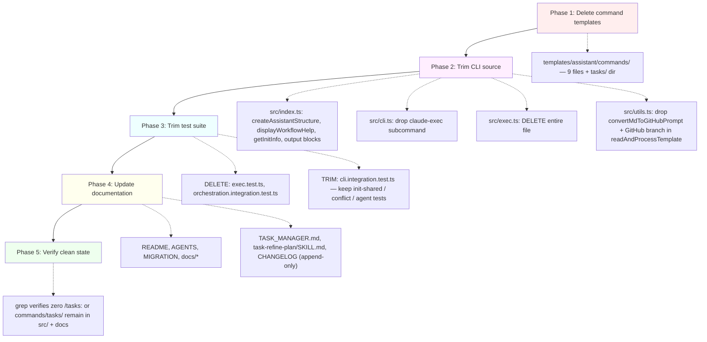
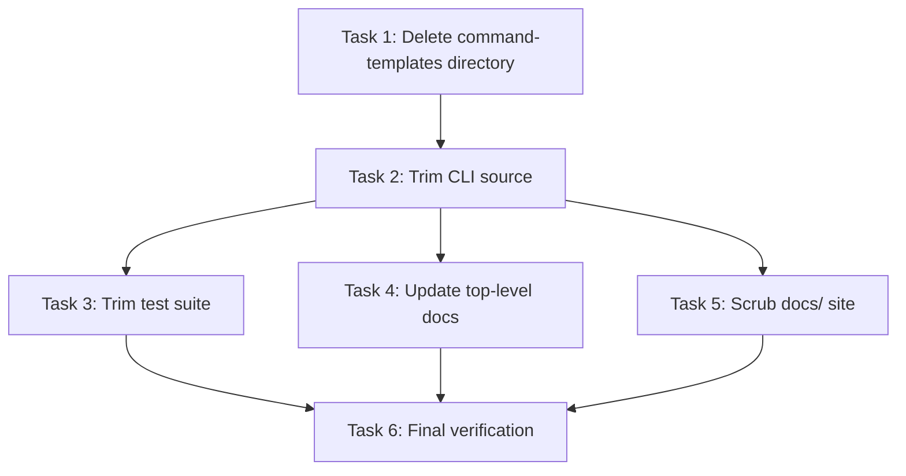

# Plan: Remove the slash-command surface entirely

## Original Work Order
> remove the commands and the references to them: documentation, testing, tooling, etc. Leave the project without a trace of the commands

## Plan Clarifications

| # | Question | Answer |
|---|----------|--------|
| 1 | Which assets are being removed? | Only the slash-command templates under `templates/assistant/commands/` (the nine `tasks/*.md` files). Skills under `templates/assistant/skills/` and agents under `templates/assistant/agents/` stay. |
| 2 | Does the CLI's `init` survive? | Yes. `init` still copies agents and the shared `.ai/task-manager/` config. The command-copy paths inside it are deleted. |
| 3 | What happens to the `claude-exec` CLI subcommand? | Deleted entirely. It exists solely to invoke `/tasks:generate-tasks` and `/tasks:execute-blueprint` against the Claude CLI; with no commands installed, it has nothing to call. `src/exec.ts` and `src/__tests__/exec.test.ts` go too. |
| 4 | What about `CHANGELOG.md`? | Left untouched as a historical record. A new top entry will document the removal. |
| 5 | How does the post-init UX change? | `displayWorkflowHelp()` is rewritten to point users at skills (already installed via `npx skills add e0ipso/ai-task-manager`) and describe invoking workflows by intent rather than by `/tasks:*` strings. The Codex-specific post-init block is deleted. |
| 6 | Backwards compatibility for users with `.claude/commands/tasks/` already on disk from prior init runs? | No BC shim. The user can delete those directories themselves; a one-line note in the new CHANGELOG entry will mention the cleanup. |
| 7 | Does the schema version need to bump? | No. `CURRENT_WORKSPACE_SCHEMA_VERSION` tracks the shape of `.ai/task-manager/`, which is untouched. The `.<assistant>/commands/` tree is per-assistant init output, not workspace shape. |

## Executive Summary

The repository currently ships two parallel delivery channels for the task-management workflow: per-assistant **slash commands** (rendered into `.claude/commands/tasks/`, `.gemini/commands/tasks/`, `.codex/prompts/tasks-*`, `.github/prompts/tasks-*.prompt.md`, etc. by `npx . init`) and equivalent **Agent Skills** (installed via `npx skills add e0ipso/ai-task-manager`). The skills now cover every workflow the commands did: plan creation, refinement, task generation, task execution, blueprint execution, full workflow, and broken-test repair. This plan removes the command channel entirely so the skills are the sole entry point.

The work spans four surfaces: (1) the **template tree** (`templates/assistant/commands/`) gets deleted; (2) the **CLI source** (`src/index.ts`, `src/cli.ts`, `src/exec.ts` and the `claude-exec` subcommand it backs) is trimmed to stop emitting command files and stop invoking slash commands; (3) the **test suite** loses every test that exists only to verify command emission, command-template composition, or the `claude-exec` flow; (4) **documentation** (`README.md`, `AGENTS.md`, `MIGRATION.md`, the `docs/` site, the `TASK_MANAGER.md` template, and one stray reference inside `task-refine-plan/SKILL.md`) is updated to describe a skills-only project.

The end state is a smaller, single-channel project: the CLI bootstraps `.ai/task-manager/` and copies Claude agents, then directs users to install skills. There is no `.claude/commands/tasks/` output, no `claude-exec`, and no surviving `/tasks:*` reference in source or docs. Historical commit messages in `CHANGELOG.md` remain intact; a new entry documents the removal.

## Context

### Current State vs Target State

| Current State | Target State | Why? |
|---------------|--------------|------|
| `templates/assistant/commands/tasks/` ships nine `.md` files (create-plan, create-plan-auto, generate-tasks, execute-task, execute-blueprint, refine-plan, refine-plan-auto, fix-broken-tests, full-workflow) | Directory deleted | Skills now cover every workflow; commands are redundant |
| `npx . init` writes per-assistant `commands/tasks/` or `prompts/tasks-*` trees and prints workflow help full of `/tasks:*` examples | `init` writes only the shared `.ai/task-manager/` config and Claude agents; workflow help points at skills | Single channel, no duplicated surface |
| `src/cli.ts` exposes a `claude-exec` subcommand backed by `src/exec.ts` that spawns the `claude` CLI with `/tasks:generate-tasks N` and `/tasks:execute-blueprint N` prompts | Both deleted | The prompts would no longer resolve to any command once templates are gone |
| `src/index.ts` `createAssistantStructure()` branches on each assistant to render commands in the right format (Markdown / TOML / GitHub prompt) | Function simplified: copy Claude agents only; non-Claude assistants get no per-assistant artifacts and `init` warns that they need skills installed via `npx skills add` | The CLI's only remaining per-assistant work is agent copying, which is Claude-only |
| `src/__tests__/cli.integration.test.ts` (1,242 lines) is dominated by assertions about command file paths, TOML/Markdown conversion, and Codex/GitHub renaming | Trimmed to cover only the surviving init behaviour: shared config copy, conflict detection, Claude agent copy | Tests for removed surfaces are dead weight |
| `src/__tests__/exec.test.ts` and `src/__tests__/orchestration.integration.test.ts` test removed code paths | Deleted | No code left to test |
| `README.md`, `AGENTS.md`, `docs/*.md` describe `/tasks:*` slash commands as the primary workflow | All `/tasks:*` references removed; documentation describes skills-only workflow | Match the new reality |
| `templates/ai-task-manager/config/TASK_MANAGER.md` line 69 references `/tasks:execute-blueprint` | Reference removed / reworded | This is shared config that ships into every user's project |
| `templates/assistant/skills/task-refine-plan/SKILL.md` line 92 mentions `/tasks:refine-plan-auto slash command` | Reworded to describe the skill invocation | The skill should describe itself, not a soon-to-be-deleted command |
| `CHANGELOG.md` contains historical entries that mention commands | Left untouched (historical record); new entry added at the top documenting the removal | Rewriting history would falsify the project log |

### Background

The skills layer was added in the recent `2.x` work (visible in the most recent five commits: schema-version contract, restructure, release workflow, AGENTS.md alignment). With skills now covering the full workflow and distributed via the `vercel-labs/skills` installer through `.claude-plugin/plugin.json`, the command channel is duplicated effort. Keeping both increases template-conversion code (Markdown → TOML for Gemini, Markdown → `.prompt.md` for GitHub Copilot, flat renaming for Codex) without delivering any capability skills don't already provide.

The `claude-exec` subcommand is a sharp edge: it spawns `claude` with literal `/tasks:execute-blueprint N` prompts (`src/exec.ts:265`). Skills are not invoked by literal `/skill-name` strings — they auto-load when their description matches the user's intent. There is no clean refactor of `claude-exec` that preserves its current semantics, so the simplest correct action is to delete it.

## Architectural Approach

The removal is sequenced so that the build never goes through a broken intermediate state: docs and templates first, then source, then tests. Each step keeps `npm run build` and `npm test` green.

### Stage 1 — Delete command templates

**Objective**: Remove the source-of-truth for every slash command shipped by the project.

Delete the `templates/assistant/commands/` directory in full (it currently contains only `tasks/` with nine `.md` files). After this step, `npx . init` will fail at `createAssistantStructure()` (which reads from this directory) — that failure is repaired in Stage 2. No documentation files are touched yet.

### Stage 2 — Trim CLI source

**Objective**: Remove every code path whose only purpose is rendering or invoking commands, and rewrite the user-facing init output to describe the skills-only world.

Edits in `src/index.ts`:
- `createAssistantStructure()` collapses to: ensure `.<assistant>/` exists for Claude only; copy `templates/assistant/agents/` → `.claude/agents/`. The Codex, GitHub, Gemini, Cursor, OpenCode branches go. Non-Claude assistants get nothing under `.<assistant>/` — they rely on skills.
- The post-init "Created Files" block (`src/index.ts:140-184`) stops iterating per-assistant command directories. The "Common Configuration" listing remains; the "Claude Agents" listing is preserved as the sole per-assistant section.
- The Codex post-init instruction block (`src/index.ts:198-216`) is deleted.
- `displayWorkflowHelp()` (`src/index.ts:562-624`) is rewritten to: (1) tell the user to run `npx skills add e0ipso/ai-task-manager` if they haven't, (2) describe the workflow in intent-language ("ask your assistant to plan, decompose, execute"), (3) drop every `/tasks:*` example.
- `getInitInfo()` (`src/index.ts:521-558`) drops detection of `.claude/commands/tasks`, `.gemini/commands/tasks`, `.opencode/command/tasks`, `.codex/prompts`, `.cursor/commands/tasks`, `.github/prompts`. The return type loses those fields. The function now reports only `hasAiTaskManager` and `hasClaudeAgents`. (Verify no caller depends on the dropped fields — `git grep getInitInfo` first.)

Edits in `src/cli.ts`:
- Delete the `claude-exec` subcommand block (`src/cli.ts:191-220`).
- Drop the `import { claudeExec } from './exec'` line.
- The `--assistants` option description ("claude,gemini,opencode") is updated to reflect that only Claude gets non-skill artifacts; consider whether non-Claude assistants should still be accepted as no-ops or rejected. Decision: keep accepting them for skill-prep but emit a one-line notice that nothing is copied for them.

Delete:
- `src/exec.ts` (entire file)
- `src/utils.ts`: `convertMdToGitHubPrompt()` and the `assistant === 'github'` branch inside `readAndProcessTemplate()`. `convertMdToToml()` stays only if any surviving code path still uses it; if not, it goes too. (Likely goes — no Gemini commands to convert.)
- `src/types.ts`: `Assistant` union may shrink to only `'claude'` if we're stripping non-Claude support. Open question: do we still accept `--assistants gemini` as a no-op, or reject it? Recommendation: keep the union, accept non-Claude with a notice, so users mid-migration don't get hard errors. Confirm during execution.

### Stage 3 — Trim test suite

**Objective**: Tests must reflect the new surface; no test should fail because of removed code, and no test should exist purely to validate removed code.

Delete entirely:
- `src/__tests__/exec.test.ts`
- `src/__tests__/orchestration.integration.test.ts` (its premise — verifying command templates embed sub-command prompts without recursing — is moot)

Trim `src/__tests__/cli.integration.test.ts` (~1,242 lines):
- Keep: tests for `init`'s common-template copy, `.ai/task-manager/` directory structure, metadata file creation, basic CLI help/version/no-args behaviour, Claude agent copying, conflict detection between runs.
- Delete: every test asserting `.claude/commands/tasks/*` file existence, every TOML/Markdown conversion test, every Codex/GitHub renaming test, every Cursor command-tree test, every multi-assistant orthogonality test that's really about command formats.
- The integration suite should still be substantive — there's real init behaviour worth testing — but it shrinks to roughly the parts that test what `init` *does* rather than what it *used to render per assistant*.

Audit `src/__tests__/conflict-detection.integration.test.ts` (344 lines): the conflict detector operates on `.ai/task-manager/config/`, which is untouched. These tests should pass unchanged. Verify with one read.

The skill-script tests (`skill-scripts.test.ts`, `task-full-workflow.skill.test.ts`, `task-generate-tasks.skill.test.ts`, `validate-plan-blueprint.test.ts`, `shared-utils.unit.test.ts`, `scripts.unit.test.ts`, `plan.test.ts`, `status.test.ts`, `utils.test.ts`, `get-next-plan-id.test.ts`) test skill-bundle code paths and the surviving CLI subcommands. They stay; sanity-check after the trim that nothing transitively depended on `exec.ts`.

### Stage 4 — Update documentation

**Objective**: Every doc file describes the post-removal reality. No surviving `/tasks:*` reference in markdown other than `CHANGELOG.md` historical entries.

Files:
- **`README.md`**: rewrite the Quick Start to use skills-only invocation (drop the `/tasks:full-workflow`, `/tasks:create-plan` examples on lines 51-58). Keep the one-liner about `npx skills add e0ipso/ai-task-manager` and add a sentence on what skills are.
- **`AGENTS.md`**: heavy edits. Delete the "Orchestration Pattern: Runtime Prompt Composition" section in full (it describes a problem that no longer exists). Delete the assistant-comparison table's command columns; the table loses most of its purpose — collapse to a short list of "skills are how to invoke the workflow." Rewrite the "Three-Phase Progressive Refinement" section to refer to skills (`task-create-plan`, `task-generate-tasks`, `task-execute-blueprint`) instead of `/tasks:*` commands. Keep the YAGNI/scope-control philosophy section, the directory-structure section (minus the `.<assistant>/...` table), and the schema-version contract. Adding new assistant support drops from a five-file procedure to "nothing needed — skills are assistant-agnostic."
- **`MIGRATION.md`**: read first, then update. If it documents migration between command versions, it likely needs heavy rewrite or partial deletion.
- **`docs/index.md`**, **`docs/installation.md`**, **`docs/getting-started.md`**, **`docs/workflow.md`**, **`docs/workflows.md`**, **`docs/features.md`**, **`docs/comparison.md`**, **`docs/customization.md`**, **`docs/customization-extension.md`**, **`docs/reference.md`**: each gets the same treatment — strip `/tasks:*` examples, describe workflows via skills. Some pages (e.g., `comparison.md` if it's a per-assistant comparison) may collapse to almost nothing; deletion is fine if there's nothing left worth saying. Check `_config.yml` for the docs site to ensure nothing breaks.
- **`templates/ai-task-manager/config/TASK_MANAGER.md`** line 69: replace `via /tasks:execute-blueprint` with `when the task-execute-blueprint skill finishes executing the blueprint` (or similar).
- **`templates/assistant/skills/task-refine-plan/SKILL.md`** line 92: replace `The invocation is the /tasks:refine-plan-auto slash command (the auto variant)` with skill-internal phrasing (e.g., `When run in auto mode, the skill resolves clarifications by inspecting the codebase rather than asking the user`).
- **`CHANGELOG.md`**: append-only. Add a new top entry: `### Breaking — Removed slash commands`. Briefly describe what was removed and that users with existing `.<assistant>/commands/tasks/` directories from prior init runs can delete them. Do not edit historical entries.

### Stage 5 — Verify clean state

**Objective**: prove nothing was missed.

- `grep -r "/tasks:" src/ templates/ docs/ README.md AGENTS.md MIGRATION.md` returns zero results (`CHANGELOG.md` excluded).
- `grep -r "commands/tasks" src/ templates/ docs/ README.md AGENTS.md MIGRATION.md` returns zero results.
- `grep -r "claude-exec" src/ docs/ README.md AGENTS.md MIGRATION.md` returns zero results.
- `npm run build` succeeds.
- `npm test` is green.
- `npm run lint` is green.
- `node dist/cli.js init --assistants claude --destination-directory /tmp/smoke-test-77` produces `.ai/task-manager/` and `.claude/agents/plan-creator.md`, and **does not** produce `.claude/commands/`.
- The CLI no longer recognises `claude-exec`: `node dist/cli.js claude-exec 1` should fail with "Unknown command".

## Risk Considerations and Mitigation Strategies

Technical Risks

- **Dead-code creep in `src/utils.ts`**: deleting GitHub/Gemini conversion functions risks leaving unused imports or unused exports.
    - **Mitigation**: Run `npm run lint` after each source-file edit; ESLint's no-unused-vars catches it. After Stage 2 completes, `grep -r "convertMdToToml\|convertMdToGitHubPrompt"` should be empty.
- **`Assistant` type union shrinking breaks callers**: if we narrow the union, every `Assistant` consumer must be updated.
    - **Mitigation**: Decision deferred to execution. Default plan: keep the union, accept non-Claude assistants as no-op with a notice. Only narrow the union if zero callers besides validators reference the broader set after Stage 2.
- **Tests masking real regressions**: aggressive test-suite trimming risks deleting coverage of surviving behaviour.
    - **Mitigation**: Before deleting any test, confirm it asserts something about removed code only. If a test asserts a path like `.ai/task-manager/config/...` or covers conflict-detection logic, it stays.

User-Impact Risks

- **Users with `.<assistant>/commands/tasks/` already on disk from prior `npx . init` runs**: after upgrading, those files remain but no longer match anything the project ships. They'll continue to work as slash commands as long as the user has them locally; if they re-init, those files won't be regenerated.
    - **Mitigation**: The new CHANGELOG entry tells users they can delete the directories. We do not auto-delete (out of scope; risk of touching user-customised files).
- **Documentation sites already published reference `/tasks:*`**: external links to specific anchors in `docs/` will break when sections are removed.
    - **Mitigation**: Accepted. This is a "leave no trace" cleanup; broken external links are the cost. The CHANGELOG entry serves as the redirect signal.

Process Risks

- **Schema-version question revisited**: a reviewer may argue `workspaceSchemaVersion` should bump because removing `claude-exec` changes the CLI surface.
    - **Mitigation**: Documented decision in the Plan Clarifications table — schema version tracks `.ai/task-manager/` shape, not CLI subcommands. Hold the line.

## Success Criteria

### Primary Success Criteria

1. `templates/assistant/commands/` does not exist; `git ls-files templates/assistant/commands/` returns empty.
2. `grep -rn "/tasks:" src/ templates/ docs/ README.md AGENTS.md MIGRATION.md` returns zero matches (CHANGELOG excluded).
3. `npm run build && npm test && npm run lint` all pass on a clean checkout.
4. `node dist/cli.js init --assistants claude --destination-directory <tmp>` produces no `.claude/commands/` subtree.
5. `node dist/cli.js claude-exec 1` exits with "Unknown command".
6. The post-init UX describes skills, not slash commands; the Codex-specific block is gone.
7. `CHANGELOG.md` has a new top entry documenting the removal; older entries are untouched.

## Self Validation

After all tasks complete, run the following verification steps to confirm correctness:

1. `git ls-files templates/assistant/commands/ | wc -l` — expect `0`.
2. `git grep -nE "(/tasks:|commands/tasks|claude-exec)" -- src/ templates/ docs/ README.md AGENTS.md MIGRATION.md` — expect no output.
3. `npm run build` — expect success; verify `dist/cli.js` contains no `claude-exec` string via `grep claude-exec dist/cli.js`.
4. `npm test` — expect green; verify suite count dropped meaningfully (record before/after numbers).
5. `npm run lint` — expect green with zero warnings about unused symbols.
6. From a clean tmpdir: `node /workspace/dist/cli.js init --assistants claude --destination-directory $(mktemp -d)` — inspect the output directory. Expect `.ai/task-manager/{plans,archive,config}` and `.claude/agents/plan-creator.md`. Expect **no** `.claude/commands/` directory.
7. Repeat (6) with `--assistants gemini,codex,cursor,github,opencode` — expect the same `.ai/task-manager/` output, no per-assistant directories, and a one-line notice that non-Claude assistants rely on skills.
8. From the same tmpdir: `node /workspace/dist/cli.js claude-exec 1` — expect `Unknown command: claude-exec` and exit code 1.
9. Read the rewritten `displayWorkflowHelp()` output in the tmpdir init — confirm it mentions `npx skills add e0ipso/ai-task-manager` and contains no `/tasks:` literals.
10. Inspect the new `CHANGELOG.md` top entry — confirm it documents the removal and that the entries below it are byte-identical to pre-change (`git diff CHANGELOG.md` shows only added lines at the top).

## Documentation

In-tree documentation updates are an explicit part of this plan (Stage 4). The plan itself does **not** introduce any new documentation files. After this work, the docs site collapses to: README quick-start, AGENTS.md project context, MIGRATION.md (post-revision), and the `docs/` site pages (trimmed). Any pages that lose all meaning when commands are gone (likely `comparison.md`, possibly `workflows.md`) are deleted outright rather than kept as stubs.

## Resource Requirements

### Development Skills

- TypeScript (CLI source trimming, type-union narrowing decisions)
- Jest (test-suite reduction without losing coverage of surviving behaviour)
- Markdown / technical writing (documentation rewrites)
- Familiarity with this project's skill / command duality

### Technical Infrastructure

- Node.js + npm (`npm run build`, `npm test`, `npm run lint`)
- A scratch directory for the init smoke test (Stage 5 step 6/7)
- `grep` / `git grep` for the leave-no-trace verification sweeps

## Notes

- No new tooling or dependencies are introduced; this is a subtractive change.
- Generated `.cjs` bundles in `templates/assistant/skills/*/scripts/` are gitignored on `main` (see AGENTS.md "GitHub Releases"). The release workflow that force-adds them at tag time is unaffected — it only touches `templates/assistant/skills/*/scripts/`, which this plan does not modify.
- The `.claude-plugin/plugin.json` manifest lists only skill paths under `templates/assistant/skills/`. Removing the commands directory has no effect on it.
- The `plan-creator.md` agent has no command references, so it is unaffected.

## Execution Blueprint

**Validation Gates:**
- Reference: `/config/hooks/POST_PHASE.md`

### Dependency Diagram

### Phase 1: Remove command source-of-truth
**Parallel Tasks:**
- Task 001: Delete the command-templates directory

### Phase 2: Trim CLI source
**Parallel Tasks:**
- Task 002: Trim CLI source to remove command-emission code paths (depends on: 001)

### Phase 3: Update tests and documentation
**Parallel Tasks:**
- Task 003: Trim test suite to match new CLI surface (depends on: 002)
- Task 004: Update top-level docs and shipped templates (depends on: 002)
- Task 005: Scrub the docs/ site of command references (depends on: 002)

### Phase 4: Verification
**Parallel Tasks:**
- Task 006: Final verification — leave-no-trace sweep (depends on: 003, 004, 005)

### Post-phase Actions
After each phase, run `npm run build` (or at minimum, `git status`) to confirm intermediate state is healthy. After Phase 4, the work is done.

### Execution Summary
- Total Phases: 4 ✅
- Total Tasks: 6 ✅

### Phase 1: Remove command source-of-truth ✅
- ✔️ Task 001: Deleted `templates/assistant/commands/` (9 files)

### Phase 2: Trim CLI source ✅
- ✔️ Task 002: Removed `src/exec.ts`, the `claude-exec` subcommand from `src/cli.ts`, the command-rendering paths from `src/index.ts` (createAssistantStructure, displayWorkflowHelp, output blocks, getInitInfo, Codex post-init block); collapsed `src/utils.ts` to just `parseAssistants`/`validateAssistants`; removed `TemplateFormat` from `src/types.ts`

### Phase 3: Update tests and documentation ✅
- ✔️ Task 003: Deleted `src/__tests__/exec.test.ts` and `src/__tests__/orchestration.integration.test.ts`; rewrote `src/__tests__/cli.integration.test.ts` (1,242 → ~210 lines) to cover only surviving CLI behaviour; trimmed `src/__tests__/utils.test.ts` to match the slimmed `utils.ts`
- ✔️ Task 004: Rewrote `README.md`, shrank `AGENTS.md` 631 → 385 lines, prepended skill-callout to `MIGRATION.md`, fixed in-template references in `TASK_MANAGER.md` and `task-refine-plan/SKILL.md`, appended new top entry to `CHANGELOG.md`
- ✔️ Task 005: Scrubbed `/tasks:*` and `commands/tasks` references from 8 `docs/` pages; rewrote in intent-language and skill-name phrasing

### Phase 4: Verification ✅
- ✔️ Task 006: All validation gates passed (see Self Validation)

## Execution Summary

**Status**: ✅ Completed Successfully
**Completed Date**: 2026-05-21

### Results
The slash-command channel has been removed from the project end-to-end:
- 9 command templates deleted from `templates/assistant/commands/`
- `src/exec.ts` deleted; `claude-exec` CLI subcommand removed
- `createAssistantStructure()` collapsed to Claude-agents-only; non-Claude assistants get a skill-install notice
- `displayWorkflowHelp()` rewritten as skills-only guidance
- Codex post-init instructional block removed
- `src/utils.ts` reduced from 292 lines (TOML/GitHub-prompt conversion functions, frontmatter parser, format selector) to a 65-line validators-only file
- 2 test files deleted, 1 majorly rewritten (cli.integration.test.ts: 1,242 → 211 lines)
- 13 documentation files updated; `AGENTS.md` lost 246 lines
- 1 new `CHANGELOG.md` entry appended; historical entries untouched
- 1 stale tooling script (`templates/ai-task-manager/config/scripts/compose-prompt.cjs`) discovered during verification and removed — its sole purpose was supporting the deleted orchestration commands

### Verification Results
- `git grep -nE "(/tasks:|commands/tasks|claude-exec)" -- src/ templates/ docs/ README.md AGENTS.md MIGRATION.md` → 3 matches, all intentional (MIGRATION heads-up explaining what was removed; 2 lines in the new regression test that verifies `claude-exec` is now an unknown command)
- `npm run build` → green
- `npm test` → 171/171 passing across 12 suites
- `npm run lint` → green
- Smoke init for Claude → produces `.ai/task-manager/` + `.claude/agents/plan-creator.md`, **no** `.claude/commands/`
- Smoke init for `gemini,codex,cursor,github,opencode` → produces `.ai/task-manager/` only; each assistant gets a skill-install notice line
- `node dist/cli.js claude-exec 1` → "Unknown command: claude-exec", exit 1

### Noteworthy Events
- Found one piece of dead tooling during verification (`compose-prompt.cjs`) that the plan had not anticipated — it was the support script for the runtime prompt-composition pattern used by the deleted orchestration commands. Deleted in the verification phase.
- Documentation rewrites delegated to two parallel subagents; both reported empty grep audits.
- No tests needed to be rewritten beyond the planned scope; the conflict-detection and skill-script suites passed unchanged.

### Necessary follow-ups
- Users with pre-existing `.claude/commands/tasks/`, `.gemini/commands/tasks/`, `.codex/prompts/tasks-*`, `.github/prompts/tasks-*.prompt.md`, `.cursor/commands/tasks/`, or `.opencode/command/tasks/` directories from prior `init` runs should delete them manually — the `init` flow no longer regenerates them. This is documented in the new `CHANGELOG.md` entry and the prepended `MIGRATION.md` heads-up. No automated migration was implemented (out of scope; risk of touching user-customised files).
- Pre-existing unused exports in `src/types.ts` (`DirectoryConfig`, `Task`, `TaskStatus`, `TaskPriority`, error classes) remain. They were dead before this plan and are out of scope; a separate cleanup pass could remove them.

---

Plan Summary:
- Plan ID: 77
- Plan File: /workspace/.ai/task-manager/plans/77--remove-commands/plan-77--remove-commands.md
