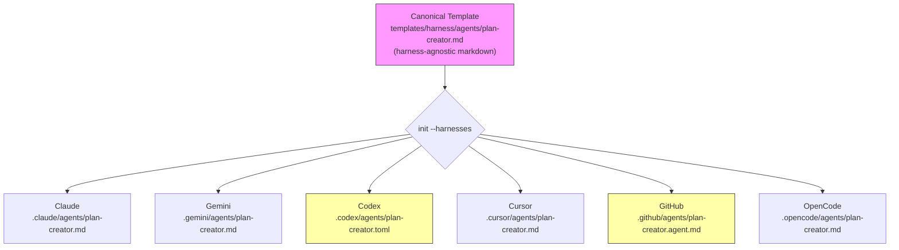
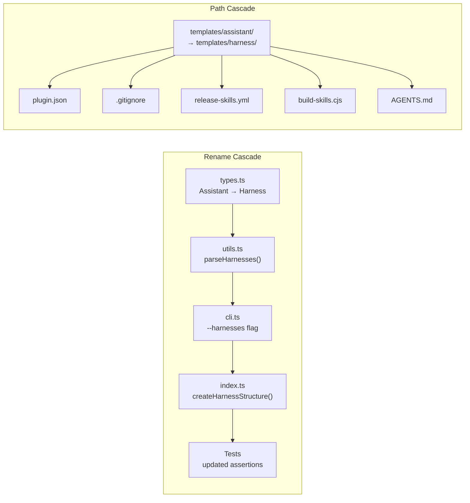
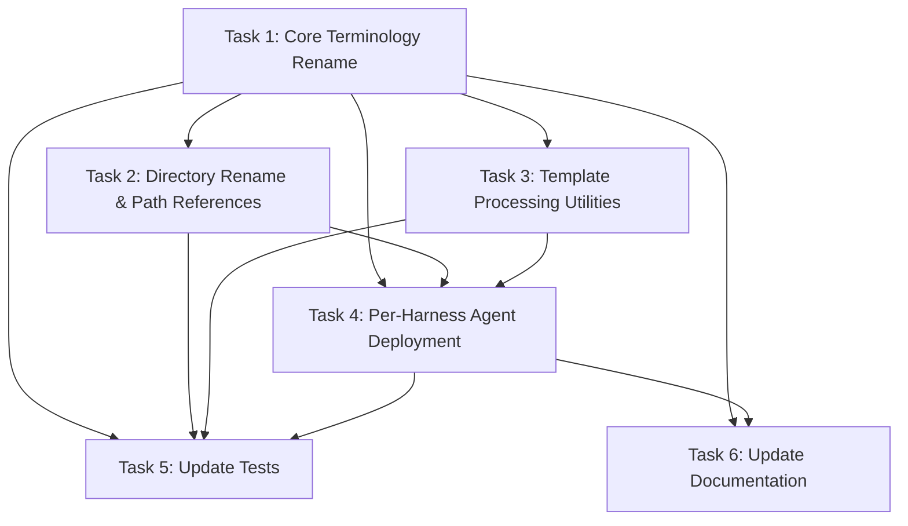

# Plan: Harness Rename and Full Per-Harness Agent Support

## Original Work Order

> I am noticing that the --assistants flag is only meaningful with Claude. I think that we are missing real support for the rest of harnesses. So the task here is for you to 1. Update the flag from assistants to harnesses. So it would be something like --harnesses. Number 2 is to ensure that all the operations that happened for Claude happened for the rest of the harnesses adapted to their appropriate locations and places. And thinking about custom sub-agents or even the hooks, locations, etc. If we have any hooks, you can't remember. So make sure that there is full support for the agents or harnesses that we claim that we support.

## Plan Clarifications

| Question | Answer |
|----------|--------|
| Should the rename be codebase-wide or CLI-flag only? | Full rename: types, functions, variables, error messages, docs, tests — `Assistant` becomes `Harness` everywhere |
| Backward compatibility for old `--assistants` flag? | No. Clean break, no hidden alias |
| How should agents work across harnesses? | Single source-of-truth markdown template, transformed per-harness at init-time into each harness's required format and location |
| Where should the canonical agent template live? | `templates/harness/agents/` (rename `templates/assistant/` → `templates/harness/`) |
| Should CLI help list all 6 harnesses? | Yes |
| Codex TOML agent format: generate or maintain separately? | Generate at init-time from the markdown source. Leverage template processing code from `main` branch |
| Update all downstream path references? | Yes — plugin.json, .gitignore, workflows, build scripts, docs |

## Executive Summary

The CLI currently treats Claude as a first-class citizen during `init` (copies `plan-creator.md` to `.claude/agents/`) while dismissing all other harnesses with a "no files emitted" message. This contradicts the project's claim of supporting six harnesses and undermines user trust in the multi-harness story.

This plan addresses two intertwined problems: (1) the `--assistants` naming is a vestige from when the tool was Claude-centric, and (2) the `init` command does nothing useful for Gemini, Codex, Cursor, GitHub Copilot, or OpenCode beyond creating the shared `.ai/task-manager/` workspace. The fix is a full terminology rename from "assistant" to "harness" across the codebase, paired with a per-harness agent deployment system that transforms a single canonical `plan-creator.md` into each harness's native format and drops it into the correct directory.

The approach reuses proven template-processing utilities (frontmatter parsing, TOML conversion, format-specific transformations) that already exist on the `main` branch for the analogous command-conversion pipeline, adapting them for agent files.

## Context

### Current State vs Target State

| Current State | Target State | Why? |
|--------------|-------------|------|
| CLI flag is `--assistants` | CLI flag is `--harnesses` | "Assistant" is misleading — these are harnesses/environments, not AI assistants themselves |
| `Assistant` type, `parseAssistants()`, `validateAssistants()`, etc. | `Harness` type, `parseHarnesses()`, `validateHarnesses()`, etc. | Consistent terminology throughout |
| Only Claude gets agents during init | All 6 harnesses get agents in their native format | Fulfills the multi-harness support promise |
| `templates/assistant/` directory | `templates/harness/` directory | Matches the renamed terminology |
| `plan-creator.md` references `CLAUDE.md` specifically | Generalized template with harness-agnostic language | Serves as the single source of truth for all harnesses |
| `createAssistantStructure()` early-returns for non-Claude | Per-harness transformation and placement logic | Every harness gets tangible value from init |
| Help text shows `(claude,gemini,opencode)` | Help text shows all 6: `(claude,gemini,codex,cursor,github,opencode)` | Accurate representation of supported harnesses |

### Background

The `main` branch already contains a mature per-harness template processing pipeline for commands (now removed in `2.x` in favor of skills). Key utilities on `main` include:

- `getTemplateFormat(assistant)` — returns `'md'` or `'toml'` per harness
- `convertMdToToml(mdContent)` — converts markdown with YAML frontmatter to TOML
- `convertMdToGitHubPrompt(mdContent)` — converts to GitHub Copilot prompt format
- `parseFrontmatter(content)` — extracts YAML frontmatter from markdown
- `escapeTomlString()` / `escapeTomlTripleQuotedString()` — TOML escaping utilities

These utilities were designed for command templates but are directly applicable to agent templates with minor adaptation. The TOML conversion on `main` was used for Gemini commands; for agents, it maps differently — Codex is the harness that uses TOML for agent definitions, while Gemini uses Markdown for agents.

Each harness has distinct agent conventions discovered through documentation research:

| Harness | Agent Directory | Agent File Format | File Extension |
|---------|----------------|-------------------|----------------|
| Claude | `.claude/agents/` | Markdown with YAML frontmatter | `.md` |
| Gemini | `.gemini/agents/` | Markdown with YAML frontmatter | `.md` |
| Codex | `.codex/agents/` | TOML with structured fields | `.toml` |
| Cursor | `.cursor/agents/` | Markdown with YAML frontmatter | `.md` |
| GitHub Copilot | `.github/agents/` | Markdown with YAML frontmatter | `.agent.md` |
| OpenCode | `.opencode/agents/` | Markdown with YAML frontmatter | `.md` |

## Architectural Approach

### Component 1: Full Terminology Rename

**Objective**: Replace "assistant" with "harness" across the entire codebase for consistent terminology.

This is a mechanical, pervasive change affecting:

- **Types** (`src/types.ts`): `Assistant` → `Harness`, `AssistantConfig` → `HarnessConfig`, etc.
- **Utilities** (`src/utils.ts`): `VALID_ASSISTANTS` → `VALID_HARNESSES`, `parseAssistants()` → `parseHarnesses()`, `validateAssistants()` → `validateHarnesses()`
- **CLI** (`src/cli.ts`): `--assistants` → `--harnesses`, help text updated to list all 6 values
- **Init logic** (`src/index.ts`): `createAssistantStructure()` → `createHarnessStructure()`, all internal variable names
- **Tests**: All test files updated to use new terminology
- **Documentation**: `AGENTS.md` and any other docs referencing "assistant"

The `InitOptions` interface changes from `assistants: string` to `harnesses: string`. No backward compatibility alias.

### Component 2: Generalized Agent Template

**Objective**: Create a harness-agnostic canonical `plan-creator.md` that serves as the single source of truth for all harnesses.

The current `templates/assistant/agents/plan-creator.md` references Claude-specific concepts (`CLAUDE.md`). The generalized version will use universal language that applies to any harness. Specifically:

- Replace "Read CLAUDE.md" with "Read project instructions (AGENTS.md, README.md, or equivalent harness-specific files)"
- Remove any Claude-specific agent invocation patterns
- Keep the core planning methodology intact (YAGNI enforcement, mermaid diagrams, template compliance, execution steps)
- Preserve the YAML frontmatter format (`name`, `description`) since that's the canonical source format

### Component 3: Per-Harness Agent Transformation and Placement

**Objective**: Transform the canonical agent template into each harness's native format and place it in the correct directory during `init`.

The `createHarnessStructure()` function (renamed from `createAssistantStructure()`) will no longer early-return for non-Claude harnesses. Instead, it will:

1. Read the canonical `plan-creator.md` from `templates/harness/agents/`
2. Determine the target format and path based on the harness
3. Transform the content if needed (Codex → TOML, GitHub → `.agent.md`)
4. Write to the harness-specific agent directory

**Harness-specific mapping logic:**

| Harness | Target Directory | Transformation | Output Filename |
|---------|-----------------|----------------|-----------------|
| Claude | `.claude/agents/` | None (native markdown) | `plan-creator.md` |
| Gemini | `.gemini/agents/` | None (native markdown) | `plan-creator.md` |
| Codex | `.codex/agents/` | Markdown → TOML conversion | `plan-creator.toml` |
| Cursor | `.cursor/agents/` | None (native markdown) | `plan-creator.md` |
| GitHub | `.github/agents/` | Rename extension | `plan-creator.agent.md` |
| OpenCode | `.opencode/agents/` | None (native markdown) | `plan-creator.md` |

The TOML conversion for Codex agents maps:
- YAML `name` → TOML `name` field
- YAML `description` → TOML `description` field
- Markdown body → TOML `developer_instructions` field (multiline string)

### Component 4: Template Processing Utilities

**Objective**: Port and adapt the template processing functions from the `main` branch for agent conversion.

The `main` branch's `src/utils.ts` contains `parseFrontmatter()`, `escapeTomlString()`, `escapeTomlTripleQuotedString()`, `convertMdToToml()`, and related functions. These were written for command-template conversion but the core parsing and escaping logic is reusable.

For agents, we need a new `convertAgentMdToToml()` function (distinct from the command-focused `convertMdToToml()` on `main`) that maps markdown agent frontmatter to Codex's TOML agent schema.

The `getTemplateFormat()` function needs updating because the format mapping is different for agents than it was for commands on `main`. For agents: only Codex uses TOML; all others use Markdown.

### Component 5: Created-Files Output and Post-Init Display

**Objective**: Update the init output to list agent files created for each harness, not just Claude.

Currently, the "Created Files" section in init output only lists Claude agents. After this change, it will dynamically list agent files for every selected harness, showing users exactly what was created and where.

### Component 6: Path Reference Updates

**Objective**: Update all references to `templates/assistant/` across configuration, build, and workflow files.

Affected files:
- `.claude-plugin/plugin.json` — skill paths change from `./templates/assistant/skills/<name>` to `./templates/harness/skills/<name>`
- `.gitignore` — rule changes from `templates/assistant/skills/*/scripts/` to `templates/harness/skills/*/scripts/`
- `.github/workflows/release-skills.yml` — path references updated
- `scripts/build-skills.cjs` — entrypoint paths and output paths updated
- `AGENTS.md` — all documentation references updated

## Risk Considerations and Mitigation Strategies

Technical Risks

- **TOML generation correctness for Codex agents**: The Codex CLI has specific TOML schema expectations for agent definitions that differ from the command TOML format on `main`.
    - **Mitigation**: Write focused integration tests that validate generated TOML against Codex's expected schema fields (`name`, `description`, `developer_instructions`). Test with actual Codex CLI if possible.

- **Agent format drift across harness versions**: Harnesses may change their agent format conventions in future releases, breaking our generated agents.
    - **Mitigation**: The single-source-of-truth pattern makes updates centralized. Only the transformation logic needs updating, not the content.

Implementation Risks

- **Incomplete rename**: Missing an "assistant" reference somewhere in the codebase leads to inconsistency or runtime errors.
    - **Mitigation**: Use `grep -r "assistant\|Assistant\|ASSISTANT"` as a final sweep. Tests should catch most misses through compilation and assertion failures.

- **Skill distribution path breakage**: Renaming `templates/assistant/` to `templates/harness/` could break the `npx skills add` flow if the tagged release doesn't reflect the new paths.
    - **Mitigation**: Update `.claude-plugin/plugin.json` and verify with `npx skills add` against a test tag. The `release-skills.yml` workflow must reference the new paths.

Integration Risks

- **GitHub Copilot `.agent.md` extension handling**: The `.agent.md` extension is significant — Copilot may not discover agents without it.
    - **Mitigation**: Validate by creating a test repo with the generated agent file and confirming GitHub Copilot agent discovery.

## Success Criteria

### Primary Success Criteria

1. `npx . init --harnesses claude,gemini,codex,cursor,github,opencode` creates agent files in all six harness-specific directories with correct formats and content
2. `npx . init --harnesses codex` produces a valid `.codex/agents/plan-creator.toml` with the correct TOML structure
3. `npx . init --harnesses github` produces `.github/agents/plan-creator.agent.md` with the `.agent.md` extension
4. `grep -r "assistant" src/` returns zero matches (excluding comments referencing external systems where the word is unavoidable)
5. All existing tests pass after being updated to use `--harnesses` terminology
6. `npm run build` succeeds with no TypeScript errors
7. `.claude-plugin/plugin.json` paths point to `templates/harness/skills/` and `npx skills add` works against the updated manifest

## Self Validation

1. Run `npm run build && npm test` — all tests must pass
2. Run `npx . init --harnesses claude,gemini,codex,cursor,github,opencode --destination-directory /tmp/harness-test` and verify:
   - `.claude/agents/plan-creator.md` exists and contains valid markdown with YAML frontmatter
   - `.gemini/agents/plan-creator.md` exists and contains valid markdown
   - `.codex/agents/plan-creator.toml` exists and contains `name`, `description`, and `developer_instructions` fields
   - `.cursor/agents/plan-creator.md` exists and contains valid markdown
   - `.github/agents/plan-creator.agent.md` exists and contains valid markdown with YAML frontmatter
   - `.opencode/agents/plan-creator.md` exists and contains valid markdown
3. Run `grep -rn "assistant\|Assistant" src/ --include="*.ts" | grep -v "// " | grep -v test` and verify no stale references remain in production code
4. Run `npm pack --dry-run` and verify `templates/harness/` appears in the package contents
5. Verify `node dist/cli.js init --assistants claude` fails (old flag removed, no BC)
6. Verify `node dist/cli.js init --harnesses invalid` shows proper error with all 6 valid harness names

## Documentation

- **AGENTS.md**: Full update required — all references to "assistants" become "harnesses", `--assistants` examples become `--harnesses`, template path references updated from `templates/assistant/` to `templates/harness/`
- **README.md**: Update CLI usage examples if they reference `--assistants`
- **docs/ pages**: Update `getting-started.md`, `installation.md`, `features.md`, `workflow.md`, and `comparison.md` if they reference the flag or terminology

## Resource Requirements

### Development Skills
- TypeScript (type system refactoring, build pipeline)
- TOML format knowledge (Codex agent schema)
- Understanding of each harness's agent discovery conventions

### Technical Infrastructure
- Existing build pipeline (`npm run build`, `npm run build:skills`)
- Jest test suite
- ESLint and Prettier for code quality
- `main` branch as reference for template processing utilities

## Notes

- The `main` branch's `getTemplateFormat()` mapped Gemini → TOML (for commands). For agents, the mapping is Codex → TOML. This is an important distinction — don't blindly copy the mapping.
- The `plan-creator.md` is currently the only agent template. If more agents are added later, the per-harness transformation system should handle them automatically (iterate over all `.md` files in `templates/harness/agents/`).
- Skills (`templates/harness/skills/`) are already harness-agnostic and need no content changes — only their directory path changes.
- The `release-skills.yml` workflow force-adds `templates/assistant/skills/*/scripts/` at tag time. This path must be updated to `templates/harness/skills/*/scripts/` or the release workflow will silently produce incomplete tags.

## Execution Blueprint

### Dependency Diagram

**Validation Gates:**
- Reference: `/config/hooks/POST_PHASE.md`

### ✅ Phase 1: Foundation Rename
**Parallel Tasks:**
- ✔️ Task 1: Core terminology rename across all TypeScript source files (Assistant → Harness)

### ✅ Phase 2: Parallel Infrastructure
**Parallel Tasks:**
- ✔️ Task 2: Directory rename (`templates/assistant/` → `templates/harness/`) and path reference updates (depends on: 1)
- ✔️ Task 3: Template processing utilities — frontmatter parsing, TOML conversion, format mapping (depends on: 1)

### ✅ Phase 3: Agent Deployment Integration
**Parallel Tasks:**
- ✔️ Task 4: Generalize agent template and implement per-harness deployment in `createHarnessStructure()` (depends on: 1, 2, 3)

### ✅ Phase 4: Validation and Documentation
**Parallel Tasks:**
- ✔️ Task 5: Update and extend test suite for new terminology and per-harness deployment (depends on: 1, 2, 3, 4)
- ✔️ Task 6: Update all documentation (AGENTS.md, README.md, docs/) (depends on: 1, 4)

### Execution Summary
- Total Phases: 4
- Total Tasks: 6

## Execution Summary

**Status**: Completed Successfully
**Completed Date**: 2026-05-25

### Results
All 6 tasks across 4 phases executed successfully. The codebase now uses "harness" terminology consistently, all 6 harnesses receive native-format agent files during `init`, and the test suite grew from 102 to 110 tests with full coverage of the new functionality. Five commits were produced: the core rename, the directory rename + utilities, per-harness deployment, tests + documentation, and a cleanup fix for YAML multiline frontmatter parsing.

### Noteworthy Events
- The `parseFrontmatter()` utility initially did not handle YAML block scalar indicators (`|` and `>`), causing Codex TOML output to show `description = "|"` instead of the full multiline description. This was caught during POST_EXECUTION self-validation and fixed.
- The `getInitInfo()` function was identified as dead code (exported but never imported anywhere) and removed during POST_EXECUTION cleanup.
- Sub-agents in Phase 2 partially missed test file path updates in `skill-scripts.test.ts`, `task-full-workflow.skill.test.ts`, and `task-generate-tasks.skill.test.ts`. These were caught and fixed before commit.

### Necessary follow-ups
- Validate that `npx skills add e0ipso/ai-task-manager` works correctly after a tagged release with the new `templates/harness/skills/` paths.
- Consider adding a `parseFrontmatter` test case for YAML multiline values (`|` and `>` indicators) to prevent regressions.
