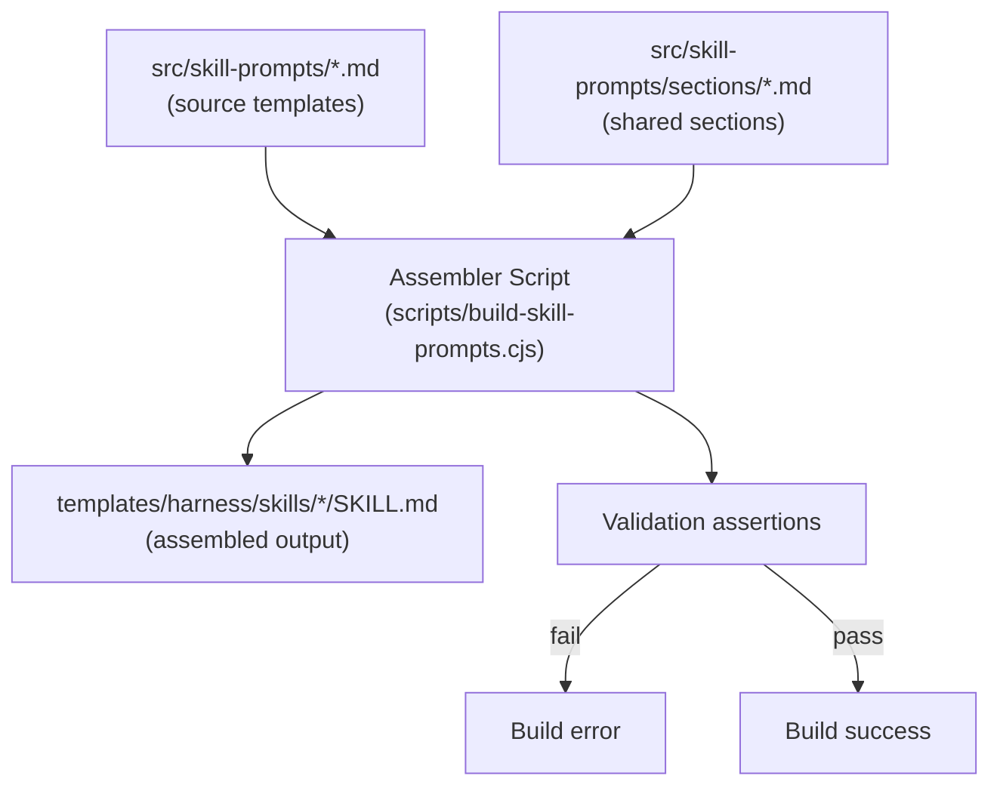
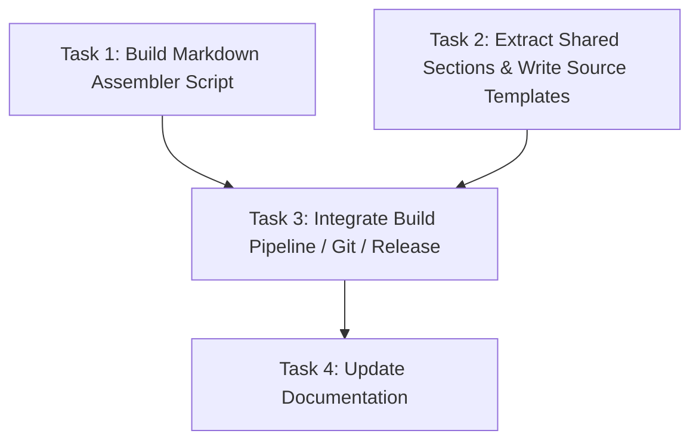

# Plan: SKILL.md Build-Time Composition System

## Original Work Order

> Address the duplication wherever it makes sense. Be pragmatic! Build a
> build-time include system for the 6 SKILL.md files that extracts shared
> procedural blocks into reusable sections and assembles them into
> self-contained SKILL.md files during `npm run build`. Support file includes
> and variable substitution. Generated SKILL.md files follow the same git
> strategy as .cjs bundles (ignored on main, force-added in release commits).

## Plan Clarifications

| Question | Answer |
|---|---|
| Code-level harness abstraction in scope? | No. Already well-centralized (~54 lines). Focus is SKILL.md prompt duplication only. |
| Approach? | Build-time composition. ~20-line include system in Node.js. |
| task-full-workflow strategy? | Import phases from the standalone skills' source sections. Maximum deduplication. |
| BC of assembled output? | Semantic equivalence. Minor formatting differences acceptable. |
| Git strategy for generated SKILL.md? | Same as .cjs bundles: git-ignored on main, force-added in release commits by semantic-release. |
| Templating features? | File includes (`{{include path}}`) + variable substitution (`{{variable_name}}`). |

## Executive Summary

The 6 SKILL.md files under `templates/harness/skills/*/` contain ~60-70% duplicated text. Shared procedural blocks (root discovery, plan resolution, phase execution, test philosophy, task minimization, failure modes) are copy-pasted with minor verb changes. The `task-full-workflow` skill (378 lines) is ~87% verbatim from the other 3 execution-phase skills.

This plan introduces build-time markdown composition: shared sections are authored once under `src/skill-prompts/sections/`, per-skill source templates reference them via `{{include}}` directives, and a build step assembles final self-contained SKILL.md files. Variable substitution (`{{variable_name}}`) handles per-skill parameterization (verbs, field names).

This mirrors the existing pattern where `src/skill-scripts/*.ts` -> `templates/harness/skills/*/scripts/*.cjs`. Now: `src/skill-prompts/*.md` -> `templates/harness/skills/*/SKILL.md`.

## Context

### Current State vs Target State

| Current State | Target State | Why? |
|---|---|---|
| 6 hand-authored SKILL.md files with ~60-70% duplicated text | Shared sections authored once, assembled at build time | Eliminate drift risk and maintenance burden |
| task-full-workflow is 378 lines, ~87% verbatim from other skills | full-workflow composed from standalone skill sections | Highest drift risk in the project |
| Changing root-discovery wording requires editing 6 files | Edit 1 shared section file | Single source of truth |
| SKILL.md files are always git-tracked | Generated SKILL.md git-ignored on main, force-added in releases | Consistent with .cjs bundle strategy |
| No validation that skills stay in sync | Build output is deterministic from source | Drift is impossible by construction |

### Background

The 2.x refactor successfully centralized code-level harness logic into a single `getAgentFormat()` switch statement. However, the prompt-level content (SKILL.md) was never deduplicated. The shared procedural blocks evolved from copy-paste during initial skill authoring and have been manually kept in sync since.

Key shared blocks and their duplication footprint:

- **Root Discovery** (~100 words, 6 copies): Identical except for one verb
- **Plan Resolution** (~120 words, 4 copies): Identical
- **Phase Execution Loop** (~400 words, 2 copies): 90% identical
- **Task Minimization + Antipatterns** (~300 words, 2 copies): 95% identical
- **Test Philosophy** (~200 words, 2 copies): 95% identical
- **Post-Execution + Archive** (~200 words, 2 copies): 95% identical
- **Dependency Analysis** (~80 words, 2 copies): Identical
- **Task ID Allocation** (~100 words, 2 copies): 98% identical

## Architectural Approach

### Build-Time Markdown Assembler

**Objective**: A lightweight Node.js script that resolves include directives and variable substitutions in source templates, producing self-contained SKILL.md files.

The assembler processes source templates from `src/skill-prompts/` and writes assembled output to `templates/harness/skills/*/SKILL.md`. It supports two directives:

1. **File includes**: `{{include sections/root-discovery.md}}` — replaced with the contents of the referenced file (path relative to `src/skill-prompts/`).
2. **Variable substitution**: `{{verb}}` — replaced with a value defined in a variables block at the top of the source template.

The variables block is a YAML frontmatter extension. The existing `name` and `description` fields are preserved (they're needed in the assembled SKILL.md frontmatter). New fields under a `vars` key define template variables:

```yaml
---
name: task-create-plan
description: "..."
target: task-create-plan
vars:
  verb: "create a plan"
  action_noun: "plan creation"
---
```

The `target` field maps to the skill directory name under `templates/harness/skills/`. The assembler strips the `vars` and `target` fields from the output frontmatter, preserving only `name` and `description`.

Includes are resolved recursively (a section can include another section), with cycle detection. Maximum depth of 3 is sufficient.

The assembler is invoked as part of `npm run build:skills` (or a new `build:skill-prompts` step that runs before/alongside the existing esbuild step).

### Source Directory Structure

**Objective**: Organize authored prompt content so shared sections are co-located and discoverable.

```
src/skill-prompts/
  sections/                         # Reusable procedural blocks
    root-discovery.md               # "Run find-task-manager-root.cjs..."
    plan-resolution.md              # "Run validate-plan-blueprint.cjs..."
    task-minimization.md            # Minimization principles + antipatterns
    test-philosophy.md              # "Write a few tests, mostly integration"
    dependency-analysis.md          # Hard/soft dependency identification
    task-id-allocation.md           # get-next-task-id.cjs usage
    phase-execution-loop.md         # PRE_PHASE -> dispatch -> verify -> POST_PHASE
    post-execution-archive.md       # POST_EXECUTION + summary + archive
    granularity-skill-rules.md      # Single-purpose, atomic, skill-specific, verifiable
    task-file-output.md             # Emit task files with frontmatter spec
    validation-checklist.md         # Pre-completion validation list
  task-create-plan.md               # Source template (unique + includes)
  task-generate-tasks.md
  task-refine-plan.md
  task-execute-blueprint.md
  task-execute-task.md
  task-full-workflow.md
```

Each source template contains the skill's unique content interspersed with `{{include}}` directives. For example, `task-create-plan.md` would look like:

```markdown
---
name: task-create-plan
description: "Create a new AI Task Manager plan..."
target: task-create-plan
vars:
  verb: "create a plan"
---

# task-create-plan

Drive the end-to-end creation of a new AI Task Manager plan...

## Inputs

The user's request supplies the work order...

## Operating Procedure

### 1. Locate the task-manager root

{{include sections/root-discovery.md}}

### 2. Load project context
...
```

### Git and Release Integration

**Objective**: Generated SKILL.md files follow the same lifecycle as .cjs bundles.

Changes required:

1. **`.gitignore`**: Add `templates/harness/skills/*/SKILL.md` to ignore generated output on main. This parallels the existing `templates/harness/skills/*/scripts/` rule.
2. **`.releaserc` / semantic-release config**: Add `templates/harness/skills/*/SKILL.md` to the `@semantic-release/git` assets glob so they're force-added in release commits.
3. **`package.json`**: The existing `"files": ["templates/"]` entry already covers SKILL.md files, so no change needed for npm publishing.
4. **Build pipeline**: The `build:skills` npm script (or a new parallel step) runs the assembler after the esbuild step.

### task-full-workflow Composition Strategy

**Objective**: Eliminate the largest single source of duplication by composing task-full-workflow from the standalone skills' sections.

task-full-workflow's source template will import sections from the standalone skills for its three phases. The orchestration glue (progress indicators, context passing, critical rule) remains unique to full-workflow.

The full-workflow source will use include directives that reference sections from the standalone skills' unique content. For example, the task minimization, test philosophy, dependency analysis, and task allocation steps are shared between `task-generate-tasks` and `task-full-workflow`'s Phase 2.

Shared sections that appear in multiple standalone skills (root discovery, plan resolution, phase execution loop) are extracted to `sections/`. Sections that are unique to one standalone skill but also appear in full-workflow can either:

- Be extracted to `sections/` if they're substantial (>100 words) and used in 2+ places
- Remain inline in the standalone skill if they're short and highly skill-specific

The decision criterion is pragmatic: extract if the section is >100 words AND appears in 2+ source templates.

### Build Validation

**Objective**: Ensure the assembled output is correct and complete.

Post-build assertions (added to the assembler or as a separate validation step):

1. **No unresolved directives**: Grep assembled output for `{{`. If any remain, fail the build with a clear error naming the unresolved directive and source file.
2. **Frontmatter integrity**: Each assembled SKILL.md must have valid `name` and `description` fields. No `vars` or `target` fields should survive into output.
3. **Smoke test**: Each assembled SKILL.md must be non-empty and contain the expected `## Operating Procedure` heading (all skills share this structural pattern).

These assertions follow the same pattern as the existing `.cjs` bundle smoke check in `scripts/build-skills.cjs` that catches unsubstituted `EXPECTED_WORKSPACE_SCHEMA_VERSION`.



## Risk Considerations and Mitigation Strategies

<details>
<summary>Technical Risks</summary>

- **Include cycle or missing file**: Assembler could recurse infinitely or reference a nonexistent section.
    - **Mitigation**: Cycle detection with max depth of 3. Missing-file errors are immediate build failures with clear messages naming the source template and missing section path.
- **Variable substitution in unexpected places**: A `{{` sequence in prose (e.g., code examples) could be misinterpreted as a directive.
    - **Mitigation**: Use a more distinctive delimiter if needed (e.g., `{}` or `<!-- include: -->` syntax). Alternatively, limit substitution to lines that match the full directive pattern. Evaluate during implementation whether plain `{{` causes false positives in practice.
</details>

<details>
<summary>Implementation Risks</summary>

- **Semantic drift during extraction**: When splitting current SKILL.md into shared sections + unique content, subtle differences between the "identical" copies may be lost or introduced.
    - **Mitigation**: Diff the assembled output against the current SKILL.md files. Require semantic equivalence review for each skill before merging.
- **Developer experience regression**: Contributors now need to understand the composition system to edit skill prompts.
    - **Mitigation**: Add a brief README in `src/skill-prompts/` explaining the system. The composition model is simple (includes + variables) and mirrors the existing .cjs bundle pattern developers already work with.
</details>

<details>
<summary>Integration Risks</summary>

- **CI/CD pipeline changes**: Release workflow must force-add generated SKILL.md alongside .cjs bundles.
    - **Mitigation**: Extend the existing `@semantic-release/git` assets glob. Test with a dry-run release before merging.
- **Skills installer compatibility**: The `npx skills add` installer reads SKILL.md from the tagged release ref. If the file is missing from the tag, installation breaks.
    - **Mitigation**: The force-add in release commits ensures SKILL.md is present in tagged refs, same as .cjs bundles today. Verify with `npm pack --dry-run` and `git ls-tree` checks.
</details>

## Success Criteria

### Primary Success Criteria

1. All 6 SKILL.md files are assembled from source templates via `npm run build`. No hand-edited SKILL.md files remain.
2. Shared procedural blocks (root discovery, plan resolution, phase execution loop, test philosophy, task minimization, dependency analysis, task ID allocation, post-execution/archive) exist as single-source section files.
3. The assembled SKILL.md files are semantically equivalent to the current versions — an AI assistant following either version would produce the same behavior.
4. Generated SKILL.md files are git-ignored on main and force-added in release commits.
5. `npm run build` succeeds with zero unresolved directives or missing sections.
6. `npm pack --dry-run` confirms SKILL.md files are included in the published package.

## Self Validation

1. Run `npm run build` and confirm it completes without errors.
2. Run `npm test` and confirm all existing tests pass.
3. For each of the 6 skills, diff the assembled SKILL.md against the current version (from git) and manually verify semantic equivalence — the instructions should produce identical AI behavior.
4. Run `npm pack --dry-run` and confirm all 6 `templates/harness/skills/*/SKILL.md` files appear in the package contents.
5. Verify that `src/skill-prompts/sections/` contains the extracted shared sections and that each is referenced by at least 2 source templates.
6. Grep assembled output for `{{` to confirm no unresolved directives survived.
7. Verify `.gitignore` contains the `templates/harness/skills/*/SKILL.md` rule.
8. Verify the semantic-release config's `@semantic-release/git` assets glob includes the SKILL.md pattern.

## Documentation

- Add a brief `src/skill-prompts/README.md` explaining the composition system, how to add sections, and how to edit skill prompts.
- Update `AGENTS.md` "Skills Layer" section to document that SKILL.md files are now build outputs assembled from `src/skill-prompts/`, parallel to how `.cjs` bundles are built from `src/skill-scripts/`.
- Update `AGENTS.md` "Build pipeline" section to include the new `build:skill-prompts` step.

## Resource Requirements

### Development Skills

- Node.js scripting (assembler script, ~50-80 lines)
- Understanding of the existing build pipeline (`scripts/build-skills.cjs`, `package.json` scripts)
- Markdown content editing (extracting sections, writing source templates)
- Git/CI configuration (`.gitignore`, semantic-release config)

### Technical Infrastructure

- Node.js (already available)
- No new dependencies required — the assembler uses only `fs` and `path`

## Notes

- The assembler should be a standalone script (`scripts/build-skill-prompts.cjs`) following the pattern of `scripts/build-skills.cjs`. It should NOT be a TypeScript file compiled via tsc, since it's a build tool that runs before/alongside compilation.
- The `{{` delimiter is a pragmatic choice. If false positives arise in practice (e.g., Mustache-style examples in prose), consider switching to `<!-- include: path -->` HTML comment syntax. Evaluate during implementation.
- The extraction of shared sections should be done by analyzing the current 6 SKILL.md files side-by-side, taking the best version of each shared block as the canonical source, and verifying that no skill-specific nuance is lost.

## Execution Blueprint

**Validation Gates:**
- Reference: `/config/hooks/POST_PHASE.md`

### Dependency Diagram



### ✅ Phase 1: Foundation
**Parallel Tasks:**
- ✔️ Task 1: Build the Markdown Assembler Script
- ✔️ Task 2: Extract Shared Sections and Write Source Templates

### ✅ Phase 2: Integration
**Parallel Tasks:**
- ✔️ Task 3: Integrate into Build Pipeline, Git, and Release (depends on: 1, 2)

### ✅ Phase 3: Documentation
**Parallel Tasks:**
- ✔️ Task 4: Update Documentation (depends on: 1, 2, 3)

### Post-phase Actions

Run the full validation suite from the plan's "Self Validation" section after Phase 2 completes (before documentation).

### Execution Summary
- Total Phases: 3
- Total Tasks: 4

## Execution Summary

**Status**: Completed Successfully
**Completed Date**: 2026-05-26

### Results
- Created `scripts/build-skill-prompts.cjs` assembler with include resolution, variable substitution, cycle detection, and post-build validation.
- Extracted 9 shared section files under `src/skill-prompts/sections/`, each referenced by 2+ source templates.
- Authored 6 source templates in `src/skill-prompts/` that produce semantically equivalent SKILL.md output via `{{include}}` and `{{variable}}` directives.
- Wired `build:skill-prompts` into the `npm run build` chain.
- Untracked generated SKILL.md files from git; configured semantic-release to force-add them in release commits.
- Created `src/skill-prompts/README.md` and updated AGENTS.md with the new composition system documentation.

### Noteworthy Events
- Assembler required a `trimEnd()` fix on included file contents to prevent double-blank-line artifacts at include boundaries.
- README.md in `src/skill-prompts/` was picked up by the assembler glob and caused a build failure; fixed by excluding `README.md` from the glob.
- task-full-workflow assembled output uses canonical (more detailed) versions from generate-tasks shared sections, adding clarity without changing behavior. This was the plan's intended design.
- task-execute-blueprint and task-full-workflow get line-wrapped formatting from the shared sections (originals had long unwrapped lines). Semantically identical.

### Necessary follow-ups
- None identified. The system is self-contained and follows existing project patterns.
