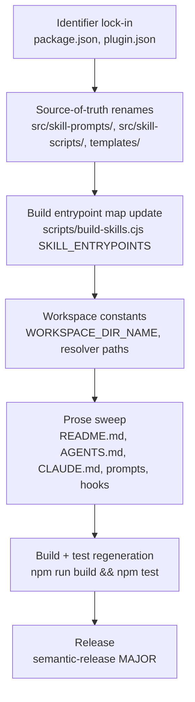
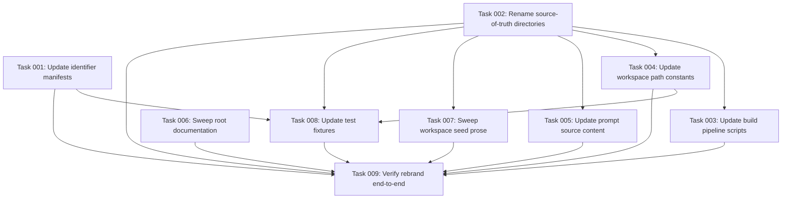

# Plan: Rebrand AI Task Manager to Strikethroo

## Original Work Order

> I want to rebrand AI Task Manager into Strikethroo. Strikethroo will be the new name of the project and it's one word and I want to rebrand everything. Including the names of the skills (/task-* -> /st-*) and the name of the repo. Include the names of the .ai/task-manager, and do not add BC layers

## Plan Clarifications

| Question | Answer |
| --- | --- |
| New npm package name? | `strikethroo` (unscoped) |
| New workspace directory path? | `.ai/strikethroo/` |
| New CLI bin name (replaces `ai-task-manager`)? | `strikethroo` |
| Rename the GitHub repo as part of this plan? | Out of scope — only code/content rebrand. URLs continue to reference `e0ipso/ai-task-manager` until a separate rename. |
| Backwards-compatibility shims for old name/paths? | None. Hard cutover. |
| Rename `.ai/knowledge-base/`? | Out of scope. The knowledge base is a separate primitive; only the task-manager workspace path changes. |
| Does the domain noun "task" rebrand too? | No. Only the `task-*` skill prefix becomes `st-*`. Plans still contain tasks, phases, and blueprints. |

## Executive Summary

This plan rebrands the project from "AI Task Manager" to "Strikethroo" end-to-end. The change touches the published npm package (`@e0ipso/ai-task-manager` → `strikethroo`), the CLI bin (`ai-task-manager` → `strikethroo`), all six shipped skills (`task-create-plan` → `st-create-plan`, `task-generate-tasks` → `st-generate-tasks`, `task-execute-blueprint` → `st-execute-blueprint`, `task-execute-task` → `st-execute-task`, `task-refine-plan` → `st-refine-plan`, `task-full-workflow` → `st-full-workflow`), the per-project workspace directory (`.ai/task-manager/` → `.ai/strikethroo/`), and every user-facing string that names the product across `README.md`, `AGENTS.md`, `CLAUDE.md`, template prompts, hook docs, error messages, and the `.claude-plugin/plugin.json` manifest.

The approach is a hard cutover with no backwards-compatibility layer: the workspace-root resolver looks for `.ai/strikethroo/.init-metadata.json` only, the schema-version contract continues forward (no reset), and existing installations of either the CLI or skills must re-run `init` and re-add skills to upgrade. This is the simplest possible rebrand and matches the user's "no BC layers" directive. The domain vocabulary (work order, plan, blueprint, phase, task, sub-agent) is preserved — only the project name and skill prefix change.

The expected outcome is a published `strikethroo` npm package whose `init` command provisions `.ai/strikethroo/` workspaces, six skills installable via `npx skills add e0ipso/strikethroo` (assuming the repo rename happens later — see Notes), and documentation that consistently presents the product as Strikethroo. The GitHub repo slug stays `e0ipso/ai-task-manager` for the scope of this plan; URL references in docs and workflows continue to point at the existing slug.

## Context

### Current State vs Target State

| Current State | Target State | Why? |
| --- | --- | --- |
| Project name "AI Task Manager" throughout docs and prompts | Project name "Strikethroo" throughout docs and prompts | User-driven rebrand |
| npm package `@e0ipso/ai-task-manager` | npm package `strikethroo` (unscoped) | Brand-aligned single-word identifier |
| CLI bin `ai-task-manager` | CLI bin `strikethroo` | Match new package name |
| Workspace path `.ai/task-manager/` (with `.init-metadata.json` inside) | Workspace path `.ai/strikethroo/` | Match new brand; "no BC layers" means the resolver only looks here |
| Skills prefixed `task-*` (6 skills) | Skills prefixed `st-*` (same 6 skills, renamed) | User-specified prefix change |
| `src/skill-prompts/` and `src/skill-scripts/` reference task-manager naming | Same trees reference strikethroo naming | Source of truth for prompt and bundle generation must reflect the new brand |
| `templates/harness/skills/task-*/` output directories | `templates/harness/skills/st-*/` output directories | Skill installer reads these paths via `.claude-plugin/plugin.json` |
| `.claude-plugin/plugin.json` lists six `./templates/harness/skills/task-*` entries | Manifest lists six `./templates/harness/skills/st-*` entries, with `name` field updated to `strikethroo` | Required for `npx skills add` to resolve the renamed skills |
| `templates/ai-task-manager/` (workspace seed copied by `init`) | `templates/strikethroo/` | Source path for `init`'s file-copy step must match the new workspace name |
| Glossary terms in `AGENTS.md` referencing "AI Task Manager" | Same glossary references "Strikethroo"; domain nouns (plan, task, blueprint, phase) preserved | Glossary defines product vs. domain vocabulary; only the product label moves |
| Schema-version error messages reference `npx @e0ipso/ai-task-manager init` and `npx skills add e0ipso/ai-task-manager` | Error messages reference `npx strikethroo init` and `npx skills add e0ipso/strikethroo` | Self-healing UX must guide users to the renamed installers |
| Existing `.ai/task-manager/` workspaces in user repos remain functional | Existing workspaces stop being detected by the renamed resolver; users re-run `init` to migrate | No-BC directive; documented as a breaking release |
| GitHub repo slug `e0ipso/ai-task-manager` | Unchanged — out of scope | Per clarification |

### Background

The product currently presents as "AI Task Manager," published as `@e0ipso/ai-task-manager` on npm. Its CLI does one thing: scaffold a `.ai/task-manager/` workspace with hooks, templates, and a metadata file. The actual workflow (planning, decomposition, execution) is delivered out-of-band as Agent Skills via `vercel-labs/skills`, which reads `.claude-plugin/plugin.json` at the repo root to discover skill directories under `templates/harness/skills/`. There are two independent distribution channels (CLI + skills installer) coupled only by a `workspaceSchemaVersion` integer baked into skill bundles via esbuild `define`.

The skills' executable logic is authored in TypeScript under `src/skill-scripts/`, type-checked with a dedicated `tsconfig.skill-scripts.json`, and bundled into per-skill `.cjs` files by `scripts/build-skills.cjs` (driven by a `SKILL_ENTRYPOINTS` array). Prompts are assembled from sources under `src/skill-prompts/` (with `{{include}}` directives resolving shared sections) by `scripts/build-skill-prompts.cjs`, writing the final `SKILL.md` files into each skill's output directory. Both the bundled `.cjs` and assembled `SKILL.md` are git-ignored on `main` and force-added into the release commit by `@semantic-release/git`.

Two prior consultations shaped this plan. First, the user picked an unscoped `strikethroo` package name; this requires that the bare name be available on npm at publish time — if it is taken, the plan blocks on choosing a fallback (`@e0ipso/strikethroo` is the obvious one) before publish, but does not need to be re-decided for any code change since the package string only appears in `package.json` and a handful of doc strings. Second, the GitHub repo rename was held out of scope; doc URLs that reference `e0ipso/ai-task-manager` therefore stay as-is, and any later rename will be handled by GitHub's automatic redirect plus a follow-up sweep of doc URLs.

The "no BC layers" directive eliminates the most invasive design questions. The workspace resolver does not need to fall back to `.ai/task-manager/`. The skill installer does not need aliasing. Error messages do not need to know the old name. The schema-version integer continues forward without reset, because its only role is detecting workspace-vs-skill drift — the brand change is orthogonal.

The release will be a semantic-release MAJOR bump (breaking change footer or `!` syntax in commit message) and ship under the new package name. Users on the old package and old workspace path must re-run `init` and re-add skills; there is no migration script.

## Architectural Approach

The rebrand is a coordinated multi-surface rename with no behavioral changes. The implementation strategy is to (1) lock in identifier replacements across configuration files that gate downstream artifacts, (2) rename source-of-truth directories and entrypoints, (3) regenerate build outputs to confirm the rename propagates, and (4) sweep human-readable prose. Every step is mechanical; the risk is missed references, not design.



### Identifier and Manifest Updates

**Objective**: Establish the canonical new identifiers in the files that other tooling reads. This anchors every downstream rename.

The two critical config files are `package.json` and `.claude-plugin/plugin.json`. In `package.json`: `name` becomes `strikethroo`, `bin` key becomes `strikethroo` pointing at the same `dist/cli.js` entrypoint, repository/bug URLs remain unchanged per scope decision, and the version is allowed to bump naturally by semantic-release (the rebrand commit message uses breaking-change syntax). In `.claude-plugin/plugin.json`: the `name` field becomes `strikethroo` and the six `skills` entries are updated to `./templates/harness/skills/st-<name>`.

The semantic-release `assets` glob in `.releaserc` (or `package.json`'s `release` block — to be confirmed during implementation) currently matches `templates/harness/skills/*/scripts/*.cjs` and `templates/harness/skills/*/SKILL.md`. The globs use `*` so they continue to match after renaming the per-skill directories; no glob change is required. This is verified during execution by re-running the existing `git ls-tree` smoke checks documented in `AGENTS.md`.

### Source-of-Truth Renames

**Objective**: Move authored content to the new names so generated artifacts come out correctly without one-off patching.

Three source trees need directory renames:

- `src/skill-prompts/<skill>/` (the assembled-from sources for each `SKILL.md`) — six directories renamed from `task-*` to `st-*`, plus any shared `sections/` content that references the old skill names inline (verified via grep, not assumed).
- `src/skill-scripts/<skill>.ts` (TypeScript entrypoints) — six files renamed.
- `templates/ai-task-manager/` (the workspace seed that the CLI's `init` copies into `<dest>/.ai/<workspace-name>/`) — renamed to `templates/strikethroo/`. The CLI's file-copy logic that points at this path is updated in lockstep.

The `templates/harness/skills/<skill>/` output directories are not renamed by hand. They are regenerated by the build pipeline after the entrypoint map and source-of-truth directories move. However, the old directories must be deleted from the working tree before the next build to avoid leaving stale `task-*` outputs alongside the new `st-*` outputs. This is a single `git rm -r` step per old directory.

### Build Pipeline Rewiring

**Objective**: Update the build's identifier map so bundling and prompt assembly emit under the new names.

The `SKILL_ENTRYPOINTS` array at the top of `scripts/build-skills.cjs` is the single registry mapping TypeScript entrypoint paths to output skill directories. Each of the six entries is updated to the new entrypoint path and the new output directory. Similarly, `scripts/build-skill-prompts.cjs` reads from `src/skill-prompts/<skill>/` directories; if it has hardcoded skill names, those entries are updated, otherwise it picks up the new names automatically from the renamed source directories (to be confirmed by inspection).

The post-build assertion in `scripts/build-skills.cjs` that fails if `EXPECTED_WORKSPACE_SCHEMA_VERSION` survives substitution is not affected by the rebrand and continues to run.

### Workspace Constants and Resolver

**Objective**: Make the workspace-root resolver look in the new location without fallback to the old one.

`src/skill-scripts/shared/root.ts` walks parent directories looking for `.ai/task-manager/.init-metadata.json`. The hardcoded path segment becomes `.ai/strikethroo/.init-metadata.json`. The same change applies to the CLI-side workspace constant in `src/metadata.ts` (or wherever `CURRENT_WORKSPACE_SCHEMA_VERSION` lives — the file that the CLI uses to write metadata at `init` time).

The schema-version error message strings in `root.ts` are updated to reference `npx strikethroo init` and `npx skills add e0ipso/strikethroo`.

### Skill-Internal Prompt Rewrites

**Objective**: Update the assembled prompts so each skill's `SKILL.md` refers to its own new name and the new workspace path.

Within `src/skill-prompts/`:

- Per-skill source templates (the renamed files inside each `st-*/` directory) reference their own name in headings, `name:` frontmatter, and procedural prose. Each is updated.
- Shared `sections/` partials (root discovery, plan resolution, phase execution, etc.) currently mention the workspace path `.ai/task-manager/` in code blocks and inline references. These are updated to `.ai/strikethroo/` in one pass.
- Cross-skill references (e.g., the `task-full-workflow` prompt chaining to `task-create-plan` → `task-generate-tasks` → `task-execute-blueprint`) update to the new `st-*` names.

The build-time validation that fails on unresolved `{{include}}` directives or missing `## Operating Procedure` headings continues to gate output.

### Prose and Documentation Sweep

**Objective**: Bring every human-readable surface in line with the new brand.

In scope: `README.md`, `AGENTS.md`, `CLAUDE.md`, `src/skill-prompts/README.md`, every hook file under the source workspace template (`templates/strikethroo/config/hooks/*.md`), every template under that tree (`templates/strikethroo/config/templates/*.md`), and any inline comments in TypeScript that name the product. The glossary in `AGENTS.md` is updated so the product is "Strikethroo" but the domain nouns (work order, plan, blueprint, phase, task, sub-agent) are preserved verbatim. URLs that reference `github.com/e0ipso/ai-task-manager` or `npmjs.com/package/@e0ipso/ai-task-manager` remain as-is per the scope decision; a single one-line note is added to `README.md` indicating the repo will be renamed in a future step.

Test fixtures and assertion strings in `src/__tests__/` are updated only where they assert on the brand identifier (e.g., bin name, package name, workspace directory). Assertions on behavior are not touched.

### Release

**Objective**: Ship the rebrand as a single semantic-release MAJOR.

The implementation lands as one or more commits whose collective intent is a breaking change. Conventional Commits syntax requires either `feat!:` / `chore!:` or a `BREAKING CHANGE:` footer to trigger a major bump; this is asserted at PR-merge time. The release workflow runs `npm ci && npm run build && npm test` and then `npx semantic-release` as it does today. The published artifact appears on npm as `strikethroo@X.0.0` (where X is the bumped major), and the GitHub release tag is created on the existing repo slug.

Post-release verification uses the existing invariant from `AGENTS.md`:

```bash
git ls-tree -r v<tag> -- 'templates/harness/skills/*/scripts/*.cjs'
git ls-tree -r v<tag> -- 'templates/harness/skills/*/SKILL.md'
```

with the expectation that the listed paths now use the `st-*` prefix.

## Risk Considerations and Mitigation Strategies

<details>
<summary>Technical Risks</summary>

- **Unscoped `strikethroo` package name is unavailable on npm.**
    - **Mitigation**: Check `npm view strikethroo` before publish. If taken, block the release commit and confirm fallback (most likely `@e0ipso/strikethroo`) with the user. This is a publish-time check, not an implementation-time check, but it must happen before semantic-release tags the commit.
- **Missed references in non-obvious surfaces.** Strings naming "task-manager", "ai-task-manager", or `task-*` skill names may exist in places not covered by the obvious sweep (e.g., embedded code blocks inside prompt partials, regex patterns, hardcoded path joins in TypeScript).
    - **Mitigation**: Run an exhaustive `grep` for each canonical token (`ai-task-manager`, `task-manager`, `AI Task Manager`, `task-create-plan`, `task-generate-tasks`, `task-execute-blueprint`, `task-execute-task`, `task-refine-plan`, `task-full-workflow`, `.ai/task-manager`) across the tree and triage every hit. Document any intentional exceptions (e.g., this plan file, archive plans) in the execution log.
- **Schema-version self-healing strings get out of sync.** The error messages in `root.ts` reference both `npx <init>` and `npx skills add <slug>`; if one is updated and the other forgotten, users hit a misleading recovery instruction.
    - **Mitigation**: Both strings are touched in the same commit; the test suite asserts on the new strings.
- **`vercel-labs/skills` installer caches old paths or fails on the rename.** The installer reads `.claude-plugin/plugin.json` at the tagged ref; a release with the new manifest plus new directory layout should be sufficient, but cached resolutions on user machines may briefly point at stale entries.
    - **Mitigation**: This is a user-side cache problem, not a project-side problem. Document the upgrade procedure (`npx skills add e0ipso/strikethroo` and accept that it replaces the prior install) in the release notes.

</details>

<details>
<summary>Implementation Risks</summary>

- **Stale `templates/harness/skills/task-*/` directories left in the tree after build.** The build emits to new `st-*` paths; the old paths must be deleted explicitly or they ship as dead code.
    - **Mitigation**: Make the old-directory deletion an explicit step in the rename, performed before the first build. Verify by listing `templates/harness/skills/` after build and confirming only `st-*` directories exist.
- **`workspaceSchemaVersion` field rename surprises.** The field name is `workspaceSchemaVersion` — it does not contain the product name. No change needed. Confirmed by inspection but flagged so a reviewer does not "helpfully" rename it.
    - **Mitigation**: Explicit non-goal in the plan: the schema-version field name is unchanged.
- **Test fixtures embedding the old workspace path.** Integration tests that exercise `init` end-to-end may assert on `.ai/task-manager/` directory creation.
    - **Mitigation**: Update fixtures in lockstep with the production code. `npm test` after the sweep is the gating check.
- **The two distribution channels (CLI vs. skills) drift if released separately.** If the npm publish succeeds but the skills installer release commit fails (or vice versa), users see a brand mismatch.
    - **Mitigation**: Both channels are driven by the same `semantic-release` job in `.github/workflows/release.yml`, with the skills assets force-added by `@semantic-release/git` into the release commit. The atomic-release property of the existing pipeline carries through unchanged.

</details>

<details>
<summary>Communication Risks</summary>

- **Users of the old `@e0ipso/ai-task-manager` package receive no deprecation signal.** Without a deprecation publish on the old name, users on stale installs simply continue running the last version of the old package without learning about the rename.
    - **Mitigation**: After the new package publishes successfully, run `npm deprecate @e0ipso/ai-task-manager@'*' 'Renamed to strikethroo. Install with: npx strikethroo init'` as a manual follow-up step. This is included as a primary success criterion below.
- **Existing users with `.ai/task-manager/` workspaces silently break on next session.** When they install the renamed skills, the resolver fails to find their workspace and reports "no workspace found" instead of "you need to migrate."
    - **Mitigation**: The release notes call out the directory rename explicitly. The hard cutover is the user's accepted directive; no in-product migration assist is added.

</details>

## Success Criteria

### Primary Success Criteria

1. `package.json` reports `name: "strikethroo"` and `bin.strikethroo` pointing at `dist/cli.js`; `npm run build && npm pack --dry-run` produces a tarball whose name is `strikethroo-<version>.tgz` and whose `files` payload includes the renamed `templates/harness/skills/st-*/` trees with both `scripts/*.cjs` and `SKILL.md` present.
2. `.claude-plugin/plugin.json` lists exactly six skill entries, all under `./templates/harness/skills/st-<name>`, with the manifest `name` field updated to `strikethroo`.
3. A fresh checkout of the post-rebrand main branch can run `npm run build` cleanly with zero unresolved-include or missing-frontmatter validation errors, and no `task-*` directory remains under `templates/harness/skills/`.
4. Running `node dist/cli.js init --harnesses claude --destination-directory /tmp/strikethroo-smoke` produces a workspace at `/tmp/strikethroo-smoke/.ai/strikethroo/` containing `.init-metadata.json`, `config/`, `plans/`, and `archive/` directories — no `.ai/task-manager/` directory is created anywhere.
5. A grep across the working tree for the tokens `ai-task-manager`, `AI Task Manager`, `task-manager`, and each old skill name (`task-create-plan`, `task-generate-tasks`, `task-execute-blueprint`, `task-execute-task`, `task-refine-plan`, `task-full-workflow`) returns only intentional exceptions: the archived completed plans under `.ai/task-manager/archive/`, this plan file, and any historical changelog entries. No production source file, prompt, hook, template, or doc retains the old identifiers.
6. `npm test` passes after the rebrand with no test disabled or skipped to accommodate the rename.
7. The release commit publishes `strikethroo` (or the agreed fallback name) to npm and creates a GitHub release; `npm view strikethroo` reports the new package. The old package is deprecated with a message pointing at the new name.

## Self Validation

After the implementation is complete, execute the following concrete checks. Each is an actionable verification, not a code review.

1. **Clean-room init smoke test.** From a fresh shell at the repo root:
    ```bash
    rm -rf /tmp/strikethroo-smoke
    npm run build
    node dist/cli.js init --harnesses claude --destination-directory /tmp/strikethroo-smoke
    test -f /tmp/strikethroo-smoke/.ai/strikethroo/.init-metadata.json && echo OK
    test ! -d /tmp/strikethroo-smoke/.ai/task-manager && echo OK
    ```
    Both checks must print `OK`.
2. **Skill bundles emit under the new prefix.** After `npm run build`:
    ```bash
    ls templates/harness/skills/
    ```
    Output must list exactly six directories, all starting with `st-`. None starting with `task-`.
3. **Schema-version self-healing strings.** Read `src/skill-scripts/shared/root.ts` (the assembled paths in the resolver) and confirm both error message branches reference `npx strikethroo init` and `npx skills add e0ipso/strikethroo`. Re-bundle and `grep -l strikethroo templates/harness/skills/*/scripts/*.cjs` should match all six bundles.
4. **Exhaustive identifier sweep.** Run:
    ```bash
    grep -rEn 'ai-task-manager|AI Task Manager|task-manager|task-(create-plan|generate-tasks|execute-blueprint|execute-task|refine-plan|full-workflow)' \
      --exclude-dir=node_modules --exclude-dir=.git --exclude-dir=dist --exclude-dir=archive \
      --exclude='plan-80--rebrand-to-strikethroo.md' \
      .
    ```
    Triage every hit. Any remaining hit must be an intentional exception (e.g., the historical knowledge-base node about `task-manager` if it exists, the archived completed plans). Document the exception list inline in the execution summary.
5. **Manifest correctness for the skills installer.** Read `.claude-plugin/plugin.json` and confirm exactly six entries, all of shape `./templates/harness/skills/st-<name>`, and the top-level `name` is `strikethroo`. Then simulate the installer's view by running `jq '.skills[]' .claude-plugin/plugin.json` and counting the result.
6. **Test suite.** `npm test` exits zero with no skipped/disabled tests added in this change.
7. **Workspace-vs-skill version contract.** Type-check the skill-scripts subtree with `npm run` (the script that invokes `tsc --noEmit -p tsconfig.skill-scripts.json`) and confirm it passes. Then bundle and run `grep -L 'EXPECTED_WORKSPACE_SCHEMA_VERSION' templates/harness/skills/*/scripts/*.cjs` and confirm the output is empty (no bundle leaks the unsubstituted identifier).
8. **Publish-time package-name availability.** Before the release commit is tagged, run `npm view strikethroo` and capture the result. If the package exists and is not owned by this account, halt the release and confirm the fallback with the user.

## Documentation

This plan does update human-facing and AI-facing documentation. Required updates:

- `README.md`: every reference to "AI Task Manager" → "Strikethroo"; install commands updated to `npx strikethroo init` and `npx skills add e0ipso/strikethroo`; one-line note added that the GitHub repo slug is unchanged in this release.
- `AGENTS.md`: project name, install commands, skill paths, glossary product label, schema-version error message examples, directory tree examples, and the skills list all updated. Domain glossary entries (work order, plan, blueprint, phase, task, sub-agent) preserved verbatim.
- `CLAUDE.md`: currently a thin pointer to `AGENTS.md`; no content change needed beyond a sanity-check pass.
- `src/skill-prompts/README.md`: skill-author guidance referencing skill names is updated to use `st-*` examples; shared `sections/` references to the workspace path are updated.
- Per-skill source templates under `src/skill-prompts/st-*/` (after directory rename): each prompt's self-reference is updated.
- Workspace seed hooks and templates under `templates/strikethroo/config/` (after directory rename): any prose referencing the product name is updated; the `TASK_MANAGER.md` file is renamed to a clearly-named replacement (e.g., `STRIKETHROO.md`) and all skills that read it are updated to the new filename. (This is the one filename inside the workspace seed that names the product; the directory structure description it contains is updated to show `.ai/strikethroo/`.)

The knowledge base under `.ai/knowledge-base/` is not touched as part of this plan; its KB nodes that mention task-manager remain as historical snapshots and can be re-curated separately.

## Resource Requirements

### Development Skills

- TypeScript and Node.js fluency for the bundler, resolver, and CLI source updates.
- Familiarity with the project's two build pipelines (`scripts/build-skills.cjs`, `scripts/build-skill-prompts.cjs`) and the esbuild `define` pattern used for the schema-version literal.
- semantic-release and Conventional Commits literacy to ensure the release commit is interpreted as a major bump.
- npm publishing workflow understanding to handle the package-name availability check and the deprecation of the old package.

### Technical Infrastructure

- Existing CI (`.github/workflows/release.yml`) and `semantic-release` configuration; no infrastructure changes required.
- npm account with publish rights to either the unscoped `strikethroo` name (if available) or the `@e0ipso/` scope as fallback.
- A throwaway directory (e.g., `/tmp/strikethroo-smoke`) for the clean-room `init` verification.

### External Dependencies

- `vercel-labs/skills` installer behavior: assumes it reads `.claude-plugin/plugin.json` at the tagged ref and resolves skill paths verbatim. No change requested from that project.

## Integration Strategy

This rebrand is internal to the project and does not introduce a new integration with another system. The two existing integration points (npm registry, `vercel-labs/skills` installer) continue to be driven by the same `package.json` and `.claude-plugin/plugin.json` files; their contents change but the contract shape is unchanged.

Users with existing installations follow a one-time migration: stop using `@e0ipso/ai-task-manager`, install `strikethroo`, run `npx strikethroo init` against any project whose `.ai/task-manager/` they want to migrate, manually move plan and archive content from `.ai/task-manager/` to `.ai/strikethroo/` if they wish to retain history, and re-run `npx skills add e0ipso/strikethroo`. This is explicitly documented in the release notes.

## Notes

- **Repo rename is deferred.** Until `e0ipso/ai-task-manager` is renamed to `e0ipso/strikethroo`, the `npx skills add e0ipso/ai-task-manager` install command continues to work against the existing slug. The rebrand commit instead updates docs to read `npx skills add e0ipso/strikethroo`, anticipating the rename. After the rename, GitHub's auto-redirect handles the gap for `npx skills add` invocations that hit the old slug. If the rename does not happen at all, a follow-up doc patch will revert install commands to the old slug.
- **Schema-version reset is explicitly rejected.** Even though the workspace path changes, the integer `workspaceSchemaVersion` continues forward from its current value. Resetting to `1` would mean any older workspace that somehow shares the new path would be misidentified as compatible. Continuing forward keeps the version monotonic.
- **The domain noun "task" stays.** Plans still contain tasks. Skills like `st-generate-tasks` and `st-execute-task` keep the word in their names because they operate on the task domain object. Only the product-name prefix `task-` → `st-` moves.
- **No migration tool ships with this release.** The user explicitly rejected BC layers; that includes any "detect-old-workspace-and-migrate" assist. Users do the move by hand or lose nothing because their plans are checked into git.

## Execution Blueprint

**Validation Gates:**
- Reference: `/config/hooks/POST_PHASE.md`

### Dependency Diagram



### ✅ Phase 1: Manifest lock-in, directory renames, and root prose
**Parallel Tasks:**
- ✔️ Task 001: Update identifier manifests (package.json, plugin.json)
- ✔️ Task 002: Rename source-of-truth directories and delete stale output directories
- ✔️ Task 006: Sweep root documentation (README, AGENTS, CLAUDE)

### ✅ Phase 2: Build rewire, constants, prompt sweep, workspace seed sweep
**Parallel Tasks:**
- ✔️ Task 003: Update build pipeline scripts to emit st-* artifacts (depends on: 002)
- ✔️ Task 004: Update workspace path constants and resolver error messages (depends on: 002)
- ✔️ Task 005: Update prompt source content (depends on: 002)
- ✔️ Task 007: Sweep workspace seed prose and rename TASK_MANAGER.md (depends on: 002)

### ✅ Phase 3: Test fixture alignment
**Parallel Tasks:**
- ✔️ Task 008: Update test fixtures asserting brand identifiers (depends on: 001, 002, 004)

### ✅ Phase 4: End-to-end verification
**Parallel Tasks:**
- ✔️ Task 009: Verify rebrand via build, test, smoke init, and exhaustive grep (depends on: 001, 002, 003, 004, 005, 006, 007, 008)

### Post-phase Actions

After each phase, run the validation gate at `.ai/task-manager/config/hooks/POST_PHASE.md` (if present). The rebrand has no behavioral changes, so the gate's role is to confirm `npm run build && npm test` continues to pass between phases — failures in Phase 2 or later typically point at a missed reference in the prior phase's task surface.

### Execution Summary
- Total Phases: 4
- Total Tasks: 9

## Execution Summary

**Status**: ✅ Completed Successfully
**Completed Date**: 2026-05-28

### Results

Project rebranded from "AI Task Manager" to "Strikethroo" end-to-end. Concretely:

- `package.json` `name` is `strikethroo`; `bin.strikethroo` → `dist/cli.js`.
- `.claude-plugin/plugin.json` `name` is `strikethroo`; six `skills` entries all under `./templates/harness/skills/st-*`.
- Six skills renamed in source and emitted under: `st-create-plan`, `st-generate-tasks`, `st-execute-blueprint`, `st-execute-task`, `st-refine-plan`, `st-full-workflow`.
- Workspace path: `.ai/strikethroo/` (no fallback to `.ai/task-manager/`).
- Workspace seed source: `templates/strikethroo/` (renamed from `templates/ai-task-manager/`).
- Seed config file renamed: `TASK_MANAGER.md` → `STRIKETHROO.md`.
- Source-of-truth renames: `src/skill-prompts/task-*.md` → `st-*.md`; `src/skill-scripts/find-task-manager-root.ts` → `find-strikethroo-root.ts`; in-bundle filename `find-task-manager-root.cjs` → `find-strikethroo-root.cjs`; resolver functions `findTaskManagerRoot`/`isValidTaskManagerRoot`/`getTaskManagerAt` → `findStrikethrooRoot`/`isValidStrikethrooRoot`/`getStrikethrooAt`; JSON field `taskManagerRoot` → `strikethrooRoot`.
- Schema-version self-healing strings reference `npx strikethroo init` and `npx skills add e0ipso/strikethroo`.
- Root docs (`README.md`, `AGENTS.md`) rebranded; `CLAUDE.md` was a thin pointer with no identifiers.
- Jekyll docs site (`docs/index.md`, `docs/getting-started.md`, `docs/workflow.md`, `docs/customization.md`, `docs/migration.md`, `docs/reference.md`, `docs/_config.yml` title) rebranded.
- Misc: `.github/SECURITY.md`, `.gitignore`, `.kbignore`, `templates/harness/agents/plan-creator.md` updated.
- Test fixtures aligned: two test files renamed (`task-full-workflow.skill.test.ts` → `st-full-workflow.skill.test.ts`, `task-generate-tasks.skill.test.ts` → `st-generate-tasks.skill.test.ts`); 109 tests pass.
- Build clean: `npm run build` emits six `st-*` skill dirs with 18 `.cjs` bundles (all 18 contain `strikethroo`; zero leak `EXPECTED_WORKSPACE_SCHEMA_VERSION`); `npm pack --dry-run` produces `strikethroo-2.2.0.tgz` with `st-*` content.
- Clean-room smoke: `node dist/cli.js init --harnesses claude --destination-directory /tmp/strikethroo-smoke` writes `/tmp/strikethroo-smoke/.ai/strikethroo/.init-metadata.json` and creates NO `.ai/task-manager/`.
- `npm view strikethroo` → 404 (npm name is available; proceed with release).

### Noteworthy Events

- **Plan-vs-reality divergence (Task 02).** The plan was authored against a stale mental model: `src/skill-prompts/` is flat files (not per-skill directories); `src/skill-scripts/` has no `task-*.ts` files (utility-named entrypoints; only `find-task-manager-root.ts` carried the brand); `templates/harness/skills/task-*/` directories contained tracked content (force-added by semantic-release in commit 201dfe93), so `git rm -r` was the correct tool, not `rm -rf`. User approved an "adapt and proceed" path; the rebrand expanded to also rename `find-task-manager-root.ts` → `find-strikethroo-root.ts`, the bundle filename, every SKILL.md reference, and the resolver function names + JSON field name. The adaptations did not change scope or intent; they made the rebrand internally consistent.
- **Pre-commit test hook precluded per-phase commits.** The pre-commit hook runs `npm test`. Intermediate-phase commits would have failed because Phase 1 already broke the path consistency relied on by tests (which Task 08 / Phase 3 was the one to fix). User authorized running all phases first and committing once at the end; per-phase progress was still tracked via the plan blueprint emoji markers.
- **Sweep misses surfaced during Phase 4.** The exhaustive identifier sweep at Task 09 caught: `templates/harness/agents/plan-creator.md` (two `.ai/task-manager/` path refs missed by Phase 2); `templates/strikethroo/config/STRIKETHROO.md` (one `task-execute-blueprint` ref missed by Task 07); `.github/SECURITY.md` (product label); `.gitignore` and `.kbignore` (workspace path exclude patterns); the entire `docs/` Jekyll site (not enumerated in the plan but in scope per the success criteria's exhaustive grep). All fixed in a follow-up sweep.
- **`docs/img/dashboard.svg` not updated.** A screenshot baked into an SVG contains the literal text "AI Task Manager CLI tool" as part of a demo-plan title. The fix is to regenerate the screenshot from a freshly-named demo plan, not to splice text into the SVG body. Flagged for follow-up under the docs/ rebrand.
- **README.md docs URLs left as-is.** Two `mateuaguilo.com/ai-task-manager/...` URLs in `README.md` were not changed by Task 06 — they would 404 until the docs site is renamed alongside the GitHub repo slug rename (deferred per plan).
- **Two CHANGELOG.md and package-lock.json hits remain as documented exceptions.** `CHANGELOG.md` is historical commit history; `package-lock.json` regenerates on `npm install`.

### Necessary follow-ups

- **`npm deprecate @e0ipso/ai-task-manager@'*'`** — after the new package publishes, mark the old one deprecated with a pointer to `strikethroo`. Plan's success criterion #7.
- **GitHub repo rename `e0ipso/ai-task-manager` → `e0ipso/strikethroo`** — deferred. When it happens, also sweep `package.json` URLs, `docs/_config.yml` `baseurl` + `aux_links`, `.releaserc.json` `repositoryUrl`, `README.md` shields and docs URLs, `templates/strikethroo/README.md` URL, and the deferred-rename note in `README.md`.
- **Regenerate `docs/img/dashboard.svg`** screenshot with a Strikethroo-titled demo plan.
- **Refresh `package-lock.json`** by running `npm install` to bring the lockfile's `name` and `bin` keys into line; will happen naturally on next dependency update.
- **Run `npx skills add e0ipso/strikethroo` end-to-end** against a clean checkout once the GitHub repo is renamed, to confirm the installer resolves the new manifest.
- **Release commit message** must use `feat!:` or `BREAKING CHANGE:` to trigger a major-version bump in semantic-release.
