# Architecture Diagrams - File-Based vs MCP

**Visual comparison of current and proposed architectures**

---

## Current Architecture (File-Based)

### Initialization Flow

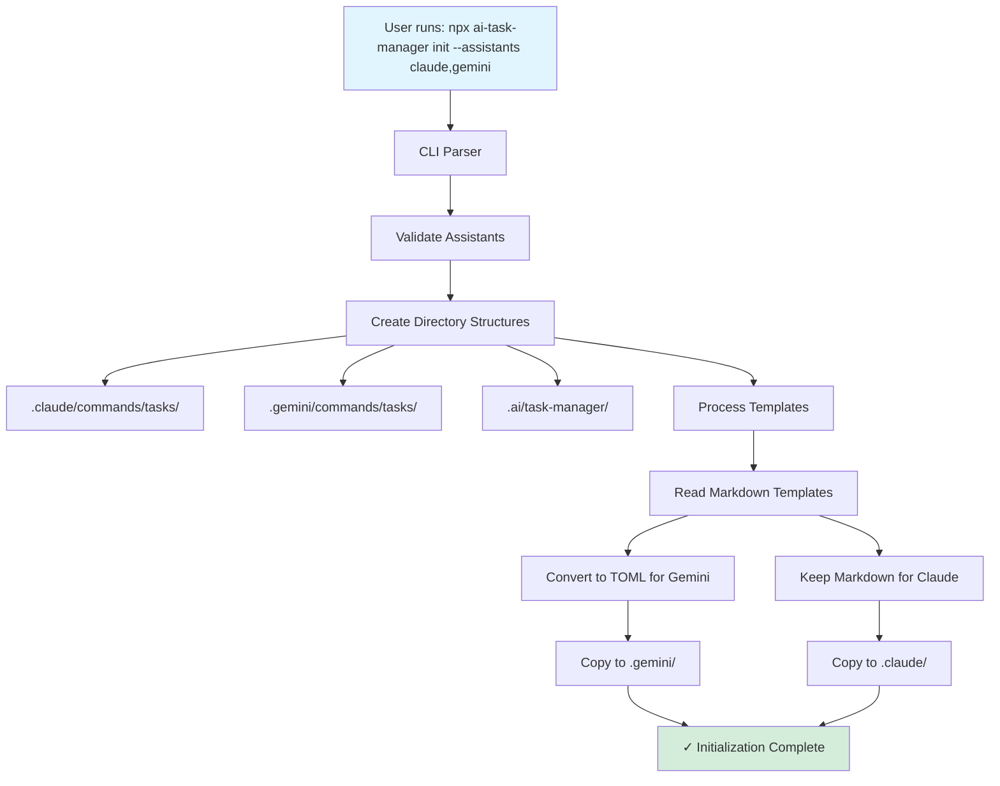

### Command Execution Flow

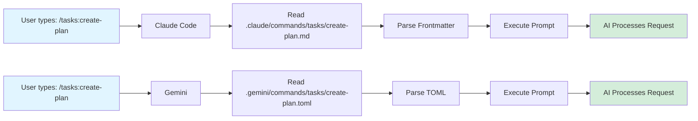

### Template Update Flow

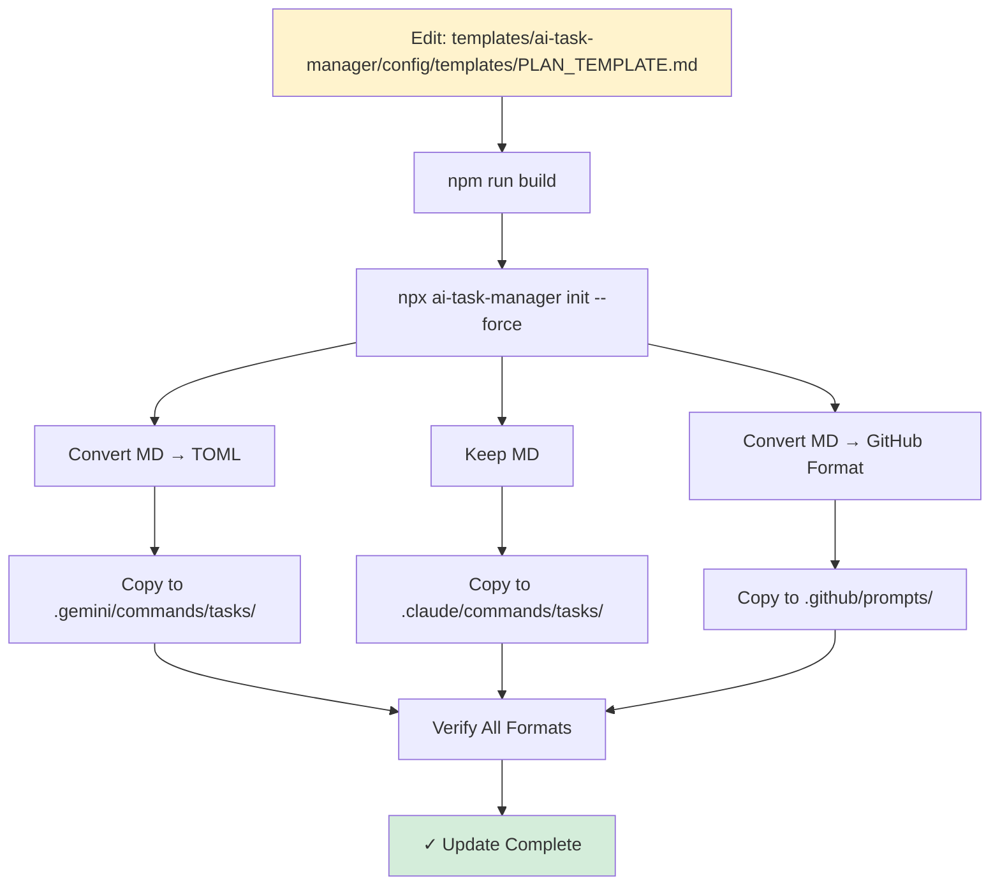

### Directory Structure

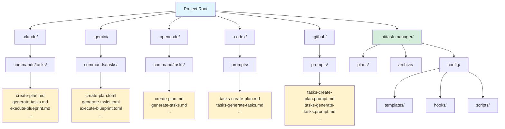

---

## MCP Architecture

### Initialization Flow

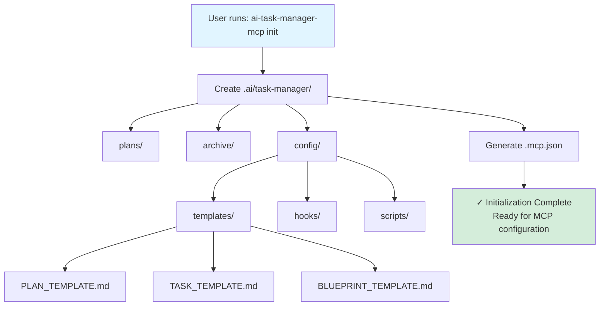

### MCP Configuration

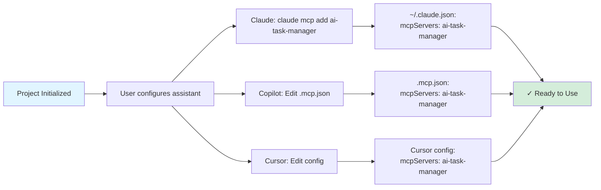

### Command Execution Flow

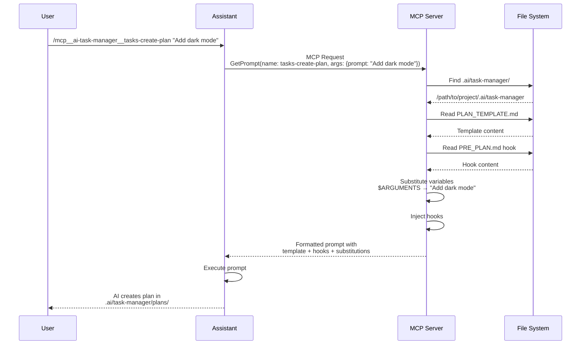

### Template Update Flow

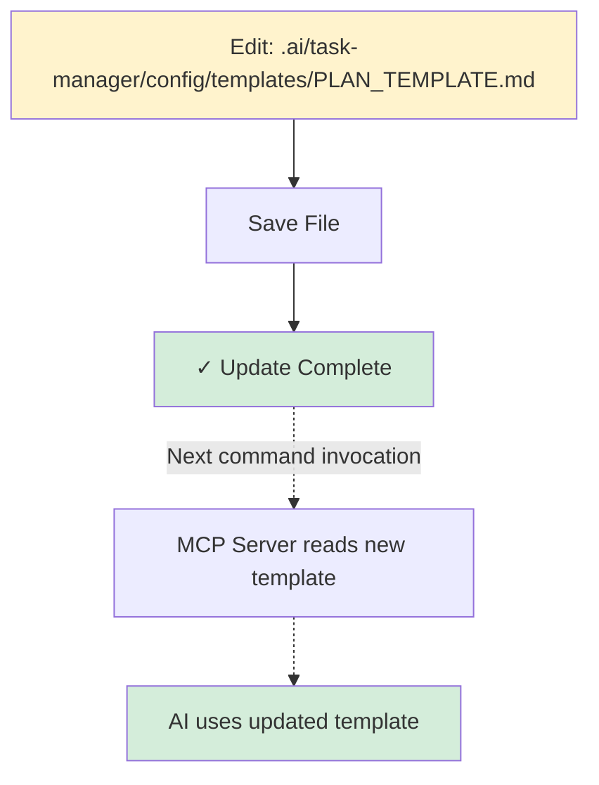

### Directory Structure

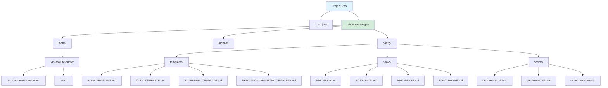

---

## Side-by-Side Comparison

### Initialization

```mermaid
graph TB
    subgraph "File-Based (Current)"
        FB_User[User] --> FB_Init[npx ai-task-manager init<br/>--assistants claude,gemini]
        FB_Init --> FB_Create5[Create 5 directory structures]
        FB_Create5 --> FB_Convert[Convert templates to 3 formats]
        FB_Convert --> FB_Copy[Copy ~40 files]
        FB_Copy --> FB_Done[✓ Done]
    end

    subgraph "MCP Approach"
        MCP_User[User] --> MCP_Init[ai-task-manager-mcp init]
        MCP_Init --> MCP_Create1[Create 1 directory structure]
        MCP_Create1 --> MCP_Copy[Copy ~15 files<br/>single format]
        MCP_Copy --> MCP_Config[Configure MCP client]
        MCP_Config --> MCP_Done[✓ Done]
    end

    style FB_Done fill:#d4edda
    style MCP_Done fill:#d4edda
```

### Command Execution

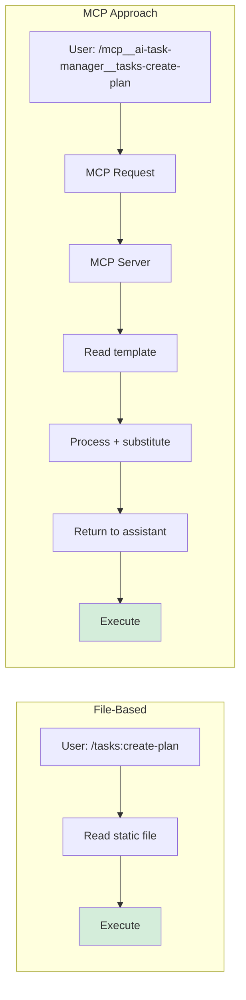

### Template Updates

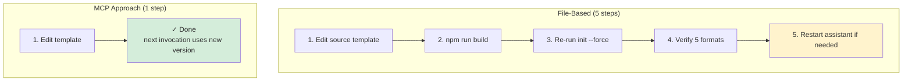

---

## MCP Server Internal Architecture

### Server Components

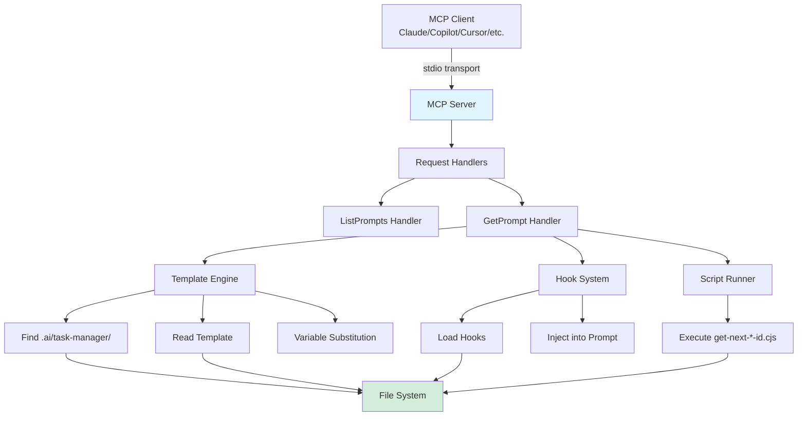

### Prompt Generation Pipeline

```mermaid
graph LR
    Request[MCP GetPrompt Request]

    Request --> Validate[Validate Arguments]
    Validate --> FindProj[Find Project<br/>.ai/task-manager/]
    FindProj --> LoadTemplate[Load Template<br/>from templates/]
    LoadTemplate --> LoadHooks[Load Hooks<br/>from hooks/]
    LoadHooks --> Substitute[Substitute Variables<br/>$ARGUMENTS → value]
    Substitute --> InjectHooks[Inject Hooks<br/>PRE_* and POST_*]
    InjectHooks --> Format[Format Response]
    Format --> Return[Return to Client]

    style Request fill:#e1f5ff
    style Return fill:#d4edda
```

---

## Multi-Assistant Support Comparison

### Current (Hardcoded Support)

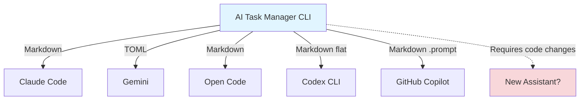

### MCP (Universal Support)

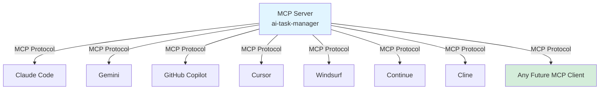

---

## Migration Flow

### Automated Migration Process

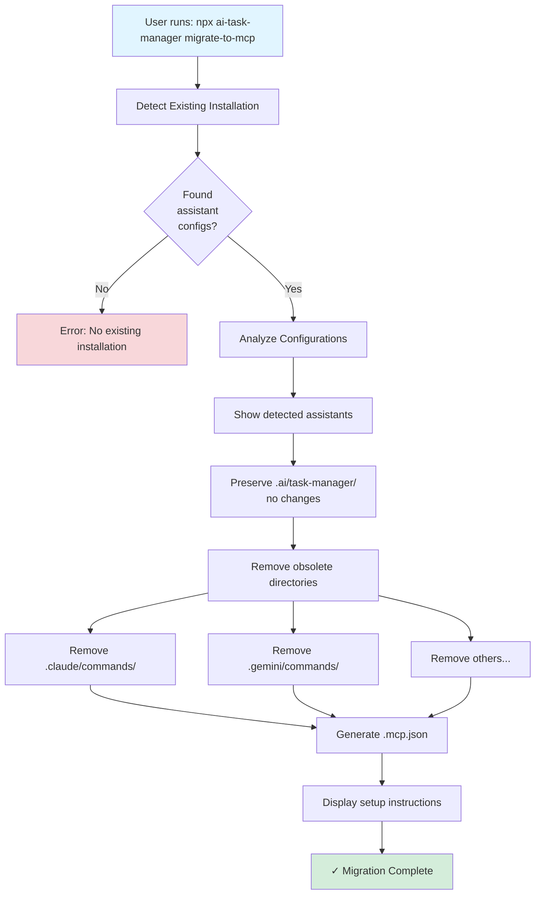

---

## Performance Comparison

### File-Based Latency

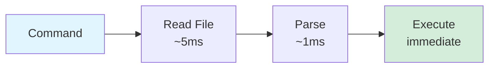

**Total**: ~5ms overhead

### MCP Latency (First Call)

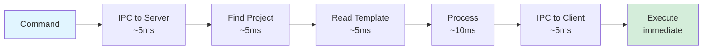

**Total**: ~30ms overhead (first call)

### MCP Latency (Cached)

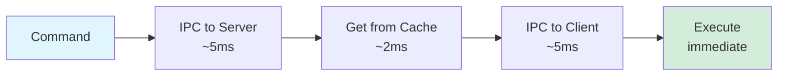

**Total**: ~12ms overhead (cached)

---

## Complexity Comparison

### Codebase Modules

```mermaid
graph TB
    subgraph "File-Based (~2,500 LOC)"
        FB_CLI[CLI<br/>60 LOC]
        FB_Index[Index<br/>630 LOC]
        FB_Utils[Utils<br/>260 LOC]
        FB_Meta[Metadata<br/>120 LOC]
        FB_Conflict[Conflict Detector<br/>150 LOC]
        FB_Prompts[Interactive Prompts<br/>100 LOC]
        FB_Types[Types<br/>290 LOC]

        FB_CLI --> FB_Index
        FB_Index --> FB_Utils
        FB_Index --> FB_Meta
        FB_Index --> FB_Conflict
        FB_Index --> FB_Prompts
    end

    subgraph "MCP Approach (~800 LOC)"
        MCP_Server[Server<br/>200 LOC]
        MCP_Prompts[Prompts<br/>250 LOC]
        MCP_Template[Template Engine<br/>150 LOC]
        MCP_Hooks[Hooks<br/>100 LOC]
        MCP_Types[Types<br/>100 LOC]

        MCP_Server --> MCP_Prompts
        MCP_Prompts --> MCP_Template
        MCP_Prompts --> MCP_Hooks
    end

    style FB_Index fill:#f8d7da
    style FB_Utils fill:#f8d7da
    style FB_Meta fill:#f8d7da
    style FB_Conflict fill:#f8d7da
    style MCP_Server fill:#d4edda
```

**Reduction**: 70% less code

---

## Legend

```mermaid
graph LR
    User[User Action]
    Process[Process/Operation]
    Decision{Decision Point}
    Success[Success State]
    Error[Error State]

    style User fill:#e1f5ff
    style Process fill:#ffffff
    style Success fill:#d4edda
    style Error fill:#f8d7da
```

---

**See Also**:
- [`mcp-architecture-analysis.md`](./mcp-architecture-analysis.md) - Full technical details
- [`executive-summary.md`](./executive-summary.md) - High-level overview
- [`quick-reference.md`](./quick-reference.md) - Side-by-side comparison
