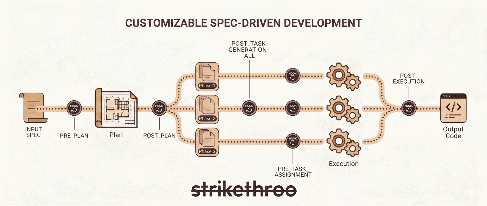
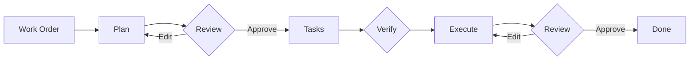
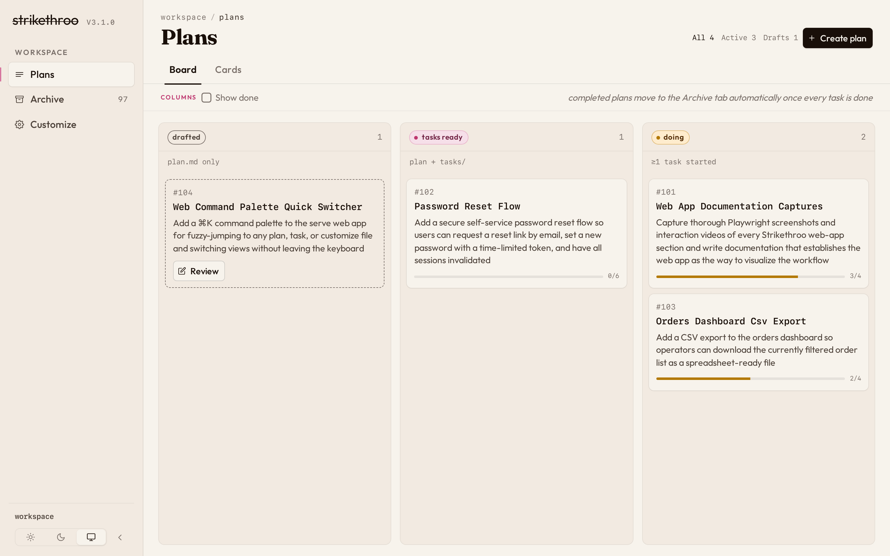
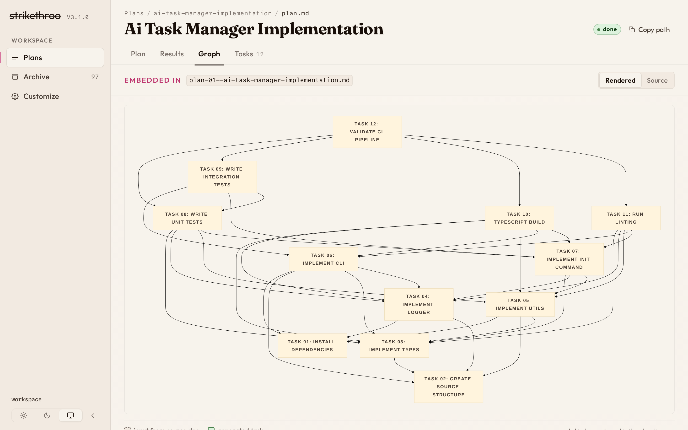
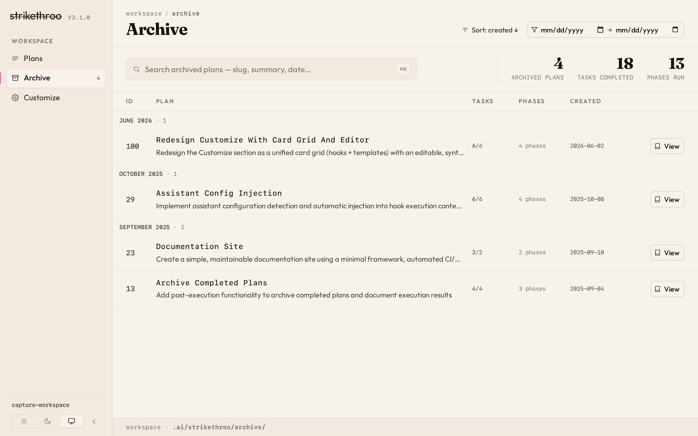

<p align="center">
  
</p>

<p align="center">
  <strong>Spec-driven development that fits each codebase like a glove.</strong><br>
  Plain-Markdown hooks teach the agent your conventions, so every plan, task, and run inherits them. No API keys, no extra tools to run.
</p>

<p align="center">
  <a href="https://www.npmjs.com/package/strikethroo"></a>
  <a href="https://github.com/e0ipso/strikethroo/actions/workflows/test.yml"></a>
  <a href="package.json"></a>
  <a href="LICENSE"></a>
</p>

<p align="center">
  <a href="https://strikethroo.canpicasoft.com/workflow.html">Workflow</a> &nbsp;·&nbsp;
  <a href="https://strikethroo.canpicasoft.com/customization.html">Customization</a> &nbsp;·&nbsp;
  <a href="https://strikethroo.canpicasoft.com/visualizations.html">Visualizations</a> &nbsp;·&nbsp;
  <a href="https://strikethroo.canpicasoft.com/faq.html">FAQ</a>
</p>

## Why Strikethroo?

<table>
<tr>
<td width="50%" valign="top">


### Bends to your conventions

Plain-Markdown hooks fire at nine points across the workflow; inject your test commands, standards, and domain rules so every plan, task, and run inherits them. No plugins, no code.

</td>
<td width="50%" valign="top">


### Clean context per agent

Every step runs with a fresh, focused context: the planner sees only your work order, the task generator only the approved plan, each execution sub-agent only its single task. No context bleed, no drift.

</td>
</tr>
<tr>
<td width="50%" valign="top">


### No API keys

Runs inside the assistant you already use -- Claude Code, Codex, Cursor, OpenCode, or Copilot -- on the subscription you already pay for. Nothing to provision, host, or rotate.

</td>
<td>


### Harness-agnostic skills

The workflow ships as Agent Skills: one `SKILL.md` works on any harness supporting the format. Install once; the right skill auto-loads when you describe what you need.

</td>
<td width="50%" valign="top"></td>
</tr>
</table>

## Adapts to every codebase

Every codebase has its own conventions, and Strikethroo bends to them instead of imposing its own. Three plain-Markdown surfaces -- no plugins, no code:

[](docs/assets/strikethroo-customization.png)

###  Hooks

Fire at nine points across the workflow (before planning, after each phase, on errors, and more). Drop in your test commands, coding standards, and domain rules; every plan, task, and execution run inherits them.

###  Templates

Define the shape of plans and tasks -- add your own sections and checklists.

###  Project context

One file of domain knowledge every step reads.

Hooks, templates, and a project-context file are all plain Markdown -- nothing to compile, no plugin API to learn. See the [Customization Guide](https://strikethroo.canpicasoft.com/customization.html) for examples.

## Quick Start

```bash
# 1. Bootstrap the shared workspace
npx strikethroo init --harnesses claude

# 2. Install the workflow skills
npx skills add e0ipso/strikethroo
```

Requires Node.js 22+ and an assistant that supports the Agent Skills format.

## In your coding assistant



Three steps, each delivered as an Agent Skill that loads when you describe what you need:

| Step        | Skill                           | Output                                            |
|-------------|---------------------------------|---------------------------------------------------|
| **Plan**    | `/st-create-plan <your prompt>` | `.ai/strikethroo/plans/64--auth/plan-64--auth.md` |
| **Tasks**   | `/st-generate-tasks 64`         | `.ai/strikethroo/plans/64--auth/tasks/*.md`       |
| **Execute** | `/st-execute-blueprint 64`      | Working code, one commit per phase                |

Human review gates between steps catch scope creep before any code is written. Each step runs with clean context -- the planning agent sees only the work order, the task agent sees only the approved plan, and each execution sub-agent receives only its specific task.

See the [Workflow Guide](https://strikethroo.canpicasoft.com/workflow.html) for the full step-by-step with advanced patterns. Once a plan exists, visualize its plans, tasks, and dependency graph in [Visualizations](https://strikethroo.canpicasoft.com/visualizations.html).

## Visualize the data
Strikethroo comes with an optional **web application** to help you visualize your plans, tasks, and progress. No installation necessary, just execute the following command in a project using Strikethroo:

```shell
npx strikethroo serve
```

This will open a web page that will help you navigate your plans and their tasks, present or archived.

| Plans board                                                 | Plan detail page                                                                                                       | Archive                                                     |
|-------------------------------------------------------------|------------------------------------------------------------------------------------------------------------------------|-------------------------------------------------------------|
| [](docs/assets/plans-board.png) | [](docs/assets/plan-detail-graph.png) | [](docs/assets/archive-all.png) |

## Documentation

- [Workflow Guide](https://strikethroo.canpicasoft.com/workflow.html) -- Step-by-step workflow with visual guides
- [Customization Guide](https://strikethroo.canpicasoft.com/customization.html) -- Hooks, templates, and project context
- [Reference](https://strikethroo.canpicasoft.com/reference.html) -- Glossary and CLI reference
- [FAQ](https://strikethroo.canpicasoft.com/faq.html) -- Answers to common questions
- [Visualizations](https://strikethroo.canpicasoft.com/visualizations.html) -- See plans, tasks, and the dependency graph
- [Migrating from 1.x](https://strikethroo.canpicasoft.com/migration.html) -- Upgrade from slash commands to Agent Skills
