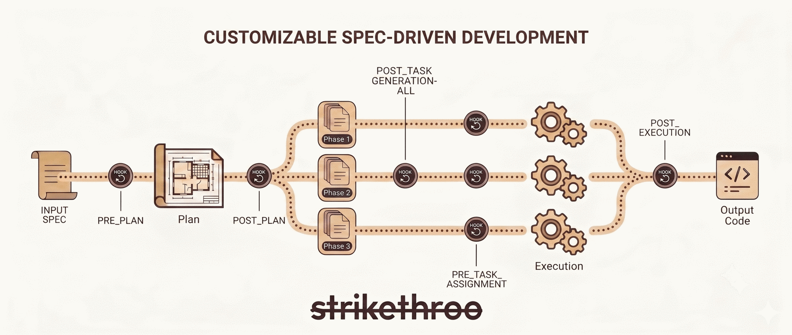
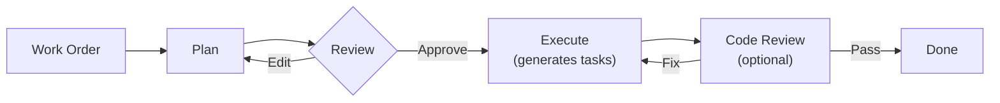
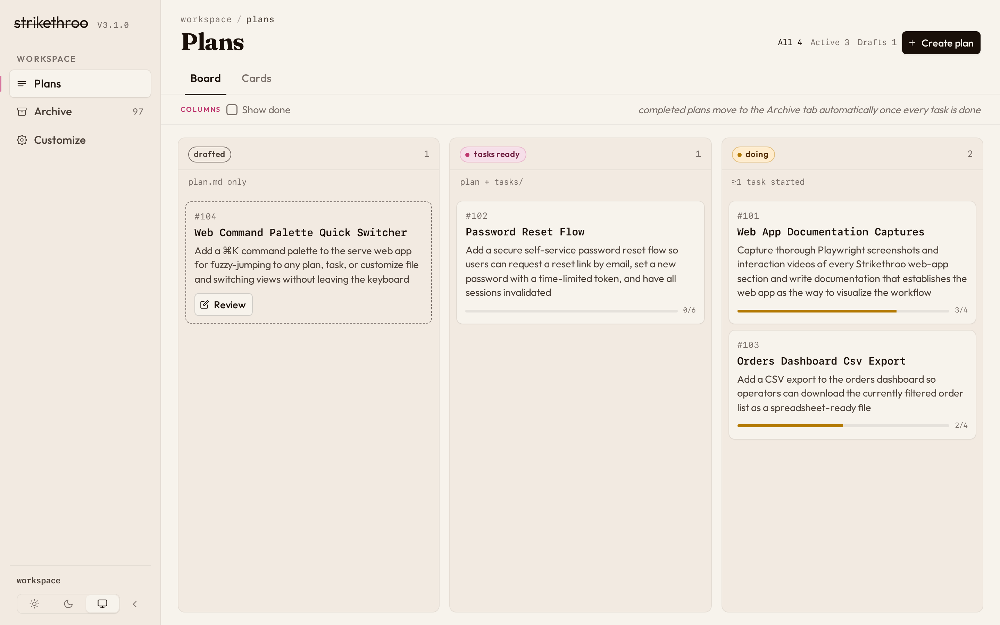
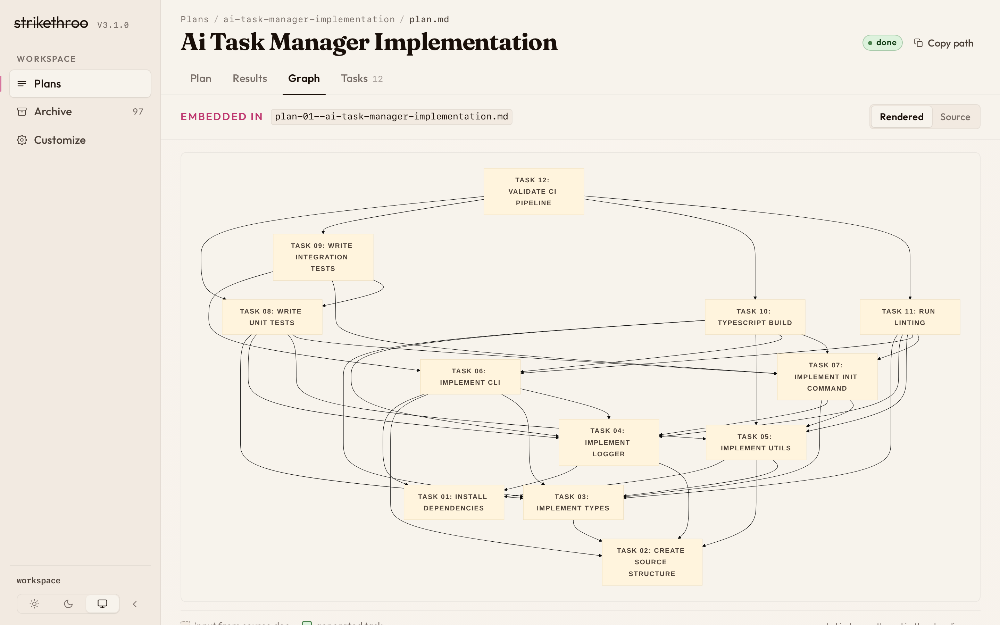
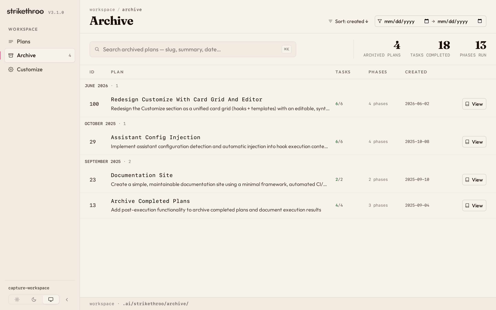

<p align="center">
  
</p>

<p align="center">
  <strong>Spec-driven development optimized for time-to-merge, not time-to-first-draft.</strong><br>
  You review the plan, where a correction costs a sentence &mdash; not the diff, where it costs a review cycle.
</p>

<p align="center">
  <a href="https://www.npmjs.com/package/strikethroo"></a>
  <a href="https://github.com/e0ipso/strikethroo/actions/workflows/test.yml"></a>
  <a href="package.json"></a>
  <a href="LICENSE"></a>
</p>

<p align="center">
  <a href="https://strikethroo.canpicasoft.com/why.html">Why Strikethroo</a> &nbsp;·&nbsp;
  <a href="https://strikethroo.canpicasoft.com/workflow.html">Workflow</a> &nbsp;·&nbsp;
  <a href="https://strikethroo.canpicasoft.com/customization.html">Customization</a> &nbsp;·&nbsp;
  <a href="https://strikethroo.canpicasoft.com/visualizations.html">Visualizations</a> &nbsp;·&nbsp;
  <a href="https://strikethroo.canpicasoft.com/faq.html">FAQ</a>
</p>

## Why Strikethroo?

Most spec-driven tools optimize the input: better spec in, better code out, human catches the rest at the end. Strikethroo assumes the agent is an unreliable narrator of its own work -- including a second agent asked to review the first -- and that the scarce resource is your attention, not tokens.

<table>
<tr>
<td width="50%" valign="top">


### You review the plan, not the diff

Correcting a plan costs a sentence. Correcting the same misunderstanding in a diff costs a review cycle, a rework cycle, and a re-review. An explicit approval gate puts your careful read where it is worth the most, and one question is asked at a time so it never gets skim-answered.

</td>
<td width="50%" valign="top">


### Guarantees are compiled, not requested

A rule in Markdown is a request; a rule in TypeScript is a guarantee. Hooks and templates are yours to edit. Termination bounds, safety floors, and fail-safe defaults are compiled -- `MAX_REVIEW_ROUNDS` can be tightened by config and raised by nothing.

</td>
</tr>
<tr>
<td width="50%" valign="top">


### Nobody marks their own homework

The optional review gate runs on a *different* harness than the one that wrote the code -- the current harness is structurally excluded from the candidate set, not merely deprioritized. The reviewer detects and never fixes; remediation is dispatched separately.

</td>
<td width="50%" valign="top">


### Bends to your conventions

Plain-Markdown hooks fire at eleven points across the workflow; inject your test commands, standards, and domain rules so every plan, task, and run inherits them. No plugins, no code.

</td>
</tr>
</table>

**Speed, measured honestly.** The industry clock starts at the prompt and stops when code appears. The clock that pays your salary stops when the code is **merged** -- and on that clock, generation is a rounding error next to the review rounds a fast-but-wrong draft costs you. Strikethroo is built against the second clock. That is not quality traded for speed; on that clock they are the same number.

Read the full thesis, with the file-by-file claims to verify it yourself: **[Why Strikethroo](https://strikethroo.canpicasoft.com/why.html)**.

<sub>Also true, and less interesting: no API keys (runs on the subscription you already pay for), harness-agnostic Agent Skills (one `SKILL.md` on any harness supporting the format), and clean per-agent context at every step.</sub>

## Adapts to every codebase

Every codebase has its own conventions, and Strikethroo bends to them instead of imposing its own. Three plain-Markdown surfaces -- no plugins, no code:

[](docs/assets/strikethroo-customization.png)

###  Hooks

Fire at eleven points across the workflow (before planning, after each phase, on errors, and more). Drop in your test commands, coding standards, and domain rules; every plan, task, and execution run inherits them.

###  Templates

Define the shape of plans and tasks -- add your own sections and checklists.

###  Project context

One file of domain knowledge every step reads.

Hooks, templates, and a project-context file are all plain Markdown -- nothing to compile, no plugin API to learn. See the [Customization Guide](https://strikethroo.canpicasoft.com/customization.html) for examples.

## Quick Start

```bash
npx strikethroo init --harnesses claude
```

This creates the shared `.ai/strikethroo/` workspace and installs the workflow skills.

Requires Node.js 22+ and an assistant that supports the Agent Skills format.

## Profiles: a tailored setup in one step

A strikethroo profile packages a complete workspace configuration -- hooks, templates, project context -- so `init --profile <folder | user/repo | git URL>` starts from a setup tuned for your stack instead of the shipped defaults, and `export profile` packages yours to share. See [Strikethroo profiles](https://strikethroo.canpicasoft.com/customization.html#strikethroo-profiles) in the Customization Guide.

## In your coding assistant


```mermaid
flowchart LR
    A[Work Order] --> B[Plan]
    B --> C{Review}
    C -->|Edit| B
    C -->|Approve| G["Execute<br/>(generates tasks)"]
    G --> H["Code Review<br/>(optional)"]
    H -->|Fix| G
    H -->|Pass| J[Done]
```

**Two commands.** Read the plan, approve it, run it:

| Step        | Command                         | Output                                                  |
|-------------|---------------------------------|---------------------------------------------------------|
| **Plan**    | `/st-create-plan <your prompt>` | `.ai/strikethroo/plans/64--auth/plan-64--auth.md`       |
| **Execute** | `/st-execute-blueprint 64`      | Task blueprint, then working code, one commit per phase |
| **Review**  | Automatic (optional)            | Findings validated against schema; bounded fixes        |

`st-execute-blueprint` decomposes the plan into atomic tasks and builds the dependency-mapped blueprint itself when one does not exist yet. Run `/st-generate-tasks 64` on its own only when you want to inspect or hand-tune the blueprint before execution starts.

Your review lands on the plan, before any code exists -- that is where a correction costs a sentence. Each step runs with clean context: the planning agent sees only the work order, and each execution sub-agent receives only its specific task. After execution, an optional automated review gate runs on a discovered second harness, critiques the cumulative diff, and drives bounded remediation if findings exceed configured thresholds.

See the [Workflow Guide](https://strikethroo.canpicasoft.com/workflow.html) for the full step-by-step with advanced patterns. Once a plan exists, visualize its plans, tasks, and dependency graph in [Visualizations](https://strikethroo.canpicasoft.com/visualizations.html).

## Visualize the data
Strikethroo comes with an optional **web application** to help you visualize your plans, tasks, and progress. No installation necessary, just execute the following command in a project using Strikethroo:

```shell
npx strikethroo serve
```

This will open a web page that will help you navigate your plans and their tasks, present or archived.

## Check the workspace

```shell
npx strikethroo validate
```

Reads your workspace and reports internal inconsistencies -- missing or malformed plan and task frontmatter, dependencies pointing at tasks that do not exist, dependency cycles, blueprint phases and task files that disagree, duplicate ids. It only reads: nothing is written or fixed for you. Every finding is an error, so the command exits non-zero as soon as it reports one, which makes it usable as a CI step. Add `--json` for a machine-readable report on stdout, or `--workspace <path>` to point it at a workspace other than the one discovered from the current directory.

| Plans board                                                 | Plan detail page                                                                                                       | Archive                                                     |
|-------------------------------------------------------------|------------------------------------------------------------------------------------------------------------------------|-------------------------------------------------------------|
| [](docs/assets/plans-board.png) | [](docs/assets/plan-detail-graph.png) | [](docs/assets/archive-all.png) |

## Optional Code Review Gate

After blueprint execution, an optional automated code review gate runs when a second harness is discovered. The reviewer critiques the cumulative diff against the plan's requirements, emits findings validated against a schema, and hands high-confidence findings to the implementer for remediation. Any applied fix forces a full re-run of tests and validation before re-verification.

**To disable:** Edit `.ai/strikethroo/config/hooks/CODE_REVIEW.md` to empty or delete it. The gate skips cleanly with a note in the execution summary.

**Important:** A green review gate is not a correctness guarantee. The gate reduces exposure to the same class of error a human PR approval reduces, and leaves the same class of error behind. See [Customization](https://strikethroo.canpicasoft.com/customization.html) for limitations and configuration.

## Documentation

- [Why Strikethroo](https://strikethroo.canpicasoft.com/why.html) -- The design thesis, the trade-offs stated plainly, and how to verify the claims
- [Workflow Guide](https://strikethroo.canpicasoft.com/workflow.html) -- Step-by-step workflow with visual guides
- [Customization Guide](https://strikethroo.canpicasoft.com/customization.html) -- Hooks, templates, project context, and code review configuration
- [Reference](https://strikethroo.canpicasoft.com/reference.html) -- Glossary and CLI reference
- [FAQ](https://strikethroo.canpicasoft.com/faq.html) -- Answers to common questions
- [Visualizations](https://strikethroo.canpicasoft.com/visualizations.html) -- See plans, tasks, and the dependency graph
- [Migration Guides](https://strikethroo.canpicasoft.com/migration.html) -- Upgrade from slash commands or the retired skills installer
