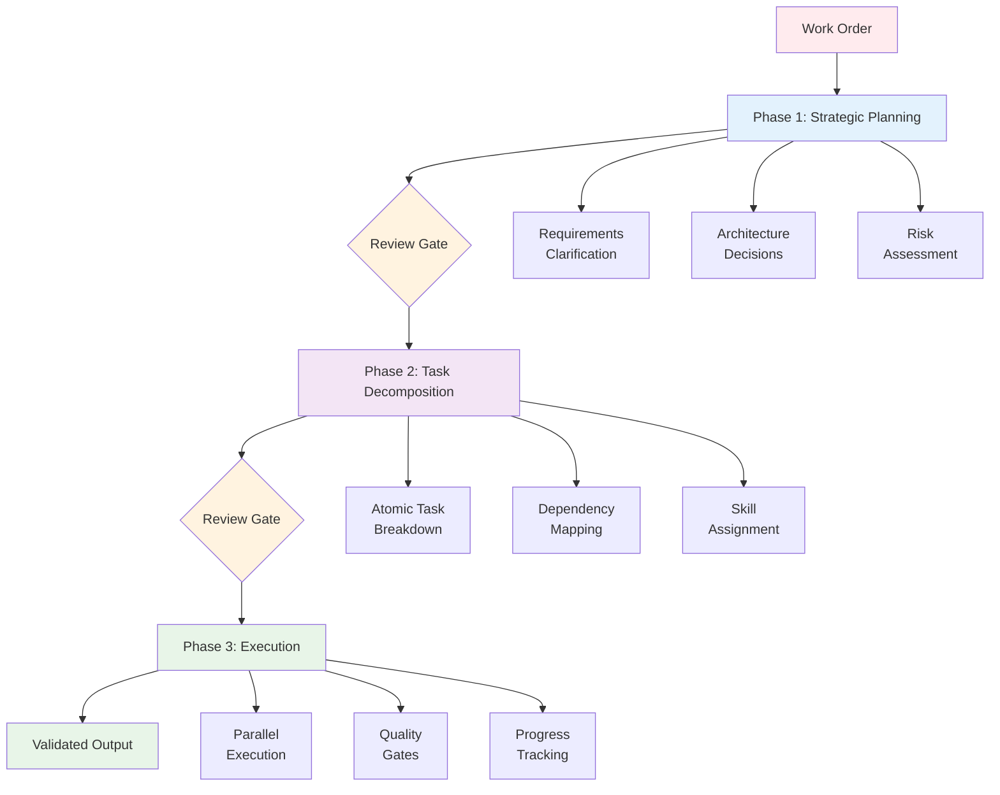
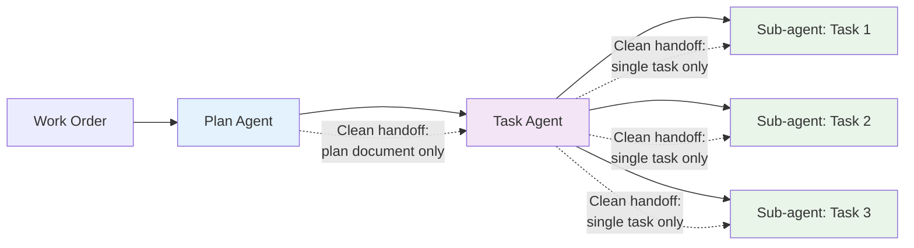

# How It Works

AI Task Manager structures AI-assisted development into a **three-phase workflow** with **context management** at its core. Each phase operates with focused context, separated by human review gates that prevent scope creep and catch misunderstandings before they compound.

## The Three-Phase Workflow

A work order enters the system and passes through three distinct phases: strategic planning, task decomposition, and execution. Human review gates between phases ensure the AI stays aligned with actual requirements.



### Phase 1: Strategic Planning

**Input**: Work order with project requirements

**Process**:
1. AI asks clarifying questions about ambiguous requirements
2. Documents requirements, constraints, and non-goals
3. Proposes a technical approach
4. Identifies risks and success criteria

**Output**: A comprehensive plan document

**Review gate**: The human reviews the plan before Phase 2 begins. This is where you verify requirements are captured accurately, remove unrequested features (YAGNI enforcement), and adjust the technical approach. Catching scope creep here, before any code exists, is far cheaper than catching it during execution.

### Phase 2: Task Decomposition

**Input**: The approved plan

**Process**:
1. AI breaks the plan into atomic tasks (1-2 skills each)
2. Maps dependencies between tasks
3. Assigns skills for specialized sub-agent deployment
4. Generates the execution blueprint organized into phases

**Output**: Task documents + dependency graph + execution blueprint

**Review gate**: The human reviews all tasks before execution begins. This is the final opportunity to control scope -- delete unnecessary tasks, adjust dependencies, and verify that the breakdown matches the approved plan.

### Phase 3: Execution

**Input**: Approved tasks and execution blueprint

**Process**:
1. Sub-agents execute tasks phase by phase
2. Independent tasks within a phase run in parallel
3. Quality gates run after each phase (configurable via `POST_PHASE` hook)
4. Results are committed and the next phase begins

**Output**: Working implementation with commits per phase

**Quality gates** (configurable via `POST_PHASE` hook):
- Linting passes
- Tests pass
- Coverage thresholds met
- Security scans pass
- Documentation updated

Quality is enforced incrementally at each phase boundary, not deferred to the end. Git commits at phase boundaries create natural rollback points, making it straightforward to identify which phase introduced an issue.

For hands-off execution, the `task-full-workflow` skill chains all three phases. See the [Workflow Guide](workflow.html) for usage details.

---

## Context Management

Context management is the architectural foundation that makes the three-phase workflow effective. Without it, AI assistants accumulate planning context, implementation details, and error-handling noise in a single conversation -- degrading output quality as the context window fills.

AI Task Manager solves this by giving each agent a **clean, focused context** containing only what it needs.

### How context is isolated

**Phase 1 -- Plan creation agent**:
```
Work order + Clarifying questions + Project context (TASK_MANAGER.md)
```
The planning agent receives the full work order and project context. Its entire reasoning power is focused on understanding requirements and producing a sound plan. It never sees implementation code.

**Phase 2 -- Task generation agent**:
```
Approved plan + Task decomposition rules + Dependency logic
```
The task generation agent receives a clean context loaded only with the approved plan. It does not carry over the back-and-forth from the planning conversation. This prevents planning-phase noise from influencing task structure.

**Phase 3 -- Execution sub-agents** (one per task):
```
Single task + Its dependencies + Acceptance criteria + Project context
```
Each sub-agent receives only the specific task it must implement, plus the outputs of its dependency tasks. It does not see other tasks, the full plan, or the planning conversation. This is the key design decision: sub-agents operate with minimal, precise context rather than accumulated conversational history.

### Why this matters



- **No context accumulation**: Each agent starts fresh. The tenth task gets the same quality of attention as the first.
- **Parallel execution without interference**: Tasks within a phase run in separate sub-agents, so they cannot pollute each other's context.
- **Phases execute in sequence**: A phase completes (and passes its quality gates) before the next phase begins, ensuring dependent tasks have validated inputs.
- **Predictable quality**: Output quality does not degrade as the project grows in complexity, because no single agent ever handles the full complexity.

For the rationale behind this design, see [Why AI Task Manager](why.html).

---

## Skill-Based Decomposition

Each task is assigned 1-2 skills that describe the domain expertise required. Skills drive how sub-agents are specialized during execution.

```yaml
# Task 1
skills: ["database", "schema-design"]
# -> Database specialist sub-agent

# Task 2
skills: ["react-components", "ui"]
# -> Frontend specialist sub-agent

# Task 3
skills: ["api-endpoints", "authentication"]
# -> Backend specialist sub-agent
```

**Why 1-2 skills maximum**: A task requiring 3 or more skills is a signal that it should be subdivided. The constraint keeps tasks atomic and ensures each sub-agent has deep, focused expertise rather than shallow generalist knowledge.

**Benefits**:
- Deeper domain expertise per task
- Better code quality from specialized context
- Natural parallelism -- independent tasks in the same phase run concurrently

---

## Hooks and Lifecycle

Nine lifecycle hooks let you inject custom logic at key workflow points. Hooks are Markdown files in `.ai/task-manager/config/hooks/` containing instructions that AI assistants interpret and execute.

| Hook | When It Fires | Typical Use |
|------|--------------|-------------|
| `PRE_PLAN` | Before plan creation begins | Inject architecture guidelines, remind about YAGNI |
| `POST_PLAN` | After plan is created | Validate plan structure |
| `PRE_PHASE` | Before each execution phase | Phase preparation, environment setup |
| `POST_PHASE` | After each execution phase | Quality gates (lint, test, coverage, security) |
| `PRE_TASK_ASSIGNMENT` | Before agent selection for a task | Custom agent selection logic |
| `PRE_TASK_EXECUTION` | Before a task begins execution | Task pre-flight checks |
| `POST_TASK_GENERATION_ALL` | After all tasks are generated | Task refinement, dependency validation |
| `POST_EXECUTION` | After all phases complete | Final test suite, security scans, archival |
| `POST_ERROR_DETECTION` | When an error is detected | Error handling, notifications |

See the [Customization Guide](customization.html) for detailed hook examples and real-world scenarios.

---

## Configuration

### Project Context (TASK_MANAGER.md)

The `TASK_MANAGER.md` file in `.ai/task-manager/config/` provides project context that AI assistants reference for every task. Document your tech stack, coding standards, architecture decisions, and links to relevant documentation here.

### Templates

Five customizable templates structure the artifacts produced at each phase:

- **PLAN_TEMPLATE.md** -- Plan structure with requirements, architecture, risks, and success criteria
- **TASK_TEMPLATE.md** -- Task structure with acceptance criteria, dependencies, and implementation notes
- **BLUEPRINT_TEMPLATE.md** -- Execution blueprint with phases and parallelization strategy
- **EXECUTION_SUMMARY_TEMPLATE.md** -- Post-completion documentation capturing results and learnings
- **FIX_BROKEN_TESTS_TEMPLATE.md** -- Enforces proper test fixes over workarounds

Templates use YAML frontmatter for structured metadata and support variable substitution for dynamic content (plan ID, task ID, arguments).

See the [Customization Guide](customization.html) for template modification examples.

---

## Next Steps

- **[Customization Guide](customization.html)** -- Customize hooks, templates, and workflows for your project
- **[Workflow Guide](workflow.html)** -- Day-to-day usage patterns
- **[Advanced Workflow Patterns](workflow.html#advanced-patterns)** -- Advanced patterns for complex projects
- **[Reference](reference.html)** -- Glossary of canonical terms, CLI reference, FAQ
