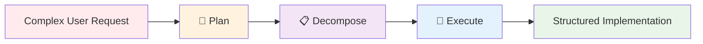

# 🤖 AI Task Manager

[](https://www.npmjs.com/package/@e0ipso/ai-task-manager)
[](https://opensource.org/licenses/MIT)

**Extensible AI-powered task management with customizable workflows and structured development processes.**

AI Task Manager transforms complex development requests into organized, executable workflows through **customizable hooks**, **flexible templates**, and **progressive refinement**. Built for extensibility, it allows you to tailor every aspect of the task management process to your project's specific needs while working seamlessly within your existing AI subscriptions.

## Why AI Task Manager?

Traditional AI assistant "plan mode" features create plans and immediately execute them in a single context, leading to scope creep, cognitive overload, and limited control. AI Task Manager introduces **progressive refinement with validation gates**, giving you control over what gets built at each phase.

### Key Advantages

- **🔧 Fully Customizable**: Modify hooks, templates, and workflows to match your project's requirements
- **🎯 Extensible Architecture**: Add custom validation gates, quality checks, and workflow patterns
- **📋 Structured Process**: Three-phase approach with mandatory human review gates
- **🔄 Plan Mode Integration**: Augment existing AI features rather than replace them
- **⚡ Parallel Execution**: Specialized agents handle independent tasks simultaneously

## Quick Start

```bash
# 1. Bootstrap the shared task-manager workspace in your project
npx @e0ipso/ai-task-manager init --harnesses claude

# 2. Install the workflow skills for your assistant
npx skills add e0ipso/ai-task-manager
```

The first command creates `.ai/task-manager/` (plans, archive, config) and copies the Claude agents. The second command installs the Agent Skills that implement the workflow (`task-create-plan`, `task-generate-tasks`, `task-execute-blueprint`, and more). Skills are harness-agnostic and load automatically when their description matches your intent.

See [AGENTS.md](https://github.com/e0ipso/ai-task-manager/blob/main/AGENTS.md) for detailed harness-specific instructions.

## The Three-Phase Workflow



1. **📝 Create Plan**: Ask your assistant to plan — the `task-create-plan` skill defines objectives, clarifies requirements, and outlines the technical approach
2. **📋 Generate Tasks**: Ask your assistant to decompose the plan — the `task-generate-tasks` skill breaks it into atomic tasks with dependencies and skill assignments
3. **🚀 Execute Blueprint**: Ask your assistant to execute — the `task-execute-blueprint` skill implements tasks in phases with validation gates

Each phase includes **mandatory human review** of the files written into `.ai/task-manager/plans/`, ensuring you control scope and quality throughout.

## Next Steps

<div class="nav-grid">
  <a href="installation.html" class="nav-card">
    <strong>📦 Installation & Setup</strong>
    <p>Get started with configuration and directory structure</p>
  </a>
  <a href="workflow.html" class="nav-card">
    <strong>🔄 Basic Workflow Guide</strong>
    <p>Learn the day-to-day development workflow</p>
  </a>
  <a href="architecture.html" class="nav-card">
    <strong>🏗️ How It Works</strong>
    <p>Understand the architecture and design principles</p>
  </a>
  <a href="customization.html" class="nav-card">
    <strong>🔧 Customization Guide</strong>
    <p>Tailor hooks and templates to your needs</p>
  </a>
</div>

## Supported Harnesses

Skills are harness-agnostic and work anywhere the Agent Skills format is supported. Works within your existing AI subscriptions — no additional API keys or costs required.
