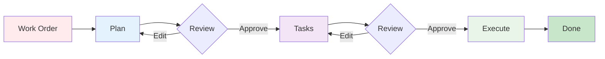

# Strikethroo

[](https://www.npmjs.com/package/strikethroo)
[](https://opensource.org/licenses/MIT)

Strikethroo transforms complex development requests into structured, validated implementations through plain text files and Agent Skills. No API keys. No additional tools. Works within your existing AI subscription and across any harness that supports the Agent Skills format.

## Quick Start

```bash
# 1. Bootstrap the shared workspace
npx strikethroo init --harnesses claude

# 2. Install the workflow skills
npx skills add e0ipso/strikethroo
```

See [Getting Started](getting-started.html) for prerequisites and directory structure.

## How It Works



Three steps, each delivered as an Agent Skill that loads when you describe what you need:

| Step | You say | Skill | Output |
|------|---------|-------|--------|
| **Plan** | "Plan user auth with JWT" | `st-create-plan` | `.ai/strikethroo/plans/01--auth/plan-01--auth.md` |
| **Tasks** | "Decompose plan 1" | `st-generate-tasks` | `.ai/strikethroo/plans/01--auth/tasks/*.md` |
| **Execute** | "Execute the blueprint for plan 1" | `st-execute-blueprint` | Working code, one commit per phase |

Human review gates between steps catch scope creep before any code is written. Each step runs with clean context -- the planning agent sees only the work order, the task agent sees only the approved plan, and each execution sub-agent receives only its specific task.

See the [Workflow Guide](workflow.html) for the full step-by-step with advanced patterns. Once a plan exists, visualize its plans, tasks, and dependency graph in [The Web App](web-app.html).

## Documentation

- [Getting Started](getting-started.html) -- Install and run your first workflow
- [Workflow Guide](workflow.html) -- Step-by-step workflow with visual guides
- [Customization Guide](customization.html) -- Hooks, templates, and project context
- [Reference](reference.html) -- Glossary, CLI reference, FAQ
- [The Web App](web-app.html) -- Visualize plans, tasks, and the dependency graph
- [Migrating from 1.x](migration.html) -- Upgrade from slash commands to Agent Skills
