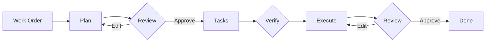

# Strikethroo

Strikethroo is spec-driven development that fits each codebase like a glove. Plain-Markdown hooks teach the agent your conventions -- test commands, coding standards, domain rules -- so every plan, task, and run inherits them. No API keys, no extra tools: it works inside the AI subscription you already pay for, on any harness that supports the Agent Skills format.

## Adapts to every codebase

Every codebase has its own conventions, and Strikethroo bends to them instead of imposing its own. Three plain-Markdown surfaces -- no plugins, no code:

- **Hooks** fire at nine points across the workflow (before planning, after each phase, on errors, and more). Drop in your test commands, coding standards, and domain rules; every plan, task, and execution run inherits them.
- **Templates** define the shape of plans and tasks -- add your own sections and checklists.
- **Project context** is one file of domain knowledge every step reads.



## Why Strikethroo?

<div class="st-cards" markdown="0">
<div class="st-card">
<span class="st-card__icon st-card__icon--sliders-horizontal" aria-hidden="true"></span>
<p class="st-card__title">Bends to your conventions</p>
<p>Plain-Markdown hooks fire at nine points across the workflow &mdash; inject your test commands, standards, and domain rules so every plan, task, and run inherits them. No plugins, no code.</p>
</div>
<div class="st-card">
<span class="st-card__icon st-card__icon--focus" aria-hidden="true"></span>
<p class="st-card__title">Clean context per agent</p>
<p>Every step runs with a fresh, focused context. The planner sees only your work order, the task generator only the approved plan, and each execution sub-agent only its single task. No context bleed, no drift.</p>
</div>
<div class="st-card">
<span class="st-card__icon st-card__icon--scissors" aria-hidden="true"></span>
<p class="st-card__title">YAGNI scope control</p>
<p>Anti-pattern enumeration, an "is this explicitly mentioned?" gate, and a 20&ndash;30% task-reduction target keep plans lean. Every task traces back to an explicit requirement.</p>
</div>
<div class="st-card">
<span class="st-card__icon st-card__icon--key-round" aria-hidden="true"></span>
<p class="st-card__title">No API keys</p>
<p>Runs entirely inside the assistant you already use &mdash; Claude Code, Codex, Cursor, OpenCode, or Copilot &mdash; on the subscription you already pay for. Nothing to provision, host, or rotate.</p>
</div>
<div class="st-card">
<span class="st-card__icon st-card__icon--blocks" aria-hidden="true"></span>
<p class="st-card__title">Harness-agnostic skills</p>
<p>The workflow ships as Agent Skills: one <code>SKILL.md</code> works on any harness supporting the format. Install once, and the right skill auto-loads when you describe what you need.</p>
</div>
</div>

## Quick Start

<div class="st-cards st-cards--2" markdown="0">
<div class="st-card">
<span class="st-card__icon st-card__icon--package" aria-hidden="true"></span>
<p class="st-card__title">1. Bootstrap the workspace</p>
<p>Create the shared <code>.ai/strikethroo/</code> workspace and copy the harness agents.</p>
<pre class="highlight"><code>npx strikethroo init --harnesses claude</code></pre>
</div>
<div class="st-card">
<span class="st-card__icon st-card__icon--puzzle" aria-hidden="true"></span>
<p class="st-card__title">2. Install the workflow skills</p>
<p>Add the harness-agnostic skills that drive plan, task, and execution.</p>
<pre class="highlight"><code>npx skills add e0ipso/strikethroo</code></pre>
</div>
</div>



## In your coding assistant



Three steps, each delivered as an Agent Skill that loads when you describe what you need:

| Step        | Skill                           | Output                                            |
|-------------|---------------------------------|---------------------------------------------------|
| **Plan**    | `/st-create-plan <your prompt>` | `.ai/strikethroo/plans/64--auth/plan-64--auth.md` |
| **Tasks**   | `/st-generate-tasks 64`         | `.ai/strikethroo/plans/64--auth/tasks/*.md`       |
| **Execute** | `/st-execute-blueprint 64`      | Working code, one commit per phase                |


Human review gates between steps catch scope creep before any code is written. Each step runs with clean context &mdash; the planning agent sees only the work order, the task agent sees only the approved plan, and each execution sub-agent receives only its specific task.



See the [Workflow Guide](workflow.html) for the full step-by-step with advanced patterns. Once a plan exists, visualize its plans, tasks, and dependency graph in [Visualizations](visualizations.html).

## Visualize the data

Strikethroo comes with an optional **web application** to help you visualize your plans, tasks, and progress. No installation necessary, just execute the following command in a project using Strikethroo:

```shell
npx strikethroo serve
```

This will open a web page that will help you navigate your plans and their tasks, present or archived.

| Plans board                                                 | Plan detail page                                                                                                       | Archive                                                     |
|-------------------------------------------------------------|------------------------------------------------------------------------------------------------------------------------|-------------------------------------------------------------|
| []({{ '/assets/plans-board.png' \| relative_url }}) | []({{ '/assets/plan-detail-graph.png' \| relative_url }}) | []({{ '/assets/archive-all.png' \| relative_url }}) |

## Documentation

<div class="st-cards" markdown="0">
<a class="st-card" href="{{ '/workflow.html' | relative_url }}">
<span class="st-card__icon st-card__icon--workflow" aria-hidden="true"></span>
<p class="st-card__title">Workflow Guide</p>
<p>Step-by-step workflow with visual guides and advanced patterns.</p>
</a>
<a class="st-card" href="{{ '/customization.html' | relative_url }}">
<span class="st-card__icon st-card__icon--sliders-horizontal" aria-hidden="true"></span>
<p class="st-card__title">Customization Guide</p>
<p>Hooks, templates, and project context to shape the workflow.</p>
</a>
<a class="st-card" href="{{ '/reference.html' | relative_url }}">
<span class="st-card__icon st-card__icon--book-open" aria-hidden="true"></span>
<p class="st-card__title">Reference</p>
<p>Glossary and full CLI reference.</p>
</a>
<a class="st-card" href="{{ '/faq.html' | relative_url }}">
<span class="st-card__icon st-card__icon--circle-help" aria-hidden="true"></span>
<p class="st-card__title">FAQ</p>
<p>Answers to common questions.</p>
</a>
<a class="st-card" href="{{ '/visualizations.html' | relative_url }}">
<span class="st-card__icon st-card__icon--network" aria-hidden="true"></span>
<p class="st-card__title">Visualizations</p>
<p>See plans, tasks, and the dependency graph.</p>
</a>
<a class="st-card" href="{{ '/migration.html' | relative_url }}">
<span class="st-card__icon st-card__icon--circle-arrow-up" aria-hidden="true"></span>
<p class="st-card__title">Migrating from 1.x</p>
<p>Upgrade from slash commands to Agent Skills.</p>
</a>
</div>
