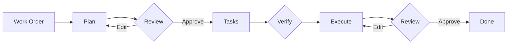

# Strikethroo

[](https://www.npmjs.com/package/strikethroo)
[](https://opensource.org/licenses/MIT)

Strikethroo transforms complex development requests into structured, validated implementations through plain text files and Agent Skills. No API keys. No additional tools. Works within your existing AI subscription and across any harness that supports the Agent Skills format.

## Quick Start

```bash
# 1. Bootstrap the shared workspace
npx strikethroo init --harnesses claude

# 2. Install the workflow skills
npx skills add e0ipso/strikethroo
```

Requires Node.js 14+ and an assistant that supports the Agent Skills format.

## In your coding assistant



Three steps, each delivered as an Agent Skill that loads when you describe what you need:

| Step        | Skill                           | Output                                            |
|-------------|---------------------------------|---------------------------------------------------|
| **Plan**    | `/st-create-plan <your prompt>` | `.ai/strikethroo/plans/64--auth/plan-64--auth.md` |
| **Tasks**   | `/st-generate-tasks 64`         | `.ai/strikethroo/plans/64--auth/tasks/*.md`       |
| **Execute** | `/st-execute-blueprint 64`      | Working code, one commit per phase                |

Human review gates between steps catch scope creep before any code is written. Each step runs with clean context -- the planning agent sees only the work order, the task agent sees only the approved plan, and each execution sub-agent receives only its specific task.

See the [Workflow Guide](workflow.html) for the full step-by-step with advanced patterns. Once a plan exists, visualize its plans, tasks, and dependency graph in [Visualizations](visualizations.html).

## One tool, every project

Every codebase has its own conventions, and Strikethroo bends to them instead of imposing its own. **Hooks** -- plain Markdown files that fire at nine points across the workflow (before planning, after each phase, on errors, and more) -- let you inject your test commands, coding standards, and domain context so every plan, task, and execution run inherits them. Combined with editable templates and a project-context file, it is one workflow shaped to your project's idiosyncrasies -- no plugins, no code.

See the [Customization Guide](customization.html) for hooks, templates, and examples.

## Visualize the data
Strikethroo comes with an optional **web application** to help you visualize your plans, tasks, and progress. No installation necessary, just execute the following command in a project using Strikethroo:

```shell
npx strikethroo serve
```

This will open a web page that will help you navigate your plans and their tasks, present or archived.

| Plans board                                                 | Plan detail page                                                                                                       | Archive                                                     |
|-------------------------------------------------------------|------------------------------------------------------------------------------------------------------------------------|-------------------------------------------------------------|
| []({{ '/assets/plans-board.png' \| relative_url }}) | []({{ '/assets/plan-detail-graph.png' \| relative_url }}) | []({{ '/assets/archive-all.png' \| relative_url }}) |

## Documentation

- [Workflow Guide](workflow.html) -- Step-by-step workflow with visual guides
- [Customization Guide](customization.html) -- Hooks, templates, and project context
- [Reference](reference.html) -- Glossary and CLI reference
- [FAQ](faq.html) -- Answers to common questions
- [Visualizations](visualizations.html) -- See plans, tasks, and the dependency graph
- [Migrating from 1.x](migration.html) -- Upgrade from slash commands to Agent Skills
