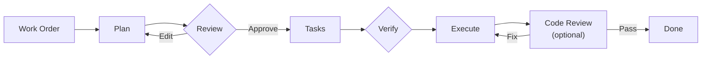

<p align="center">
  
</p>

# Strikethroo

Strikethroo is spec-driven development optimized for **time-to-merge, not time-to-first-draft**. You review the plan, where a correction costs a sentence -- not the diff, where the same correction costs a review cycle. It works inside the AI subscription you already pay for, on any harness that supports the Agent Skills format.

## Why Strikethroo?

Most spec-driven tools optimize the input: better spec in, better code out, human catches the rest at the end. Strikethroo assumes the agent is an unreliable narrator of its own work -- including a second agent asked to review the first -- and that the scarce resource is your attention, not tokens.

<div class="st-cards" markdown="0">
<div class="st-card">
<span class="st-card__icon st-card__icon--focus" aria-hidden="true"></span>
<p class="st-card__title">You review the plan, not the diff</p>
<p>Correcting a plan costs a sentence. Correcting the same misunderstanding in a diff costs a review cycle, a rework cycle, and a re-review. An explicit approval gate puts your careful read where it is worth the most, and one question is asked at a time so it never gets skim-answered.</p>
</div>
<div class="st-card">
<span class="st-card__icon st-card__icon--shield-check" aria-hidden="true"></span>
<p class="st-card__title">Guarantees are compiled, not requested</p>
<p>A rule in Markdown is a request; a rule in TypeScript is a guarantee. Hooks and templates are yours to edit. Termination bounds, safety floors, and fail-safe defaults are compiled &mdash; <code>MAX_REVIEW_ROUNDS</code> can be tightened by config and raised by nothing.</p>
</div>
<div class="st-card">
<span class="st-card__icon st-card__icon--git-fork" aria-hidden="true"></span>
<p class="st-card__title">Nobody marks their own homework</p>
<p>The optional review gate runs on a <em>different</em> harness than the one that wrote the code &mdash; the current harness is structurally excluded from the candidate set, not merely deprioritized. The reviewer detects and never fixes; remediation is dispatched separately.</p>
</div>
<div class="st-card">
<span class="st-card__icon st-card__icon--sliders-horizontal" aria-hidden="true"></span>
<p class="st-card__title">Bends to your conventions</p>
<p>Plain-Markdown hooks fire at eleven points across the workflow &mdash; inject your test commands, standards, and domain rules so every plan, task, and run inherits them. No plugins, no code.</p>
</div>
</div>

**Speed, measured honestly.** The industry clock starts at the prompt and stops when code appears. The clock that pays your salary stops when the code is **merged** -- and on that clock, generation is a rounding error next to the review rounds a fast-but-wrong draft costs you. Strikethroo is built against the second clock. That is not quality traded for speed; on that clock they are the same number.

Read the full thesis, with the file-by-file claims to verify it yourself: **[Why Strikethroo](why.html)**.



## Adapts to every codebase

Every codebase has its own conventions, and Strikethroo bends to them instead of imposing its own. Three plain-Markdown surfaces -- no plugins, no code:


- **Hooks** fire at eleven points across the workflow (before planning, after each phase, on errors, and more). Drop in your test commands, coding standards, and domain rules; every plan, task, and execution run inherits them.
- **Templates** define the shape of plans and tasks -- add your own sections and checklists.
- **Project context** is one file of domain knowledge every step reads.



## Quick Start

<div class="st-cards st-cards--2" markdown="0">
<div class="st-card">
<span class="st-card__icon st-card__icon--package" aria-hidden="true"></span>
<p class="st-card__title">1. Bootstrap the workspace</p>
<p>Create the shared <code>.ai/strikethroo/</code> workspace and copy the harness agents.</p>
<pre class="highlight"><code>npx strikethroo init --harnesses claude</code></pre>
</div>
<div class="st-card">
<span class="st-card__icon st-card__icon--puzzle" aria-hidden="true"></span>
<p class="st-card__title">2. Install the workflow skills</p>
<p>Add the harness-agnostic skills that drive plan, task, and execution.</p>
<pre class="highlight"><code>npx skills add e0ipso/strikethroo</code></pre>
</div>
</div>



## In your coding assistant


```mermaid
flowchart LR
    A[Work Order] --> B[Plan]
    B --> C{Review}
    C -->|Edit| B
    C -->|Approve| D[Tasks]
    D --> E{Verify}
    E --> G[Execute]
    G --> H["Code Review<br/>(optional)"]
    H -->|Fix| G
    H -->|Pass| J[Done]
```

Four steps, three delivered as Agent Skills that load when you describe what you need:

| Step        | Skill                           | Output                                            |
|-------------|---------------------------------|---------------------------------------------------|
| **Plan**    | `/st-create-plan <your prompt>` | `.ai/strikethroo/plans/64--auth/plan-64--auth.md` |
| **Tasks**   | `/st-generate-tasks 64`         | `.ai/strikethroo/plans/64--auth/tasks/*.md`       |
| **Execute** | `/st-execute-blueprint 64`      | Working code, one commit per phase                |
| **Review**  | Automatic (optional)            | Findings validated against schema; bounded fixes  |


Human review gates between steps catch scope creep before any code is written. Each step runs with clean context &mdash; the planning agent sees only the work order, the task agent sees only the approved plan, and each execution sub-agent receives only its specific task. After execution, an optional automated review gate runs on a discovered second harness, critiques the cumulative diff, and drives bounded remediation if findings exceed configured thresholds.



See the [Workflow Guide](workflow.html) for the full step-by-step with advanced patterns. Once a plan exists, visualize its plans, tasks, and dependency graph in [Visualizations](visualizations.html).

## Visualize the data

Strikethroo comes with an optional **web application** to help you visualize your plans, tasks, and progress. No installation necessary, just execute the following command in a project using Strikethroo:

```shell
npx strikethroo serve
```

This will open a web page that will help you navigate your plans and their tasks, present or archived.

| Plans board                                                 | Plan detail page                                                                                                       | Archive                                                     |
|-------------------------------------------------------------|------------------------------------------------------------------------------------------------------------------------|-------------------------------------------------------------|
| []({{ '/assets/plans-board.png' \| relative_url }}) | []({{ '/assets/plan-detail-graph.png' \| relative_url }}) | []({{ '/assets/archive-all.png' \| relative_url }}) |

## Documentation

<div class="st-cards" markdown="0">
<a class="st-card" href="{{ '/why.html' | relative_url }}">
<span class="st-card__icon st-card__icon--shield-check" aria-hidden="true"></span>
<p class="st-card__title">Why Strikethroo</p>
<p>The design thesis, the trade-offs stated plainly, and how to verify the claims.</p>
</a>
<a class="st-card" href="{{ '/workflow.html' | relative_url }}">
<span class="st-card__icon st-card__icon--workflow" aria-hidden="true"></span>
<p class="st-card__title">Workflow Guide</p>
<p>Step-by-step workflow with visual guides and advanced patterns.</p>
</a>
<a class="st-card" href="{{ '/customization.html' | relative_url }}">
<span class="st-card__icon st-card__icon--sliders-horizontal" aria-hidden="true"></span>
<p class="st-card__title">Customization Guide</p>
<p>Hooks, templates, and project context to shape the workflow.</p>
</a>
<a class="st-card" href="{{ '/reference.html' | relative_url }}">
<span class="st-card__icon st-card__icon--book-open" aria-hidden="true"></span>
<p class="st-card__title">Reference</p>
<p>Glossary and full CLI reference.</p>
</a>
<a class="st-card" href="{{ '/faq.html' | relative_url }}">
<span class="st-card__icon st-card__icon--circle-help" aria-hidden="true"></span>
<p class="st-card__title">FAQ</p>
<p>Answers to common questions.</p>
</a>
<a class="st-card" href="{{ '/visualizations.html' | relative_url }}">
<span class="st-card__icon st-card__icon--network" aria-hidden="true"></span>
<p class="st-card__title">Visualizations</p>
<p>See plans, tasks, and the dependency graph.</p>
</a>
<a class="st-card" href="{{ '/migration.html' | relative_url }}">
<span class="st-card__icon st-card__icon--circle-arrow-up" aria-hidden="true"></span>
<p class="st-card__title">Migrating from 1.x</p>
<p>Upgrade from slash commands to Agent Skills.</p>
</a>
</div>
