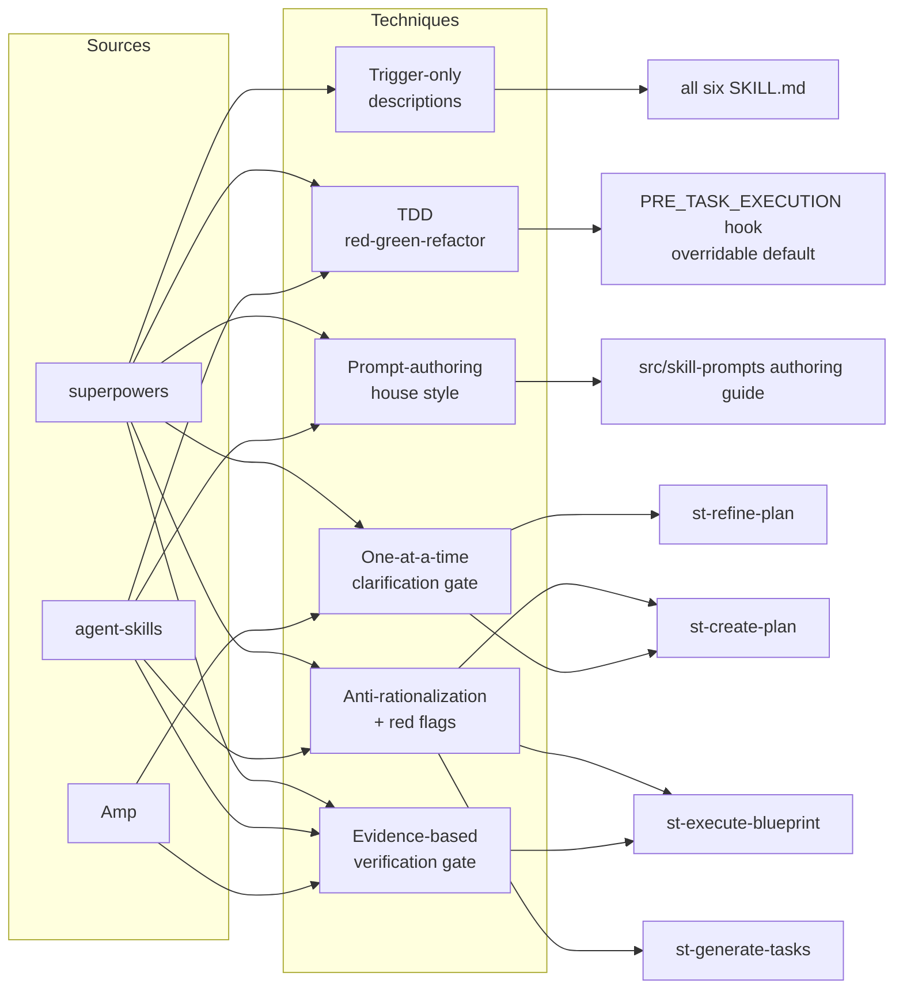

# Plan: Correlate External Skill Frameworks to Sharpen Strikethroo's Skill Prompts

## Original Work Order

> I need you to be smart, and be extremely autonomous, into investigating the
> superpowers' skills project, and the agent skills project, to correlate with
> strike through and learn how we can take parts of those projects or
> inspiration from those in order to improve strike through, either
> structurally, architecturally, or just the prompts. But keeping in mind that
> we don't want to significantly alter the strike through principles.

## Plan Clarifications

| Question | Answer |
| --- | --- |
| What is the deliverable you want out of this investigation? | A Strikethroo plan (run findings into the plan format). |
| Which projects should I correlate against? | `addyosmani/agent-skills`, `obra/superpowers`, and `ampcode.com` (Amp / Sourcegraph). |
| Where should the correlation focus? | Prompts & skill content. |
| Is backwards compatibility required? | Yes — changes are additive to prompt text only. No workspace-shape change, so `workspaceSchemaVersion` stays `1`; the harness-agnostic `SKILL.md` format and all existing principles are preserved. |

## Executive Summary

This plan captures the findings of a focused investigation into three external
agent-skill frameworks — `obra/superpowers`, `addyosmani/agent-skills`, and Amp
(`ampcode.com`) — and translates the highest-leverage, **prompt/skill-content**
techniques into refinements for Strikethroo's six workflow skills. The three
projects converge on a small set of prompt-engineering disciplines that
Strikethroo currently under-uses: explicit anti-rationalization tables,
evidence-based verification gates, trigger-only skill descriptions, a codified
house style for writing the prompts themselves, and a test-driven
RED-GREEN-REFACTOR execution discipline shipped as an **overridable default
hook**. Each is a textual refinement layered onto Strikethroo's existing
`src/skill-prompts/` and `config/hooks/` assets — none change the workspace
shape, the schema contract, or the staged plan→tasks→blueprint pipeline.

The approach was chosen because the work order asks explicitly for *inspiration*
applied *without significantly altering Strikethroo's principles*. Every
component below is additive prompt text or metadata tuning that reinforces a
principle Strikethroo already holds (atomic decomposition, scope control,
clarification gates, verifiable tasks) — it sharpens enforcement rather than
introducing a new methodology. Techniques that *would* conflict with
Strikethroo's principles were deliberately rejected (see Notes).

Expected outcomes: more reliable skill auto-loading (tighter descriptions),
fewer agent shortcuts under pressure (rationalization tables + red-flags),
higher-confidence "done" claims (verification gates with concrete evidence),
and a durable contributor guide that keeps future prompt edits consistent with
these disciplines.

## Context

### Current State vs Target State

| Current State | Target State | Why? |
| --- | --- | --- |
| Skills use prose "anti-pattern" lists (e.g. `task-minimization.md`) but no enumerated *rationalization → counter* tables tied to the excuses agents actually make under pressure. | Discipline-critical skills carry a shared anti-rationalization table + red-flags list (superpowers / agent-skills technique). | The strongest convergent finding across both skill projects; closes the loopholes that soft "prefer…" guidance leaves open. |
| `st-execute-blueprint` phase/task completion is verified softly ("ensure every task has status `completed`"). | A reusable "evidence before claims" verification gate: identify the proving command, run it, read output, verify, *then* claim — with red-flag language ("should/probably/seems"). | superpowers' `verification-before-completion` and agent-skills' mandatory-evidence rule both treat unverified claims as defects, not efficiency. |
| `st-create-plan` clarification loop asks "targeted questions" with no cadence rule. | Clarification refined to ask **one question at a time, multiple-choice-first**, with an explicit pre-emit approval gate. | superpowers' `brainstorming` shows one-at-a-time multiple-choice raises answer quality and prevents bundled, half-answered prompts. |
| `SKILL.md` `description` fields are long and partly *summarize the workflow*. | Descriptions rewritten to be trigger-only ("Use when…"), keyword-rich, workflow-free, within a token budget. | superpowers' Skill Discovery Optimization: descriptions that summarize workflow create a shortcut so the agent never reads the full skill, hurting load accuracy. |
| The house style for *writing* Strikethroo prompts lives implicitly in `src/skill-prompts/README.md` (assembly mechanics only). | A prompt-authoring guide codifying form-over-narrative, "no nuance clauses", anti-rationalization tables, and SDO. | superpowers' `writing-skills` and agent-skills' "process not prose" institutionalize prompt quality so refinements don't regress over time. |
| `PRE_TASK_EXECUTION.md` is an empty stub; task execution carries no test-first discipline. | The default `PRE_TASK_EXECUTION` hook ships a RED-GREEN-REFACTOR cycle that any project can override by editing its copied hook. | superpowers / agent-skills test-driven development, adopted as an *overridable default* so it does not hard-code over Strikethroo's "few tests, mostly integration" philosophy. |

### Background

Strikethroo authors every skill prompt once in `src/skill-prompts/` (per-skill
templates + shared `sections/*.md` included via `{{include}}`), assembled into
`templates/harness/skills/<name>/SKILL.md` by `scripts/build-skill-prompts.cjs`.
This plan operates entirely within that layer — it edits and adds section files
and per-skill templates, then relies on the existing build to reassemble. No
runtime TypeScript (`src/skill-scripts/`), no workspace shape, and no schema
version is touched.

Investigation sources and the specific techniques drawn from each:

- **`obra/superpowers`** — `writing-skills` (RED-GREEN-REFACTOR for prompts,
  SDO, the form-over-narrative table, "never add nuance clauses"),
  `brainstorming` (one-question-at-a-time, multiple-choice-first, approval
  gate), `verification-before-completion` (the 5-step evidence gate, red-flag
  language), `subagent-driven-development` (task brief as single source of
  truth, artifacts-as-file-paths, durable progress ledger surviving
  compaction).
- **`addyosmani/agent-skills`** — "Process, not prose: steps, checkpoints, exit
  criteria"; mandatory verification with concrete evidence; anti-rationalization
  tables + red flags as a standard skill section; progressive disclosure.
- **Amp (`ampcode.com`)** — imperative phrasing ("do X", not "can you do X");
  feedback loops (tell the agent how to check its work: test commands, URLs,
  logs); context discipline (artifacts as file paths, isolated subagent
  context); the Oracle second-opinion pattern for review.

Strikethroo already embodies the *structural* analogues of much of this
(subagent-per-task with clean context, progressive disclosure via `sections/`
+ `
`, verifiable acceptance criteria, the plan template's Self
Validation). The gap is consistently in the **prompt text's enforcement
strength**, which is exactly where this plan concentrates.

## Architectural Approach

The work is a set of additive edits to the prompt-source layer, organized so
each component maps a convergent external technique onto the specific
Strikethroo skill(s) it strengthens. All components share one delivery
mechanism: author/modify `src/skill-prompts/` content, then `npm run build`
reassembles the `SKILL.md` files. Components are independent and can be
generated as parallel tasks.

### Component A — Anti-Rationalization & Red-Flags Layer

**Objective**: Close the loopholes that soft, prose-only "anti-pattern" lists
leave open, so discipline-critical steps survive time/sunk-cost/authority
pressure. This is the single most convergent finding across superpowers and
agent-skills.

Add a new shared section `src/skill-prompts/sections/anti-rationalization.md`
that defines (a) a two-column *rationalization → counter* table of the specific
excuses an agent makes to skip a discipline, and (b) a short red-flags list of
self-check trigger phrases. Author it parametrically (via the existing
`{{variable}}` mechanism) so each consuming skill injects its own excuse set:

- `st-generate-tasks` (scope control): "one extra task won't hurt", "this
  edge case deserves its own task", "I'll add a test suite to be safe" →
  countered against the 20–30% minimization and YAGNI rules already in
  `task-minimization.md`.
- `st-create-plan` / `st-refine-plan` (clarification gate): "I can reasonably
  assume the answer", "asking again is annoying", "the user implied it" →
  countered against the existing "never invent answers" rule.
- `st-execute-blueprint` (verification): "the subagent reported success so
  it's done", "tests probably pass", "I'll verify later".

Follow the form-over-narrative discipline: prohibitions + tables for
rule-violations, and **no nuance clauses** ("unless it matters" reopens
negotiation). This reinforces existing principles — it adds no new rule, only
hardens enforcement of rules Strikethroo already states.

### Component B — Evidence-Based Verification Gate

**Objective**: Replace soft completion checks with a verification gate that
demands concrete evidence before any "done" claim, mirroring superpowers'
`verification-before-completion` and agent-skills' mandatory-evidence rule, and
Amp's feedback-loop guidance.

Add a shared section `src/skill-prompts/sections/verification-gate.md`
expressing the 5-step gate (IDENTIFY the proving command → RUN it fresh → READ
full output/exit code → VERIFY it matches the claim → only THEN state it) plus a
red-flag word list ("should", "probably", "seems to", premature "Done!"). Wire
it into `st-execute-blueprint`'s phase-completion verification (currently in
`sections/phase-execution-loop.md` step *c*) and its post-execution step.

Couple this with a per-task refinement in `st-generate-tasks`: every generated
task's **Acceptance Criteria** must carry at least one concrete, runnable
verification step (command + expected output / observable signal), not a vague
"works correctly" — directly reinforcing the existing "Verifiable" granularity
rule and the plan template's Self Validation section. This is an enforcement
sharpening of Strikethroo's *verifiable-task* principle, not a new requirement.

### Component C — Clarification Gate Cadence & Approval

**Objective**: Raise the quality of clarification rounds in `st-create-plan` and
`st-refine-plan` by adopting superpowers' `brainstorming` cadence without
abandoning Strikethroo's existing mandatory clarification gate.

Refine the clarification loop text (and factor it into a shared
`sections/clarification-gate.md` reused by both skills) to: ask **one question
at a time**; **prefer multiple-choice** options with a recommended default when
the question allows; and require an **explicit confirmation gate** before the
plan is emitted ("present the resolved scope; do not write the plan until the
user confirms"). The existing rules — never invent answers, confirm backwards
compatibility, stop with `needs-clarification` if blocked — are preserved
verbatim; only the *interaction shape* is sharpened.

### Component D — Skill Discovery Optimization (Descriptions)

**Objective**: Improve auto-load accuracy by making every `SKILL.md`
`description` trigger-only, per superpowers' SDO finding that descriptions which
summarize the workflow cause agents to act on the description instead of reading
the skill.

Audit the `description` frontmatter of all six skill templates in
`src/skill-prompts/*.md`. Rewrite each to lead with "Use when…", enumerate
concrete triggering conditions / symptoms / keywords, and **remove embedded
workflow summaries** (e.g. `st-create-plan`'s current description recites
"discovers the local root, runs hooks, gathers clarifications, allocates the
next ID, writes Markdown" — that belongs in the body, not the trigger). Keep the
harness-agnostic format and the `target`/`vars` fields untouched. Apply a soft
token budget consistent with SDO guidance. This is metadata-only and the
lowest-risk, broadest-reach change.

### Component E — Prompt-Authoring House Style

**Objective**: Institutionalize the disciplines above so future prompt edits
stay consistent — the equivalent of superpowers' `writing-skills` and
agent-skills' "process not prose", scoped to Strikethroo's own contributor flow.

Extend `src/skill-prompts/README.md` (or add a sibling `AUTHORING.md`
referenced from it and from `AGENTS.md`) with a concise house-style guide:
the form-over-narrative matching table (failure type → right prompt form),
the "no nuance clauses" rule, when to add an anti-rationalization table vs a
positive recipe vs a structural template slot, the SDO description rules, and
imperative-phrasing guidance (Amp). This is documentation for maintainers — it
changes no shipped skill behavior but guards the other components against
regression.

### Component F — TDD Red-Green-Refactor as an Overridable Default Hook

**Objective**: Adopt the superpowers / agent-skills test-driven
RED-GREEN-REFACTOR discipline during task execution, but ship it as the default
`PRE_TASK_EXECUTION` hook so any project can override or remove the preference.
This is what makes adopting TDD compatible with the work-order constraint: it
becomes a **project-level default**, not a hard-coded skill rule, so it never
overrides Strikethroo's "few tests, mostly integration" philosophy against a
project's wishes.

Populate the currently-empty default hook
`templates/strikethroo/config/hooks/PRE_TASK_EXECUTION.md` with the cycle —
**RED**: write a failing test for the next increment and observe it fail;
**GREEN**: write the minimal code to make it pass; **REFACTOR**: clean up with
the test green. No skill-prompt change is needed to activate it: the existing
`sections/phase-execution-loop.md` already instructs both the orchestrator and
every dispatched subagent to read and execute `PRE_TASK_EXECUTION.md` before any
implementation work, so the hook body flows automatically into execution.

**Override mechanism (no new machinery).** The hook is copied to
`.ai/strikethroo/config/hooks/PRE_TASK_EXECUTION.md` at `init` time; a project
overrides the preference simply by editing its copy, and `init`'s SHA-256
hash-tracking in `.init-metadata.json` detects and protects that user
modification on subsequent runs (only `--force` overwrites). A project that
prefers the integration-heavy default replaces or empties the hook body.

**Reconciliation with the test philosophy.** The default hook text must defer to
`sections/test-philosophy.md`: apply the RED-GREEN-REFACTOR cycle to the
meaningful tests that philosophy already calls for (custom logic, critical
paths, edge cases) — not to gold-plate trivial or framework code. This keeps the
two coherent: *what* to test stays governed by the test philosophy at
task-generation time; *how* to build it (test-first) becomes the overridable
execution default.

## Risk Considerations and Mitigation Strategies

Principle-Drift Risks

- **Over-adoption that alters Strikethroo's identity** (e.g. the full six-phase
  DEFINE→…→SHIP lifecycle or git-worktree workflow): These conflict with
  Strikethroo's deliberately narrow plan→tasks→blueprint scope.
    - **Mitigation**: Scope is fixed to prompt-text/hook enforcement of
      *existing* principles. The Notes section enumerates explicitly-rejected
      techniques; task generation must reject any task tracing to them.
- **TDD imposed as a non-negotiable gate** would override the "few tests, mostly
  integration" philosophy for projects that don't want it.
    - **Mitigation**: Component F ships TDD only as the *default*
      `PRE_TASK_EXECUTION` hook body, overridable per project via init's
      hash-tracked hook copy; the hook defers to `test-philosophy.md` for which
      tests are worth writing.

Technical Risks

- **Prompt bloat degrading skill readability / token budget**: Adding tables and
  gates lengthens `SKILL.md` files.
    - **Mitigation**: Deliver shared text as `sections/*.md` includes (DRY,
      single source) and keep per-skill injections parametric; respect the SDO
      token discipline; place heavy detail behind progressive disclosure.
- **Build/validation regressions**: `build-skill-prompts.cjs` fails on
  unresolved `{{include}}`/`{{variable}}` directives or missing
  `## Operating Procedure` headings.
    - **Mitigation**: Run `npm run build` after each component; new variables
      must be declared in each consuming template's frontmatter `vars` block.

Scope / Quality Risks

- **Components D and E touch all six skills** — risk of inconsistent edits.
    - **Mitigation**: Treat the description audit as one task with a single
      reviewer pass; the authoring guide lands before or alongside so edits
      follow it.

## Success Criteria

### Primary Success Criteria

1. A shared `anti-rationalization.md` section exists and is injected into at
   least `st-generate-tasks`, `st-create-plan`, and `st-execute-blueprint`,
   each with skill-specific excuse/counter content and a red-flags list.
2. `st-execute-blueprint` enforces an evidence-based verification gate, and
   `st-generate-tasks` requires every task's Acceptance Criteria to include a
   concrete runnable verification step.
3. `st-create-plan` and `st-refine-plan` share a clarification-gate section that
   mandates one-question-at-a-time, multiple-choice-first, and an explicit
   pre-emit approval gate — with all existing clarification rules preserved.
4. All six `SKILL.md` `description` fields are trigger-only ("Use when…"),
   carry no workflow summary, and remain within the SDO token budget.
5. A prompt-authoring house-style guide exists under `src/skill-prompts/` and is
   linked from `AGENTS.md`.
6. The default `templates/strikethroo/config/hooks/PRE_TASK_EXECUTION.md` hook
   contains a RED-GREEN-REFACTOR cycle that defers to the test philosophy, and a
   fresh `init` copies it into a project's `config/hooks/` where it can be
   overridden (verified by re-`init` preserving an edited copy).
7. `npm run build` succeeds (prompts reassemble with no unresolved directives)
   and `workspaceSchemaVersion` is unchanged (still `1`).

## Self Validation

After all tasks are complete, an executing agent must verify by:

1. Run `npm run build` and confirm exit code 0 with no
   "unresolved directive"/"missing frontmatter"/"absent Operating Procedure"
   errors from `build-skill-prompts.cjs`.
2. Open each assembled `templates/harness/skills/<name>/SKILL.md` and confirm:
   the new sections rendered (no literal `{{include ...}}` or `{{variable}}`
   tokens remain), and each `description` begins with "Use when" and contains no
   step-by-step workflow recitation.
3. Grep the assembled skills for the red-flag word list and the rationalization
   table headers to confirm the anti-rationalization and verification sections
   landed in the intended skills (`st-generate-tasks`, `st-create-plan`,
   `st-execute-blueprint`, `st-refine-plan`).
4. Confirm `CURRENT_WORKSPACE_SCHEMA_VERSION` in `src/metadata.ts` is unchanged
   and `EXPECTED_WORKSPACE_SCHEMA_VERSION` smoke assertion in
   `build-skills.cjs` still passes during the build.
5. Run `npm run test:unit` and confirm it passes (no behavior-level regressions
   from prompt edits).
6. Run `node dist/cli.js init --harnesses claude --destination-directory /tmp/st-tdd-check`
   and confirm the generated
   `/tmp/st-tdd-check/.ai/strikethroo/config/hooks/PRE_TASK_EXECUTION.md`
   contains the RED-GREEN-REFACTOR cycle; then edit that copy, re-run `init`
   without `--force`, and confirm the edit is preserved (override works).
7. Diff `git status`/`git diff --stat` to confirm only `src/skill-prompts/**`,
   the regenerated `templates/harness/skills/*/SKILL.md`,
   `templates/strikethroo/config/hooks/PRE_TASK_EXECUTION.md`, and docs
   (`AGENTS.md`/README) changed — no `src/skill-scripts/**`, `src/serve/**`, or
   `src/web/**` files were touched.

## Documentation

- `src/skill-prompts/README.md` (or a new `AUTHORING.md` it references) gains the
  prompt-authoring house-style guide (Component E).
- `AGENTS.md` — add a short pointer under "Prompt source of truth" to the new
  authoring guide, and note the shared `anti-rationalization.md`,
  `verification-gate.md`, and `clarification-gate.md` sections alongside the
  existing `sections/` description. Also note, near the hooks list, that
  `PRE_TASK_EXECUTION` now ships a default (overridable) TDD discipline.

## Resource Requirements

### Development Skills

- Prompt engineering for agent skills (the primary skill — authoring enforcement
  language, tables, and triggers).
- Familiarity with Strikethroo's `src/skill-prompts/` assembly
  (`{{include}}`/`{{variable}}`, `vars` frontmatter, `build-skill-prompts.cjs`).
- Light Markdown/docs editing for `AGENTS.md` and the authoring guide.

### Technical Infrastructure

- The existing build pipeline (`npm run build`, specifically
  `build:skill-prompts`) and unit tests (`npm run test:unit`).
- No new libraries, dependencies, or services.

## Integration Strategy

All changes flow through the established prompt-assembly build: edit
`src/skill-prompts/` sources → `npm run build:skill-prompts` regenerates the
shipped `SKILL.md` files (force-added into release commits by
`@semantic-release/git`). Because the changes are prompt-text only, distribution
(`npx skills add e0ipso/strikethroo`) and the schema-version contract are
unaffected; existing installed workspaces keep working without re-`init`.

## Notes

**Adopted with a compatibility guard**:

- TDD RED-GREEN-REFACTOR (superpowers / agent-skills) is adopted (Component F)
  but **only as the default, project-overridable `PRE_TASK_EXECUTION` hook** —
  never as a hard-coded, non-negotiable skill gate. This honours the work-order
  constraint by leaving Strikethroo's "write a few tests, mostly integration"
  philosophy in control for any project that wants it: the hook is theirs to
  edit, and it defers to `test-philosophy.md` for what is worth testing.

**Deliberately rejected to preserve Strikethroo's principles** (work-order
constraint: "we don't want to significantly alter the strikethroo principles"):

- The full six-phase DEFINE→PLAN→BUILD→VERIFY→REVIEW→SHIP lifecycle and
  slash-command-per-phase model (agent-skills) — Strikethroo intentionally
  scopes to plan→tasks→blueprint.
- Git-worktree-per-feature workflow and finishing-a-branch skills
  (superpowers) — outside Strikethroo's workspace model.

**Considered but deferred (YAGNI / borderline structural)**:

- A durable cross-compaction *progress ledger* for `st-execute-blueprint`
  (superpowers' `subagent-driven-development`). Strikethroo already records
  task/phase status in the blueprint; a dedicated ledger leans structural rather
  than prompt-content, so it is noted here rather than included. Revisit only if
  resume-after-compaction proves unreliable in practice.
- An Oracle-style "second-opinion review on the most capable model" pass
  (Amp / superpowers final reviewer). The `serve` layer already exposes
  self-review; fold into a future plan if a stronger review gate is wanted.
