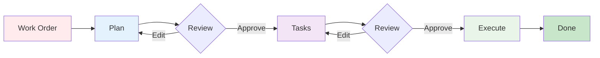

# Workflow Guide

AI Task Manager breaks complex work into three steps -- planning, task generation, and execution -- each delivered as an Agent Skill that loads automatically when you describe what you need.

## The Workflow



Human review gates between steps are where you catch scope creep and wrong turns. Do not skip them.

## Step-by-Step

### 1. Create a Plan

Ask your assistant in plain language. The `task-create-plan` skill loads automatically.

> Use the task-manager workflow to plan user authentication with email/password and JWT tokens.

The skill asks clarifying questions, then writes a plan document with requirements, technical approach, risks, and success criteria.

**Output**: `.ai/task-manager/plans/01--user-authentication/plan-01--user-authentication.md`

### 2. Review the Plan

Open the plan file and verify:
- Requirements are accurate and complete
- No unnecessary features were added (scope creep)
- Technical approach fits your architecture

Edit the file directly -- it is yours, not the AI's. Optionally, ask a second assistant to refine the plan (`task-refine-plan` skill) for a two-agent feedback loop.

### 3. Generate Tasks

> Decompose plan 1 into tasks.

The `task-generate-tasks` skill breaks the plan into atomic tasks (1-2 skills each), maps dependencies, and produces an execution blueprint organized into phases of parallel work.

**Output**: `.ai/task-manager/plans/01--user-authentication/tasks/*.md`

### 4. Review Tasks

Check each task file in the `tasks/` directory:
- Remove anything outside the original scope
- Split tasks that have 3+ skills (too complex)
- Verify dependency order makes sense
- Tighten vague acceptance criteria

### 5. Execute the Blueprint

> Execute the blueprint for plan 1.

The `task-execute-blueprint` skill runs tasks grouped into phases. Within each phase, independent tasks run in parallel. The POST_PHASE hook validates quality after each phase. Commits are created automatically.

If you skipped step 3, the skill auto-generates tasks and the blueprint before starting.

### 6. Monitor Progress

```bash
npx @e0ipso/ai-task-manager status
```

Shows active plans, task completion counts, progress bars, and warnings for incomplete archived plans.


## File Structure

```
.ai/task-manager/
├── plans/
│   └── 01--user-authentication/
│       ├── plan-01--user-authentication.md
│       └── tasks/
│           ├── 01--database-schema.md
│           ├── 02--user-model.md
│           └── 03--auth-endpoints.md
├── archive/                          # Completed plans
├── config/
│   ├── TASK_MANAGER.md               # Project context (tech stack, conventions)
│   ├── hooks/                        # Lifecycle hooks (PRE_PLAN, POST_PHASE, etc.)
│   └── templates/                    # PLAN_TEMPLATE.md, TASK_TEMPLATE.md
└── .init-metadata.json               # Tracks file hashes and schema version
```

## Plan Management

```bash
npx @e0ipso/ai-task-manager plan show 41    # View plan details and progress
npx @e0ipso/ai-task-manager plan archive 41 # Move completed plan to archive/
npx @e0ipso/ai-task-manager plan delete 41  # Permanently remove plan and tasks
```

## Alternative: Automated Workflow

For clear requirements with minimal ambiguity, the `task-full-workflow` skill chains all three steps end-to-end. Ask your assistant to run the full task-manager workflow and it handles plan creation, task generation, and execution in one pass.

## Advanced Patterns

### Plan Mode Integration

Use your assistant's native plan/brainstorm mode for initial ideation, then feed the refined output into `task-create-plan`. Plan mode explores broadly; Task Manager executes precisely. Best for vague requirements where you want the AI to explore options before committing to a structured plan.

### Iterative Refinement

Edit plan and task files directly between steps. Re-run `task-create-plan` with tightened requirements, or manually adjust task files before execution. The `task-refine-plan` skill can also interrogate an existing plan for gaps. Best for evolving requirements and feedback-driven development.

### Multi-Session Projects

Plans and task statuses persist on disk. Resume any time: check `npx @e0ipso/ai-task-manager status`, then ask the assistant to continue executing the blueprint -- it picks up where it left off. Commit after each phase so context survives across sessions.

### Parallel Development

Task dependencies define the phase structure automatically. Independent tasks within the same phase execute in parallel. Teams can coordinate by sharing the `.ai/task-manager/` directory via git -- backend and frontend developers work from the same plan, with dependency enforcement ensuring correct ordering.

### Spike to Production

Create two plans: a quick spike plan (low quality gates, research-focused tasks) to validate a technical approach, then a production plan that applies the spike findings with full testing and quality standards. The spike documents the decision rationale; the production plan executes it properly.

## Next Steps

- **[Customization Guide](customization.html)**: Tailor hooks, templates, and project context
- **[Reference](reference.html)**: CLI commands, hook catalog, template variables
