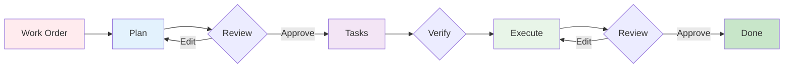

# Workflow Guide

Strikethroo breaks complex work into three steps -- planning, task generation, and execution -- each delivered as an Agent Skill that loads automatically when you describe what you need.

## The Workflow



Human gates wrap each step: you **review** the plan, **verify** the blueprint, and **review** the executed result -- looping back to edit whenever something is off. The plan and the result get a careful read; the blueprint just gets a quick validation pass before execution.



## Step-by-Step

### 1. Create a Plan

Ask your assistant in plain language. The `st-create-plan` skill loads automatically.

> /st-create-plan create user authentication with email/password and JWT tokens.

The skill asks clarifying questions, then writes a plan document with requirements, technical approach, risks, and success criteria. Two hooks bracket this step: [`PRE_PLAN`](customization.html#pre_plan) runs before planning begins, and [`POST_PLAN`](customization.html#post_plan) runs once the document is written.

**Output**: `.ai/strikethroo/plans/01--user-authentication/plan-01--user-authentication.md`

### 2. Review the Plan

Open the plan file and verify:
- Requirements are accurate and complete
- No unnecessary features were added (scope creep)
- Technical approach fits your architecture

Edit the file directly -- it is yours, not the AI's. Optionally, ask a second assistant to refine the plan (`st-refine-plan` skill) for a two-agent feedback loop.

Prefer reading it rendered? `npx strikethroo serve` shows the plan document with its task blueprint pinned alongside:

[]({{ '/assets/plan-detail-plan.png' | relative_url }})

### 3. Generate Tasks

> /st-generate-tasks 1

The `st-generate-tasks` skill breaks the plan into atomic tasks (1-2 skills each), maps dependencies, assigns a `complexity_score` to every task, and produces an execution blueprint organized into phases of parallel work. The [`POST_TASK_GENERATION_ALL`](customization.html#post_task_generation_all) hook runs once all task files exist; it is blueprint-only and does not revisit complexity analysis.

**Output**: `.ai/strikethroo/plans/01--user-authentication/tasks/*.md`

The blueprint's phases -- groups of tasks that run in parallel -- render as swimlanes in the web app:

[]({{ '/assets/plan-detail-tasks-swimlanes.png' | relative_url }})

### 4. Validate the Tasks

The task documents don't need a line-by-line review -- just a quick validation pass before you let it run. Skim the `tasks/` directory and confirm:
- Nothing obviously outside the original scope slipped in
- No task is overloaded (3+ skills signals it should be split)
- Each task has a `complexity_score` between 1 and 10
- The dependency order is sane

If something looks wrong, fix the task file directly; otherwise move straight to execution. Save the careful reading for the plan (step 2) and the result (step 6).

A wrong ordering is easiest to spot on the dependency graph -- a live mermaid render of the same task files:

[]({{ '/assets/plan-detail-graph.png' | relative_url }})

### 5. Execute the Blueprint

> /st-execute-blueprint 1

The `st-execute-blueprint` skill runs tasks grouped into phases. Before phases begin, it runs `create-feature-branch.cjs` to create a plan feature branch when appropriate (skipped when not on `main`/`master` — that is expected, not a failure). Before each phase, the skill runs `check-phase-readiness.cjs`, then the [`PRE_PHASE`](customization.html#pre_phase) hook. Independent tasks run in parallel within the phase. For every task, [`PRE_TASK_ASSIGNMENT`](customization.html#pre_task_assignment) runs before dispatch and [`PRE_TASK_EXECUTION`](customization.html#pre_task_execution) runs on the task agent before implementation. [`POST_ERROR_DETECTION`](customization.html#post_error_detection) runs if a task fails, and [`POST_PHASE`](customization.html#post_phase) runs after each phase completes.



The `st-execute-blueprint` skill drives progress end to end: it updates task statuses as phases complete, and you can inspect plan and task files directly under `.ai/strikethroo/plans/` at any point. Prefer a visual view? Run `npx strikethroo serve` to watch progress in [Visualizations](visualizations.html), the web app that renders plans, tasks, and the dependency graph live from those same files. From the board you can drill straight down into any task:

<video class="wide-video" controls preload="metadata" src="{{ '/assets/nav-plans-to-task-detail.webm' | relative_url }}"></video>

### 6. Review the Results

When the last phase finishes, the [`POST_EXECUTION`](customization.html#post_execution) hook runs before the summary is written and the plan is archived.

Execution finishing is not the finish line -- the working code is. Read what the blueprint produced:
- Run the test suite and confirm the plan's success criteria are actually met
- Read the diffs for correctness, not just for green checks
- Watch for tasks that completed on paper but missed the intent

If something is off, adjust the relevant task or plan files and re-run execution -- the blueprint resumes the affected work. Once the result matches the plan, the plan is done: `st-execute-blueprint` archives it to `.ai/strikethroo/archive/`.

Each task's implementation notes capture what actually happened during execution -- a quick read on the work and any noteworthy events:

[]({{ '/assets/task-detail-implementation-notes.png' | relative_url }})

## File Structure

```
.ai/strikethroo/
├── plans/
│   └── 01--user-authentication/
│       ├── plan-01--user-authentication.md
│       └── tasks/
│           ├── 01--database-schema.md
│           ├── 02--user-model.md
│           └── 03--auth-endpoints.md
├── archive/                          # Completed plans
├── config/
│   ├── STRIKETHROO.md                # Project context (tech stack, conventions)
│   ├── hooks/                        # Lifecycle hooks (PRE_PLAN, POST_PHASE, etc.)
│   └── templates/                    # PLAN_TEMPLATE.md, TASK_TEMPLATE.md
└── .init-metadata.json               # Tracks file hashes and schema version
```

## Alternative: Automated Workflow

For clear requirements with minimal ambiguity, the `st-full-workflow` skill chains all three steps end-to-end. Ask your assistant to run the full Strikethroo workflow and it handles plan creation, task generation, and execution in one pass.

## Advanced Patterns

<div class="st-cards" markdown="0">
<div class="st-card">
<span class="st-card__icon st-card__icon--route" aria-hidden="true"></span>
<p class="st-card__title">Plan Mode Integration</p>
<p>Use your assistant's native plan/brainstorm mode for initial ideation, then feed the refined output into <code>st-create-plan</code>. Plan mode explores broadly; Strikethroo executes precisely. Best for vague requirements you want explored before committing.</p>
</div>
<div class="st-card">
<span class="st-card__icon st-card__icon--refresh-cw" aria-hidden="true"></span>
<p class="st-card__title">Iterative Refinement</p>
<p>Edit plan and task files directly between steps. Re-run <code>st-create-plan</code> with tightened requirements, or let <code>st-refine-plan</code> interrogate an existing plan for gaps. Best for evolving, feedback-driven work.</p>
</div>
<div class="st-card">
<span class="st-card__icon st-card__icon--history" aria-hidden="true"></span>
<p class="st-card__title">Multi-Session Projects</p>
<p>Plans and statuses persist on disk; completed plans archive automatically. Resume any time &mdash; the blueprint picks up where it left off. Commit after each phase so context survives across sessions.</p>
</div>
<div class="st-card">
<span class="st-card__icon st-card__icon--git-branch" aria-hidden="true"></span>
<p class="st-card__title">Parallel Development</p>
<p>Task dependencies define the phase structure automatically, so independent tasks run in parallel. Teams coordinate by sharing <code>.ai/strikethroo/</code> via git, with dependency enforcement keeping the ordering correct.</p>
</div>
<div class="st-card">
<span class="st-card__icon st-card__icon--rocket" aria-hidden="true"></span>
<p class="st-card__title">Spike to Production</p>
<p>Create a quick spike plan (low gates, research-focused) to validate an approach, then a production plan that applies the findings with full testing and quality standards. The spike documents the rationale; production executes it properly.</p>
</div>
</div>

## Next Steps

- **[Visualizations](visualizations.html)**: See plans, tasks, and the dependency graph
- **[Customization Guide](customization.html)**: Tailor hooks, templates, and project context
- **[Reference](reference.html)**: CLI commands, hook catalog, template variables
