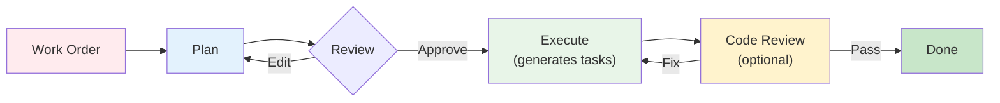

# Workflow Guide

Strikethroo runs on **two commands**: `st-create-plan` to draft the work, and `st-execute-blueprint` to build it. Each is an Agent Skill that loads automatically when you describe what you need. Task decomposition happens inside execution, and an optional automated code review runs at the end.

## The Workflow


```mermaid
flowchart LR
    A[Work Order] --> B[Plan]
    B --> C{Review}
    C -->|Edit| B
    C -->|Approve| G["Execute<br/>(generates tasks)"]
    G --> H["Code Review<br/>(optional)"]
    H -->|Fix| G
    H -->|Pass| J[Done]

    style A fill:#ffebee
    style B fill:#e3f2fd
    style G fill:#e8f5e8
    style H fill:#fff3cd
    style J fill:#c8e6c9
```

One human gate sits before any code exists: you **review** the plan, looping back to edit until it is right. Then you run it, and **review** the result. An optional automated review gate runs in between: a discovered second harness critiques the cumulative diff and drives remediation for high-confidence findings, before your read of the result.

That distribution of effort is deliberate, not incidental. Attention is **rationed toward the point where a correction is cheapest** -- a misunderstanding costs one sentence to fix in the plan and a full review cycle to fix in the diff. So the plan gets your careful read, and the task blueprint gets generated for you rather than reviewed by you. See [Why Strikethroo](why.html) for the reasoning in full.



## Step-by-Step

### 1. Create a Plan

Ask your assistant in plain language. The `st-create-plan` skill loads automatically.

> /st-create-plan create user authentication with email/password and JWT tokens.

The skill asks clarifying questions, then writes a plan document with requirements, technical approach, risks, and success criteria. Two hooks bracket this step: [`PRE_PLAN`](customization.html#pre_plan) runs before planning begins, and [`POST_PLAN`](customization.html#post_plan) runs once the document is written.

**Output**: `.ai/strikethroo/plans/01--user-authentication/plan-01--user-authentication.md`

### 2. Review the Plan

Open the plan file and verify:
- Requirements are accurate and complete
- No unnecessary features were added (scope creep)
- Technical approach fits your architecture

Edit the file directly -- it is yours, not the AI's. Optionally, ask a second assistant to refine the plan (`st-refine-plan` skill) for a two-agent feedback loop.

Prefer reading it rendered? `npx strikethroo serve` shows the plan document with its task blueprint pinned alongside:

[]({{ '/assets/plan-detail-plan.png' | relative_url }})

<details markdown="1">
<summary><strong>Optional detour: build the blueprint separately</strong></summary>

Most runs go straight from the approved plan to execution, which generates the blueprint itself. Run task generation on its own only when you want to inspect or hand-tune the decomposition first -- an unusually large plan, or one whose phase ordering you want to see before committing to it.

> /st-generate-tasks 1

The `st-generate-tasks` skill breaks the plan into atomic tasks (1-2 skills each), maps dependencies, assigns a `complexity_score` to every task, and produces an execution blueprint organized into phases of parallel work. If [execution routing](customization.html#execution-routing) is configured, each task is classified into a configured execution profile and stores that profile in `execution_profile` — the [`TASK_EXECUTION_ROUTING`](customization.html#task_execution_routing) hook governs classification. Concrete targets are selected immediately before task delegation. The [`POST_TASK_GENERATION_ALL`](customization.html#post_task_generation_all) hook runs only after routing succeeds (or reports routing off); it is blueprint-only and does not revisit complexity analysis.

**Output**: `.ai/strikethroo/plans/01--user-authentication/tasks/*.md`

If you do look, skim rather than read line by line: check that nothing outside the original scope slipped in, that no task carries 3+ skills, and that the dependency order is sane. Fix a task file directly if something is off. Save the careful reading for the plan and the result.

The blueprint's phases -- groups of tasks that run in parallel -- render as swimlanes in the web app, and a wrong ordering is easiest to spot on the dependency graph:

[]({{ '/assets/plan-detail-tasks-swimlanes.png' | relative_url }})

[]({{ '/assets/plan-detail-graph.png' | relative_url }})

</details>

### 3. Execute the Blueprint

> /st-execute-blueprint 1

The `st-execute-blueprint` skill runs tasks grouped into phases. Before phases begin, it runs `create-feature-branch.cjs` to create a plan feature branch when appropriate (skipped when not on `main`/`master` — that is expected, not a failure). Before each phase, the skill runs `check-phase-readiness.cjs`, then the [`PRE_PHASE`](customization.html#pre_phase) hook. Independent tasks run in parallel within the phase. For routed tasks, dispatch selects a target from the persisted profile immediately before delegation; native/current-harness targets skip availability probes, while external harnesses are checked and unavailable targets are avoided on retry. For every task, [`PRE_TASK_ASSIGNMENT`](customization.html#pre_task_assignment) runs before dispatch and [`PRE_TASK_EXECUTION`](customization.html#pre_task_execution) runs on the task agent before implementation. [`POST_ERROR_DETECTION`](customization.html#post_error_detection) runs if a task fails, and [`POST_PHASE`](customization.html#post_phase) runs after each phase completes.

Before any of that, if the plan has no tasks yet, the skill generates them: it breaks the plan into atomic tasks (1-2 skills each), maps dependencies, assigns every task a `complexity_score`, and assembles the phase-grouped blueprint. That is the normal path -- you do not run a separate task-generation command.

The `st-execute-blueprint` skill drives progress end to end: it updates task statuses as phases complete, and you can inspect plan and task files directly under `.ai/strikethroo/plans/` at any point. Prefer a visual view? Run `npx strikethroo serve` to watch progress in [Visualizations](visualizations.html), the web app that renders plans, tasks, and the dependency graph live from those same files. From the board you can drill straight down into any task:

<video class="wide-video" controls preload="metadata" src="{{ '/assets/nav-plans-to-task-detail.webm' | relative_url }}"></video>

### 4. Review the Results

When the last phase finishes, the [`POST_EXECUTION`](customization.html#post_execution) hook runs before the summary is written and the plan is archived.

Execution finishing is not the finish line -- the working code is. Read what the blueprint produced:
- Run the test suite and confirm the plan's success criteria are actually met
- Read the diffs for correctness, not just for green checks
- Watch for tasks that completed on paper but missed the intent

If something is off, adjust the relevant task or plan files and re-run execution -- the blueprint resumes the affected work. Once the result matches the plan, the plan is done: `st-execute-blueprint` archives it to `.ai/strikethroo/archive/`.

Each task's implementation notes capture what actually happened during execution -- a quick read on the work and any noteworthy events:

[]({{ '/assets/task-detail-implementation-notes.png' | relative_url }})

### 5. Automated Code Review (Optional)

After `POST_EXECUTION` reports green, an optional code review gate runs if a second harness is discovered and the [`CODE_REVIEW`](customization.html#code_review) hook is present and non-empty. A discovered reviewer harness critiques the cumulative diff against the plan's requirements and emits schema-validated findings.

**How it works:**

1. **Detect** — Reviewer harness examines the base commit through working tree, emitting findings as XML
2. **Threshold** — Findings below configured severity and confidence floors are recorded but not auto-fixed
3. **Fix** — High-confidence findings are dispatched to the implementer route for local text replacements
4. **Re-verify** — Full `POST_EXECUTION` re-runs (lint, tests, validation) before the reviewer re-checks
5. **Bounded** — Rounds are limited (default 3); exhaustion halts and leaves the plan with findings recorded

The review never creates task files and never mutates the execution blueprint. Findings are written to the plan directory under `review/` and are visible via `serve`.

The reviewed scope runs from a base commit recorded before phase execution against the working tree, so committed phase work, uncommitted fixes, and untracked new files are all in scope — nothing needs to be staged or committed for the reviewer to see it. Ignored, generated, and vendored paths are excluded; see [Customization](customization.html#code_review) for the complete list of limitations.

**To disable:** Edit or delete `.ai/strikethroo/config/hooks/CODE_REVIEW.md`. The gate skips cleanly with a note in the execution summary.

**Important:** A passing review is not a correctness guarantee. The gate reduces exposure to the same class of error a human PR approval reduces, and leaves the same exposure behind. See [Customization](customization.html#code_review) for limitations.

## File Structure

```
.ai/strikethroo/
├── plans/
│   └── 01--user-authentication/
│       ├── plan-01--user-authentication.md
│       └── tasks/
│           ├── 01--database-schema.md
│           ├── 02--user-model.md
│           └── 03--auth-endpoints.md
├── archive/                          # Completed plans
├── config/
│   ├── STRIKETHROO.md                # Project context (tech stack, conventions)
│   ├── hooks/                        # Lifecycle hooks (PRE_PLAN, POST_PHASE, etc.)
│   └── templates/                    # PLAN_TEMPLATE.md, TASK_TEMPLATE.md
└── .init-metadata.json               # Tracks file hashes and schema version
```

## Alternative: Automated Workflow

For clear requirements with minimal ambiguity, the `st-full-workflow` skill runs the whole thing end-to-end, skipping the plan-approval gate. Ask your assistant to run the full Strikethroo workflow and it handles plan creation, task generation, and execution in one pass.

## Advanced Patterns

<div class="st-cards" markdown="0">
<div class="st-card">
<span class="st-card__icon st-card__icon--route" aria-hidden="true"></span>
<p class="st-card__title">Plan Mode Integration</p>
<p>Use your assistant's native plan/brainstorm mode for initial ideation, then feed the refined output into <code>st-create-plan</code>. Plan mode explores broadly; Strikethroo executes precisely. Best for vague requirements you want explored before committing.</p>
</div>
<div class="st-card">
<span class="st-card__icon st-card__icon--refresh-cw" aria-hidden="true"></span>
<p class="st-card__title">Iterative Refinement</p>
<p>Edit plan and task files directly between steps. Re-run <code>st-create-plan</code> with tightened requirements, or let <code>st-refine-plan</code> interrogate an existing plan for gaps. Best for evolving, feedback-driven work.</p>
</div>
<div class="st-card">
<span class="st-card__icon st-card__icon--history" aria-hidden="true"></span>
<p class="st-card__title">Multi-Session Projects</p>
<p>Plans and statuses persist on disk; completed plans archive automatically. Resume any time &mdash; the blueprint picks up where it left off. Commit after each phase so context survives across sessions.</p>
</div>
<div class="st-card">
<span class="st-card__icon st-card__icon--git-branch" aria-hidden="true"></span>
<p class="st-card__title">Parallel Development</p>
<p>Task dependencies define the phase structure automatically, so independent tasks run in parallel. Teams coordinate by sharing <code>.ai/strikethroo/</code> via git, with dependency enforcement keeping the ordering correct.</p>
</div>
<div class="st-card">
<span class="st-card__icon st-card__icon--rocket" aria-hidden="true"></span>
<p class="st-card__title">Spike to Production</p>
<p>Create a quick spike plan (low gates, research-focused) to validate an approach, then a production plan that applies the findings with full testing and quality standards. The spike documents the rationale; production executes it properly.</p>
</div>
</div>

## Next Steps

- **[Visualizations](visualizations.html)**: See plans, tasks, and the dependency graph
- **[Customization Guide](customization.html)**: Tailor hooks, templates, and project context
- **[Reference](reference.html)**: CLI commands, hook catalog, template variables
