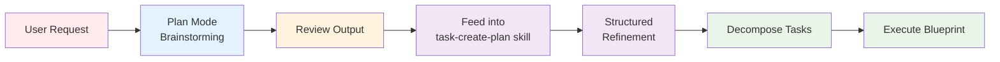
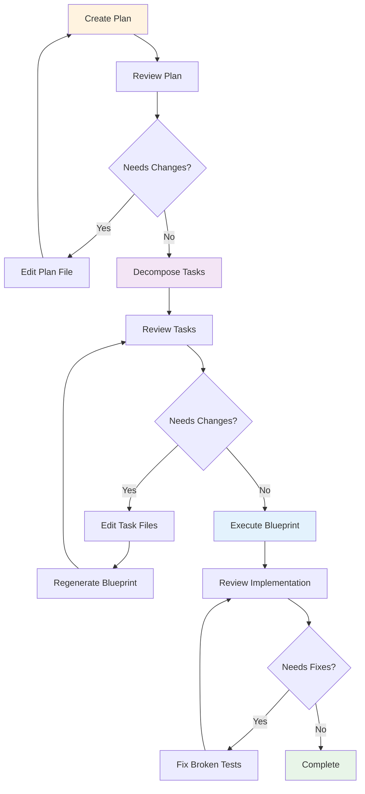
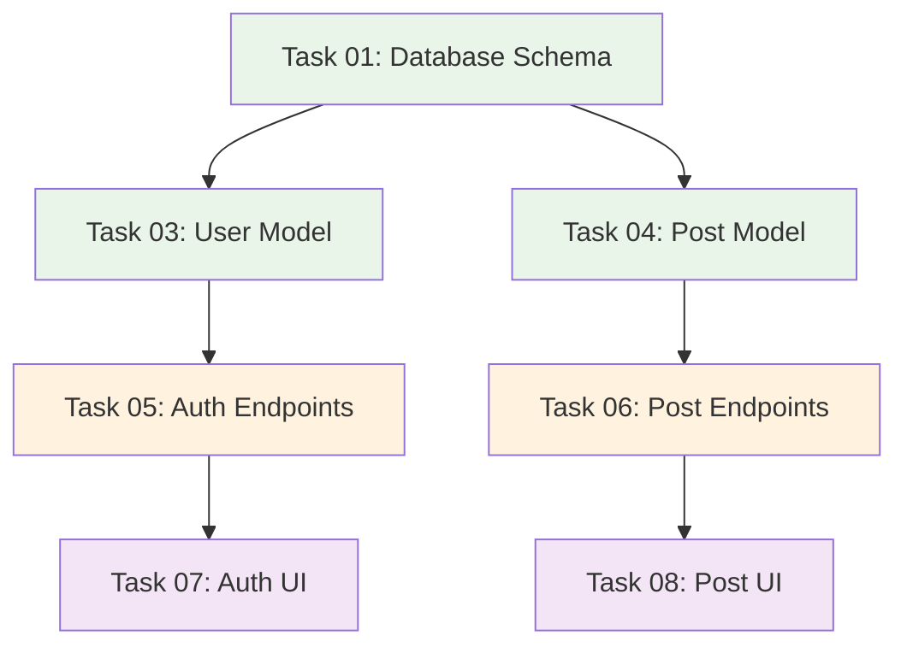

# 🔄 Workflow Patterns

AI Task Manager supports multiple workflow patterns to match your development style and project needs. This guide demonstrates advanced usage beyond the basic three-phase workflow.

All patterns are driven through the installed Agent Skills (`task-create-plan`, `task-refine-plan`, `task-generate-tasks`, `task-execute-blueprint`, `task-full-workflow`, `fix-broken-tests`). You invoke each phase by asking your assistant in plain language; the matching skill loads automatically based on intent.

## Pattern 1: Plan Mode Integration

**The most powerful workflow pattern**: Combine your AI assistant's native "plan mode" with AI Task Manager's structured execution.

### Why This Pattern?

AI assistant plan modes excel at:
- **Fast brainstorming**: Quick generation of initial ideas
- **Exploratory thinking**: Considering multiple approaches
- **Broad context**: Understanding user intent

AI Task Manager excels at:
- **Structured refinement**: Breaking ideas into executable tasks
- **Scope control**: Preventing feature creep through validation gates
- **Quality assurance**: Testing and validation at each phase
- **Progress tracking**: Clear visibility into implementation status

**Best of both worlds**: Use plan mode for ideation, AI Task Manager for execution.

### Step-by-Step Guide



**Step 1: Use Plan Mode for Initial Ideation**
```
You: Build a REST API for blog management

AI (in plan mode):
I'll create a comprehensive plan for a blog API with:
- User authentication (JWT tokens)
- CRUD operations for posts
- Comment system
- Tag/category management
- Search functionality
- Rate limiting
- ...
```

**Step 2: Review and Extract Relevant Parts**

Review the plan mode output and identify what you actually need:
- Keep: User auth, post CRUD, basic search
- Remove: Comment system (not requested), complex tag management, rate limiting (premature optimization)

**Step 3: Feed Refined Requirements to the Plan Skill**

Ask your assistant to create a task-manager plan with the refined requirements, for example:

> Build a REST API for blog management with user authentication using JWT tokens, CRUD operations for blog posts (title, content, author, publish date), basic search by title and content, and the existing database schema from /db/schema.sql.

The `task-create-plan` skill takes over from here.

**Step 4: AI Task Manager Structures the Work**

The skill now:
- Asks clarifying questions specific to your context
- Creates a focused plan without unnecessary features
- Documents technical decisions
- Identifies risks and success criteria

**Step 4b: Refine the Plan with a Second Assistant (Optional)**

Ask another assistant (or the same one in a new session) to refine plan 1. The `task-refine-plan` skill interrogates the plan, asks for missing context, and immediately applies refinements before task generation. This enables a "two-agent" feedback loop while keeping the plan consistent.

**Step 5: Continue with Standard Workflow**

- Review the plan at `.ai/task-manager/plans/01--blog-api/` and edit if needed.
- Ask your assistant to decompose plan 1 (`task-generate-tasks` skill). Review the tasks and remove any scope creep.
- Ask your assistant to execute the blueprint for plan 1 (`task-execute-blueprint` skill). The skill executes validated, scoped tasks phase by phase.

### Benefits of This Hybrid Approach

1. **Faster Start**: Plan mode generates initial ideas quickly
2. **Better Scope**: Human review catches unnecessary features before execution
3. **Context Preservation**: Plan mode explores broadly, Task Manager executes precisely
4. **Flexibility**: Skip plan mode for clear requirements, use it for exploratory projects

### When to Use Plan Mode Integration

**Use this pattern when:**
- Requirements are somewhat vague ("build a dashboard")
- Multiple implementation approaches exist
- You want AI to explore options before committing
- Project scope needs clarification

**Skip plan mode when:**
- Requirements are crystal clear
- Implementation path is obvious
- Small, focused tasks (bug fixes, minor features)

## Pattern 2: Iterative Refinement

**For projects requiring multiple rounds of feedback and adjustment.**

### Workflow Diagram



### Step-by-Step Process

**Phase 1: Plan Refinement**

- Ask your assistant to create a task-manager plan for "Build user dashboard with analytics" (the `task-create-plan` skill loads).
- Ask the assistant (or a different one) to refine plan 1 (`task-refine-plan` skill). Capture clarifications and tighten the scope.
- Review the generated plan and edit `.ai/task-manager/plans/01--dashboard/plan-01--dashboard.md` directly: refine objectives, add constraints, clarify scope.
- If major changes are needed, ask the assistant to create a new plan with the tightened brief, for example: "Build user dashboard with analytics. Focus on daily active users, session duration, and conversion funnel. Use Chart.js for visualization."

**Phase 2: Task Refinement**

- Ask your assistant to decompose plan 1 (`task-generate-tasks` skill).
- Review tasks in `.ai/task-manager/plans/01--dashboard/tasks/`. Common adjustments:
  - Remove tasks outside core scope
  - Split overly complex tasks
  - Adjust dependencies
  - Modify acceptance criteria
- If needed, edit individual task files manually — they are picked up automatically by the execute step.

**Phase 3: Execution Monitoring and Adjustment**

- Ask your assistant to execute the blueprint for plan 1 (`task-execute-blueprint` skill).
- Check status periodically with `npx @e0ipso/ai-task-manager status`.
- If tests fail after implementation, ask your assistant to fix the broken tests by running `npm test` (the `fix-broken-tests` skill enforces test integrity).
- Review implementation quality, commit, and continue.

### Best Practices for Iterative Refinement

1. **Document Why**: When editing plans/tasks, add comments explaining changes
2. **Version Control**: Commit plan before generating tasks, commit tasks before execution
3. **Small Iterations**: Make incremental changes rather than massive rewrites
4. **Validation Points**: Use `status` command to verify state before major changes

## Pattern 3: Multi-Session Projects

**For complex projects spanning multiple days or weeks.**

### Session Management Strategy

**Session 1: Planning and Initial Setup**

- Day 1: Ask your assistant to create a plan for a large project (e.g., "Build e-commerce platform with product catalog, shopping cart, checkout, and payment processing"). The `task-create-plan` skill takes you through clarifications.
- Review the plan carefully (this may take hours for complex projects) and document decisions.
- Ask your assistant to decompose the plan (`task-generate-tasks` skill).
- Review all tasks and identify the phases you'll tackle first. Don't feel pressured to execute everything immediately.

**Session 2-N: Phased Execution**

- Day 2: Check status with `npx @e0ipso/ai-task-manager status`. You should see something like "15 tasks pending, 0 completed".
- Ask your assistant to execute the blueprint for plan 1 (`task-execute-blueprint` skill). Phase 1 (database schema, models) runs and commits results.
- End of session: re-check status. You might see "10 tasks pending, 5 completed (Phase 1)".

**Resuming After Days/Weeks**

- New session: review `npx @e0ipso/ai-task-manager status`.
- Read recently completed task documents to refresh context, e.g. `.ai/task-manager/plans/01--ecommerce/tasks/01--database-schema.md`.
- Ask your assistant to continue executing the blueprint for plan 1; the skill picks up where it left off.

### Pausing and Resuming Best Practices

**Before Pausing:**
1. **Commit completed work**: `git commit` after each phase
2. **Document blockers**: If stuck, add notes to task files
3. **Update task status**: Ensure statuses are accurate (pending/in_progress/completed)

**When Resuming:**
1. **Review status dashboard**: `npx @e0ipso/ai-task-manager status`
2. **Check task dependencies**: Verify prerequisites are complete
3. **Refresh context**: Read recently completed task documents
4. **Continue execution**: Ask your assistant to execute the blueprint for the plan; the skill picks up automatically.

### Archiving Completed Plans

```bash
# When plan is fully complete:
npx @e0ipso/ai-task-manager plan archive 1
```

Archived plans remain accessible but don't clutter the active workspace. The status dashboard shows them in the "Archived Plans" section.

## Pattern 4: Parallel Development with Dependencies

**For teams or complex projects with independent workstreams.**

### Dependency Graph Strategy

AI Task Manager automatically generates dependency graphs during task generation:



### Parallel Execution Within Phases

**Phase 1: Independent Foundations**
- Task 01 (Database Schema) - no dependencies

**Phase 2: Parallel Model Development**
- Task 03 (User Model) - depends on 01
- Task 04 (Post Model) - depends on 01
- **These execute in parallel** (different models, no conflicts)

**Phase 3: Parallel API Development**
- Task 05 (Auth Endpoints) - depends on 03
- Task 06 (Post Endpoints) - depends on 04
- **These execute in parallel** (different API domains)

**Phase 4: Parallel UI Development**
- Task 07 (Auth UI) - depends on 05
- Task 08 (Post UI) - depends on 06
- **These execute in parallel** (different UI components)

### Team Coordination Pattern

**Scenario**: Backend developer and frontend developer working on same plan

**Setup:**
```bash
# Both developers initialize same project
git clone project-repo
cd project-repo
# .ai/task-manager/ already in repository (shared configuration)
# Both developers install the skills locally:
npx skills add e0ipso/ai-task-manager
```

**Backend Developer Workflow:**
- Focus on backend tasks: review the blueprint in `.ai/task-manager/plans/01--feature/plan-01--feature.md` and identify backend tasks (skills: `["database", "api-endpoints"]`).
- Execute only the backend phases via the `task-execute-blueprint` skill; AI Task Manager's skill-based assignment handles routing.

**Frontend Developer Workflow:**
- Focus on frontend tasks: review the same blueprint and identify frontend tasks (skills: `["react-components", "ui"]`).
- Execute the frontend phases via the `task-execute-blueprint` skill; dependencies ensure the backend is ready first.

**Coordination:**
- **Shared Plan**: Both developers work from same plan document
- **Task Status**: Git commits update task statuses for team visibility
- **Dependency Enforcement**: Frontend tasks blocked until backend dependencies complete
- **Pull Requests**: Each phase creates logical PR boundaries

### Best Practices for Parallel Development

1. **Clear Skill Boundaries**: Ensure tasks have distinct skill categories for clean parallelization
2. **Communication**: Use task comments for team updates
3. **Frequent Commits**: Commit after each phase to update team
4. **Dependency Validation**: Let PRE_PHASE hook validate dependencies are satisfied

## Pattern 5: Exploratory Spike → Production Implementation

**For uncertain technical approaches requiring proof-of-concept work.**

### Two-Plan Strategy

**Plan 1: Spike/Research Plan**

- Ask your assistant to create an exploratory plan, for example: "Research authentication approaches for multi-tenant SaaS: evaluate JWT vs session-based vs OAuth2 delegation. Create proof-of-concept for chosen approach."
- Ask the assistant to decompose plan 1; tasks should focus on research, prototyping, and documentation, with low quality gates (no tests, quick implementations).
- Ask the assistant to execute the blueprint for plan 1. Result: a decision document and POC code.

**Plan 2: Production Implementation Plan**

- Based on spike results, ask your assistant to create a production plan, for example: "Implement JWT-based authentication with refresh tokens for multi-tenant SaaS using findings from Plan 1. Follow production standards: tests, error handling, security hardening."
- Ask the assistant to decompose plan 2; tasks should focus on production quality with high quality gates (tests, security, documentation).
- Ask the assistant to execute the blueprint for plan 2 using the spike learnings.

### Benefits of Spike Pattern

- **Risk Reduction**: Validate technical approach before committing
- **Learning**: Explore unfamiliar technologies in isolated plan
- **Quality Separation**: Spike code can be messy; production code is polished
- **Documentation**: Spike plan documents decision rationale

## Choosing the Right Pattern

| Pattern | Best For | Time Investment | Complexity |
|---------|----------|----------------|------------|
| **Plan Mode Integration** | Vague requirements, exploratory projects | Medium | Low |
| **Iterative Refinement** | Evolving requirements, feedback-driven | High | Medium |
| **Multi-Session Projects** | Large projects, async work | Very High | Low |
| **Parallel Development** | Team collaboration, independent modules | High | Medium |
| **Spike → Production** | Technical uncertainty, new technologies | Medium | High |

## Combining Patterns

Patterns can be mixed:

**Example: Team Project with Plan Mode Integration**
1. Use **Plan Mode Integration** to explore initial ideas
2. Use **Iterative Refinement** to tune scope with stakeholders
3. Use **Multi-Session Projects** for gradual execution over weeks
4. Use **Parallel Development** for backend/frontend team coordination

**Example: Exploratory Feature Development**
1. Use **Spike → Production** for uncertain technical approach
2. Use **Plan Mode Integration** within spike for brainstorming
3. Use **Iterative Refinement** for production plan based on spike learnings

## Advanced Tips

### Workflow Pattern Documentation

Document your team's preferred patterns in `TASK_MANAGER.md`:

```markdown
## Team Workflow Patterns

### Standard Feature Development
1. Use plan mode for initial brainstorming
2. Ask the assistant to create a structured task-manager plan
3. Review plan with product owner
4. Decompose and review tasks
5. Execute in phases with PR per phase

### Bug Fixes
1. Skip plan mode (requirements clear)
2. Create minimal plan (reproduce, fix, test)
3. Decompose into max 3 tasks
4. Execute immediately
5. Hot-fix deployment
```

### Custom Phase Actions

Add project-specific actions to PRE_PHASE and POST_PHASE hooks:

```markdown
## POST_PHASE Hook

After Phase 1 (Database/Models):
- Run database migrations in test environment
- Verify schema matches models

After Phase 2 (API Endpoints):
- Update OpenAPI documentation
- Run API integration tests
- Deploy to staging

After Phase 3 (UI Components):
- Run accessibility audit
- Deploy to preview environment
- Notify QA team
```

## Next Steps

- **Customize Hooks**: See [Customization Guide](customization.html) for project-specific validation gates
- **Understand Architecture**: See [How It Works](architecture.html) for design principles
- **Compare Approaches**: See [Comparison](comparison.html) for when to use AI Task Manager vs plan mode alone
