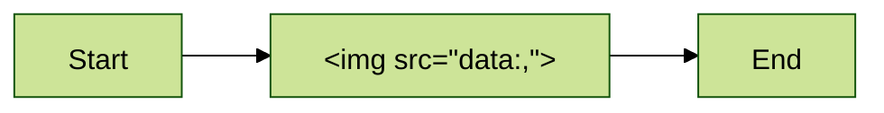

# Hostile reader fixture

## Executive Summary

Authored content that must render as inert prose. Nothing in this document may
become an active control, an overlay, or a third-party load.

<form action="/api/self-review" method="post">
  <input type="text" name="path" value="evil">
  <button type="submit">Launch review</button>
</form>

<div class="fixed inset-0 z-50 bg-cream">Overlay that must not cover the page</div>


<video src="https://example.invalid/v.mp4" autoplay></video>

<iframe src="https://example.invalid/frame"></iframe>

<object data="https://example.invalid/o.swf"></object>

<p id="author-id" class="prose-lg text-dalia" style="position:fixed;top:0">Styled and identified paragraph</p>

<svg width="10" height="10"><circle cx="5" cy="5" r="5" /></svg>

<a href="javascript:alert(1)">javascript link</a> and
<a href="https://example.invalid/page" title="external">external link</a> and
<a href="#context">same-document link</a> and
<a href="../relative/doc.md">relative link</a>.

A relative image  and an inline data image
.

Keyboard <kbd>Ctrl</kbd>+<kbd>C</kbd>, ~~struck~~, H<sub>2</sub>O and x<sup>2</sup>.

| Column | Align |
|:-------|------:|
| left   |     1 |
| right  |     2 |

<details>
<summary>Collapsed detail</summary>

Detail body with `inline code`.

</details>

```ts
const safe = true;
```

- [ ] open task item
- [x] done task item

## Context

A quiet section.

## Architectural Approach



## Execution Blueprint

### Phase 1: Hostile

- Task 1: Hostile task body
