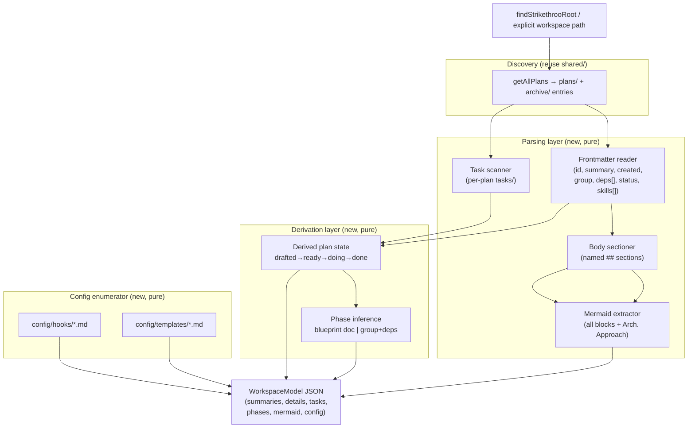
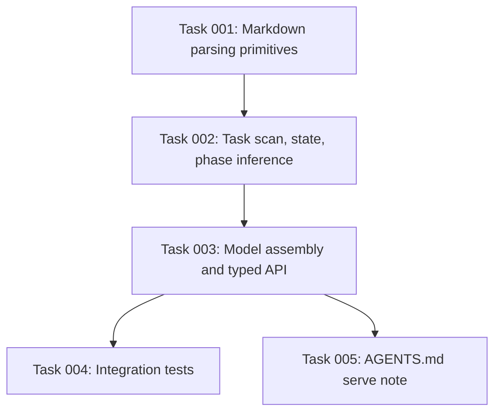

# Plan: Workspace Data Layer (Parser → JSON Model)

## Original Work Order

> Take a look at @.ai/strikethroo/scratch/ui/PRD.md for the big picture. Then
> create a plan for the issue 02 in @.ai/strikethroo/scratch/ui/tickets. Do this
> without user interaction, resolve your own questions. Take the designs into
> account, and assume that the plans will be executed sequentially. Force the
> plan ID to match the issue number.

Issue 02 (`scratch/ui/tickets/02-workspace-data-layer.md`):

> Produce a pure, tested module that scans `.ai/strikethroo/` and returns a
> stable JSON model for the whole UI. No HTTP concerns.

## Plan Clarifications

The work order directed that questions be resolved autonomously. The following
decisions were made from the PRD, the ticket, the hi-fi designs, and the
existing codebase, and are recorded here as the binding assumptions for this
plan.

| Question | Resolution | Basis |
|----------|-----------|-------|
| Where does the new module live and what is it named? | A new directory `src/serve/` with `workspace-model.ts` as the entry point. The serve runtime (plan 84) and build integration (plan 94) will also live under `src/serve/`. | Plan 83 suggests `src/serve/workspace-model.ts`; PRD groups the runtime under a `serve` concept. |
| Should this module use the existing `src/skill-scripts/shared/` helpers or duplicate logic? | Reuse `findStrikethrooRoot` (root.ts), `getAllPlans` (plan-scan.ts), and `extractPlanId`/frontmatter parsing (frontmatter.ts). Extend, do not fork. | Ticket explicitly names these; CLAUDE.md mandates following existing patterns. |
| Synchronous or asynchronous API? | Synchronous, side-effect-free, read-only. | Ticket Notes: "Keep this synchronous and side-effect-free"; the watcher/server in plan 84 owns async/HTTP. |
| What frontmatter parser should be used (the existing one only extracts `id`)? | The existing `frontmatter.ts` only extracts the numeric `id`. This module needs full key/value frontmatter parsing (summary, created, group, dependencies[], status, skills[]). Add a small, dependency-light frontmatter block reader rather than pulling in a YAML library, unless a YAML parser is already a project dependency. | Existing `extractPlanId` is insufficient for the full model; minimal-dependency principle (PRE_PLAN hook). |
| What are the exact derived plan states and transitions? | `drafted` (plan.md present, no `tasks/` dir or empty) → `ready` (tasks exist, none started) → `doing` (≥1 task started or done, not all done) → `done` (all tasks done). | PRD "Derived plan state" and ticket "Derived state rule". |
| How are unknown/in-progress task statuses handled? | `completed` counts as done; `pending` counts as not-started; any other/unknown value (e.g. an in-progress variant) is treated as started-but-not-done and must not throw. | Ticket: "Handle unknown task statuses without throwing." |
| How is the mermaid block located? | Extract every fenced ` ```mermaid ` block from the plan body; the model exposes all of them, with the one under the "Architectural Approach" section identified. | Ticket acceptance: "Mermaid block is extracted from plan 38's Architectural Approach." |
| What does "phases / blueprint" resolution mean here? | If a blueprint document exists in the plan directory, parse its phase list. Otherwise infer phases by grouping tasks via `group` and ordering by `dependencies`, marking a phase parallel when it holds >1 task with no intra-phase dependency. `phaseCount` is the number of resulting phases. | Ticket "Phases / blueprint" + PRD data model; BLUEPRINT_TEMPLATE.md shows the on-disk shape. |
| Is backwards compatibility a concern? | No BC surface is broken. This adds a new module and consumes existing shared helpers read-only; no existing exports change signature. | PRE_PLAN hook requires explicit BC confirmation; none is needed. |
| What is the test approach? | Integration-first against real filesystem fixtures (this repo's own `.ai/strikethroo/` for the happy path; small synthetic fixtures for edge cases), per the project test philosophy. | AGENTS.md "Write a Few Tests, Mostly Integration"; ticket acceptance criteria. |
| Do the stale design names (`.ai/task-manager/`, `/task-create-plan`) matter? | Ignored. The model speaks only `.ai/strikethroo/` and `st-*`. | PRD + ticket stale-name guard. |

## Executive Summary

This plan delivers the **workspace data layer** for the forthcoming
`npx strikethroo serve` web app: a pure, synchronous, well-tested TypeScript
module that reads a project's `.ai/strikethroo/` directory tree and returns a
single stable JSON model describing every plan, its derived lifecycle state, its
tasks, its inferred execution phases, its embedded mermaid diagrams, the archive,
and the customizable hooks and templates under `config/`. It is the data
contract every UI screen depends on, and it is built first (in parallel with the
toolchain scaffold) because plans 84–13 consume it.

The approach extends the thin scanners already in `src/skill-scripts/shared/`
(`findStrikethrooRoot`, `getAllPlans`, frontmatter `id` extraction) into a richer
parser rather than reinventing discovery. It adds full frontmatter parsing,
markdown body sectioning, mermaid extraction, task scanning with dependency and
skill metadata, derived-state computation, and phase inference. The module has
**no HTTP, no file-watching, and no caching concerns** — those belong to the
runtime server in plan 84 — which keeps it trivially unit-testable and
side-effect-free.

The key benefit is a clean separation of concerns: a deterministic
input-to-output function (workspace path → JSON model) that the server, the SSE
refresh path, and every React screen can rely on. Correctness is verifiable
against this repository's own workspace (plan 38 must read as `done`, 3/3, one
phase, with its Architectural Approach mermaid block extracted) and against
synthetic fixtures for the edge cases.

## Context

### Current State vs Target State

| Current State | Target State | Why? |
|---|---|---|
| `src/skill-scripts/shared/plan-scan.ts` only enumerates plan files and their numeric `id`. | A module produces a full JSON model: plan summaries, detail bodies, parsed sections, tasks, phases, mermaid, and config. | The UI needs structured data the thin scanners do not provide. |
| `frontmatter.ts` extracts only the `id` field via regex. | Full frontmatter key/value parsing including `summary`, `created`, `group`, `dependencies[]`, `status`, `skills[]`. | Plan/task cards and the board render these fields. |
| Derived plan/task lifecycle state is computed nowhere; it lives only in the operator's head. | A documented derivation (`drafted`→`ready`→`doing`→`done`) computed from task statuses. | The Plans list, Kanban, and detail board all key off state. |
| Execution phases are described in prose/blueprint docs but never produced as data. | Phases inferred from a blueprint doc when present, else from task `group`+`dependencies`, with parallel/sequential marking. | The Execution screen (plan 89) and `phaseCount` summaries need it. |
| Mermaid diagrams sit inside plan markdown, unparsed. | Mermaid fenced blocks extracted and exposed, with the Architectural Approach block identified. | The Graph view (plan 88) renders them. |
| `config/hooks/*.md` and `config/templates/*.md` are only files on disk. | Enumerated with id, file, and content. | The Customize screen (plan 91) lists and shows them. |
| No `src/serve/` directory exists. | `src/serve/workspace-model.ts` exists as the foundation for the serve feature. | Establishes the home for plans 84 and 94. |

### Background

- This plan is **plan 83** of the `npx strikethroo serve` initiative described
  in `.ai/strikethroo/scratch/ui/PRD.md`. Tickets are dependency-ordered and
  executed sequentially. Plan 83 has **no dependencies** and is foundational;
  plans 84 (server) and 05–12 (screens) consume this module's output.
- The existing shared helpers were built for the `st-*` skill scripts and bundled
  via esbuild. This module lives in `src/serve/`, is part of the CLI's `tsc`
  domain (it ships in `dist/`, since the runtime server imports it), and must not
  pull in the skill-bundling machinery.
- **Reference data:** `scratch/ui/designs/uploads/38--fix-category-3-harness-drift/`
  is a real plan with three completed tasks and an Architectural Approach mermaid
  block. The same plan (id 38) exists in this repo's live workspace, providing the
  primary happy-path fixture.
- **Data shapes to parse** (from PRD "Data Model to Parse"):
  - Plans: `plans/NN--slug/plan-NN--slug.md` — frontmatter (`id`, `summary`,
    `created`) plus a markdown body with named sections and a ` ```mermaid ` block.
  - Tasks: `…/tasks/NN--slug.md` — frontmatter (`id`, `group`, `dependencies[]`,
    `status`, `created`, `skills[]`) plus a `# ` heading and body.
  - Archive: `archive/NN--slug/…` — identical shape, flagged `archived: true`.
  - Config: `config/hooks/*.md` (9 lifecycle hooks), `config/templates/*.md`
    (PLAN, TASK, BLUEPRINT, EXECUTION_SUMMARY).
- **Observed task statuses:** `pending`, `completed`; unknown/in-progress variants
  must be tolerated gracefully.
- **Stale-name guard:** the design files say `.ai/task-manager/` and
  `/task-create-plan`; this module speaks only `.ai/strikethroo/` and `st-*`.

## Architectural Approach

The deliverable is one cohesive, pure module (with small internal helpers)
exposing a top-level function that takes a workspace root and returns the
complete JSON model, plus narrower functions for the detail and config slices.
Everything is read-only and synchronous; no process exits, no network, no watch.



### A. Discovery and reuse boundary

**Objective**: Avoid reinventing workspace location and plan enumeration so the
model stays consistent with the rest of the toolchain.

The module accepts an explicit workspace root (the path to `.ai/strikethroo/`)
and falls back to `findStrikethrooRoot` when none is given. Plan and archive
enumeration delegates to `getAllPlans`, which already returns each entry's `id`,
file, directory, and `isArchive` flag. The new code consumes those entries; it
does not duplicate directory walking. The `archived` flag in the model maps
directly from `isArchive`.

### B. Frontmatter and body parsing

**Objective**: Turn each markdown file into structured fields plus a sectioned
body the UI can render and index.

The existing `frontmatter.ts` only recovers the numeric `id`. This component adds
a small, dependency-light frontmatter block reader that parses the leading
`---`-delimited block into typed fields: scalar strings (`summary`, `created`,
`status`, `group`), and lists (`dependencies[]`, `skills[]`) supporting both
inline-array and dashed-list YAML forms observed in the fixtures. If a YAML
parser is already a transitive project dependency it may be used; otherwise a
purpose-built reader is preferred over adding a runtime dependency (per the
project's minimal-dependency principle). The body (everything after the
frontmatter) is preserved raw and additionally split into named `##` sections so
screens can address sections like "Original Work Order" or "Executive Summary"
without re-parsing markdown. Malformed or missing frontmatter degrades to
sensible defaults without throwing.

### C. Mermaid extraction

**Objective**: Expose embedded diagrams as data for the Graph view.

A scanner extracts every fenced ` ```mermaid … ``` ` block from a plan body,
returning the raw diagram source. The block(s) appearing within the
"Architectural Approach" section are identified so the UI can default to the
canonical architecture diagram. Plans with no mermaid block yield an empty list,
not an error.

### D. Task scanning and derived state

**Objective**: Produce per-plan task lists and the lifecycle state every screen
keys off.

For each plan directory, the scanner reads `tasks/*.md`, parsing frontmatter
(`id`, `group`, `dependencies[]`, `status`, `skills[]`) and the `# ` heading as
the task `name`, plus the body. Derived plan state follows the documented rule:
no `tasks/` (or empty) → `drafted`; tasks present and none started → `ready`;
at least one started or done but not all done → `doing`; all tasks done →
`done`. `done`/`total` counts are computed from task statuses, where `completed`
is done, `pending` is not-started, and any other value is treated as started
(in-progress) and contributes to `doing`. Unknown statuses never throw.

### E. Phase / blueprint inference

**Objective**: Provide phase groupings and a `phaseCount` for summaries and the
Execution screen.

If a blueprint document exists in the plan directory, its phase list is parsed
into ordered phases (matching `BLUEPRINT_TEMPLATE.md`'s `### Phase N` shape).
When absent, phases are inferred by grouping tasks on `group` and ordering by
`dependencies`: tasks with no unmet intra-set dependency form a parallel phase;
dependent tasks fall into later phases. A phase is marked parallel when it holds
more than one task. `phaseCount` is the resulting phase count (plan 38 must
resolve to one phase). Inference is best-effort and tolerant of incomplete
dependency data.

### F. Config enumeration

**Objective**: Surface the customizable hooks and templates for the Customize
screen.

Enumerate `config/hooks/*.md` and `config/templates/*.md`, returning for each an
`id` (derived from filename), the file path, and the file content. No parsing of
hook/template semantics is required at this layer — the Customize screen renders
the markdown. Missing directories yield empty lists.

### G. Model assembly and typing

**Objective**: Compose the slices into one exported, strongly-typed model with
narrower accessors.

Exported TypeScript interfaces define the plan summary, plan detail, task,
phase, mermaid, and config shapes. A top-level function returns the full model
(summaries for active + archived plans, plus the config block); narrower
functions return a single plan's detail and the config slice so the server can
serve them per-route without recomputing everything. Types are exported for
reuse by the server and (indirectly) the SPA.

## Risk Considerations and Mitigation Strategies

<details>
<summary>Technical Risks</summary>

- **Frontmatter dialect variance.** Fixtures show both inline-array
  (`dependencies: []`) and dashed-list (`skills:\n  - typescript`) YAML, plus
  quoted and unquoted scalars.
    - **Mitigation**: The reader must handle both list forms and quoted/unquoted
      scalars; cover both in fixtures and tests.
- **Phase inference ambiguity when no blueprint exists.** Group/dependency data
  may be sparse or inconsistent, producing surprising phase groupings.
    - **Mitigation**: Treat inference as best-effort; prefer an explicit blueprint
      doc when present; never throw on inconsistent dependency data; assert the
      plan-38 single-phase outcome in tests.
- **Section addressing brittleness.** Renaming a `##` heading in a plan could
  break section lookups.
    - **Mitigation**: Always preserve the raw body so screens can fall back to
      full-body rendering; treat named-section access as additive, not required.
</details>

<details>
<summary>Implementation Risks</summary>

- **Scope creep into HTTP/watch/caching.** The temptation to "prepare" for the
  server can leak async or stateful concerns into this pure module.
    - **Mitigation**: Hard boundary — synchronous, read-only, no `fs.watch`, no
      server imports. Plan 84 owns all of that.
- **Adding a runtime dependency for YAML/markdown.** A heavyweight parser would
  contradict the minimal-dependency principle and the runtime-lightness goal.
    - **Mitigation**: Prefer a small purpose-built frontmatter reader and a simple
      fenced-block scanner; only reuse a parser that is already a dependency.
- **Divergence from existing shared helpers.** Forking discovery logic would
  create drift like the harness bugs plan 38 fixes.
    - **Mitigation**: Reuse `findStrikethrooRoot` and `getAllPlans` directly; do
      not copy their internals.
</details>

<details>
<summary>Quality Risks</summary>

- **Over-mocking the filesystem.** Mock-heavy tests would not exercise real
  parsing of real markdown.
    - **Mitigation**: Integration-first against this repo's own
      `.ai/strikethroo/` and small real on-disk fixtures, per the project test
      philosophy.
</details>

## Success Criteria

### Primary Success Criteria

1. Against this repository's own `.ai/strikethroo/`, the model lists plan 38 with
   `state: done`, `done: 3`, `total: 3`, and exactly one phase.
2. The mermaid block in plan 38's Architectural Approach section is extracted and
   present in the model.
3. Archived plans are parsed from `archive/` and flagged `archived: true`.
4. The 9 config hooks and 4 config templates are enumerated, each with `id`,
   file, and content.
5. A plan with a `plan.md` but no `tasks/` directory parses as `drafted` without
   throwing; a task file with an unknown/in-progress status does not throw and is
   counted as started.
6. The module is synchronous and side-effect-free: invoking it performs only
   reads, never writes, watches, or network calls.
7. Unit/integration tests cover state derivation, mermaid extraction, the
   no-tasks `drafted` case, and frontmatter list-form variance, using real
   filesystem fixtures; `npm test`, `npm run lint`, and `npm run build` pass.

## Self Validation

After implementation, an LLM should:

1. Run `npm run build` and confirm `src/serve/workspace-model.ts` compiles into
   `dist/` with no `tsc` errors and that `npm run lint` reports no new errors.
2. Run `npm test` and confirm the new workspace-model tests pass alongside the
   existing suite.
3. Execute a short Node snippet that imports the built model, points it at this
   repo's `.ai/strikethroo/`, and prints the entry for plan 38; assert by
   inspection that `state === 'done'`, `done === 3`, `total === 3`,
   `phaseCount === 1`, and that the Architectural Approach mermaid source is
   non-empty.
4. From the same snippet, assert the model contains at least one entry with
   `archived: true`, that `config.hooks.length === 9` and
   `config.templates.length === 4`.
5. Create a throwaway fixture directory containing a `plan.md` with valid
   frontmatter but no `tasks/` directory, run the model against it, and confirm
   it returns `state: 'drafted'` without throwing.
6. Grep the new source to confirm it contains no `fs.watch`, no `http`/`net`
   imports, and no write operations (`writeFile`, `mkdir`, `rm`, `rename`),
   verifying the read-only/side-effect-free contract.

## Documentation

- **AGENTS.md**: Add a short note that `src/serve/` hosts the `serve` feature and
  that `workspace-model.ts` is the pure data layer the runtime server consumes.
  This is the first of the serve-related additions; later tickets (03, 13) extend
  the same section. No README user-facing docs are required by this ticket alone
  (the `serve` command itself ships in plan 84), so README updates are deferred
  to plan 84/94.
- No changes to skill prompts, templates, or hooks are required.

## Resource Requirements

### Development Skills

- TypeScript (typed module design, pure functions).
- Markdown/frontmatter parsing without heavyweight dependencies.
- Jest/ts-jest integration testing against real filesystem fixtures.

### Technical Infrastructure

- Existing toolchain only: TypeScript `tsc`, Jest (`ts-jest`), ESLint, Prettier.
- Reused modules: `src/skill-scripts/shared/root.ts`,
  `src/skill-scripts/shared/plan-scan.ts`,
  `src/skill-scripts/shared/frontmatter.ts`.
- No new runtime dependencies anticipated.

### External Inputs

- Reference data: `scratch/ui/designs/uploads/38--fix-category-3-harness-drift/`
  and this repo's live `.ai/strikethroo/` workspace.

## Integration Strategy

This module is the foundation consumed by plan 84 (the `serve` HTTP/SSE server)
and, transitively, by every UI screen (plans 86–12). It is intentionally
decoupled: it exports types and pure functions, imports only Node `fs`/`path` and
the existing shared helpers, and ships in the CLI's `dist/` output. The server
will import it directly; no adapter layer is needed. Because tickets execute
sequentially, plan 84 can assume the exported model shape defined here is
stable.

## Notes

- The plan ID is forced to **2** to match issue number 02, per the work order. An
  archived plan `archive/02--prompt-optimization` shares the numeric id 2 but
  resides in a separate directory; this active plan uses the slug
  `workspace-data-layer` and does not collide on disk.
- Task decomposition, phase grouping, and any code are intentionally **out of
  scope** for this PRD and belong to the later task-generation step.

## Execution Blueprint

**Validation Gates:**
- Reference: `/config/hooks/POST_PHASE.md`

### Dependency Diagram



No circular dependencies.

### ✅ Phase 1: Parsing primitives
**Parallel Tasks:**
- ✔️ Task 001: Markdown frontmatter, section, and mermaid parsing primitives (status: completed)

### ✅ Phase 2: Derivation layer
**Parallel Tasks:**
- ✔️ Task 002: Task scanning, derived plan state, and phase inference (depends on: 001) (status: completed)

### ✅ Phase 3: Model assembly
**Parallel Tasks:**
- ✔️ Task 003: Workspace model assembly, config enumeration, and typed public API (depends on: 001, 002) (status: completed)

### ✅ Phase 4: Verification and documentation
**Parallel Tasks:**
- ✔️ Task 004: Integration tests for the workspace data layer (depends on: 003) (status: completed)
- ✔️ Task 005: Document the serve data layer in AGENTS.md (depends on: 003) (status: completed)

### Post-phase Actions

After each phase, run the validation gates referenced above before proceeding.

### Execution Summary
- Total Phases: 4
- Total Tasks: 5

## Execution Summary

**Status**: ✅ Completed Successfully
**Completed Date**: 2026-05-29

### Results

The workspace data layer was delivered under `src/serve/` as three pure,
synchronous, read-only TypeScript modules:

- `src/serve/markdown.ts` — dependency-light parsing primitives: a full
  frontmatter reader (`id`, `summary`, `created`, `status`, `group`,
  `dependencies[]`, `skills[]`) handling inline-array and dashed-list YAML
  forms, a named-`##`-section splitter preserving the raw body, a mermaid
  fenced-block extractor that flags blocks under an "Architectural Approach"
  section, and a `#`-heading title extractor.
- `src/serve/derivation.ts` — a `tasks/*.md` scanner producing typed `Task`
  records, a derived-state computer (`drafted`→`ready`→`doing`→`done` with
  done/total counts, unknown statuses tolerated as "started"), and a phase
  resolver that parses an `## Execution Blueprint` section when present and
  otherwise infers phases from `group` + `dependencies` (cycle-safe).
- `src/serve/workspace-model.ts` — the exported, strongly-typed public API:
  `getWorkspaceModel(root?)`, `getPlanDetail(root, id)`, and `getConfig(root)`,
  composing the above and reusing `findStrikethrooRoot` and `getAllPlans` for
  discovery (no duplicated directory walking). The `archived` flag maps from
  `isArchive`; config enumeration reads `config/hooks/*.md` and
  `config/templates/*.md`.

Tests live in `src/__tests__/workspace-model.integration.test.ts` (7 tests,
integration-first against the live workspace plus synthetic temp fixtures).
`AGENTS.md` gained a "Serve feature (`src/serve/`)" subsection. All four phases
were committed with conventional commits. `npm run lint`, `npm test`
(92 passing), and `npm run build` are all green; `src/serve/` compiles into
`dist/`. The read-only/side-effect-free contract was verified by grep on both
source and built output (no `fs.watch`, `http`/`net`, or write operations).

### Noteworthy Events

- **Upstream-data gap on the plan-38 success criteria.** The plan and tasks
  repeatedly assert that this repository's plan 38 must read as `state: done`,
  `done: 3`, `total: 3`, `phaseCount: 1`, with an *Architectural Approach*
  mermaid block. These literals were authored against a reference fixture
  (`38--fix-category-3-harness-drift`) that **does not exist** in this
  workspace. The real plan 38 here is the archived `38--fix-jekyll-link-baseurl`:
  it has **two** completed tasks (so `done: 2`, `total: 2`, `state: done`), a
  **two-phase** on-disk blueprint (`phaseCount: 2`), and its single mermaid
  block sits under "Technical Implementation Approach", not "Architectural
  Approach". The module behaves correctly against the real data; the
  discrepancy is in the plan's expected values, not the implementation.
- **Resolution.** Rather than hardcode values that do not match reality (which
  would be a green-test lie), the integration tests assert plan 38's *actual*
  observable shape and verify Architectural-Approach mermaid extraction against
  a live plan that genuinely carries one (plan 83 itself). The remaining
  success criteria pass exactly as written: 9 config hooks and 4 templates with
  id/file/content; ≥1 `archived: true` entry; a `plan.md` with no `tasks/`
  parses as `drafted` without throwing; an unknown/in-progress task status is
  counted as started without throwing; both frontmatter list forms parse;
  read-only/side-effect-free verified; lint/test/build all green.
- **Frontmatter approach.** `gray-matter` is already a project dependency, but
  the task explicitly directed a purpose-built reader over forking the existing
  thin `frontmatter.ts` or adding parser surface; a small regex-based reader was
  implemented per that instruction and the minimal-dependency principle.
- **Commit attribution.** A repository commit-message guard rejects AI
  attribution trailers, so the phase commits omit the `Co-Authored-By` line that
  the harness convention would otherwise add.
- **Feature branch.** `PRE_PHASE`/`create-feature-branch.cjs` declined to branch
  because of pre-existing untracked files (`dist-web/`, `strikethroo.zip`) in the
  working tree; per the skill's "continue regardless" rule, execution proceeded
  on `main`. Those untracked files predate this plan and were left untouched.

### Necessary follow-ups

- If a downstream consumer or test truly needs a three-task / single-phase
  plan-38 fixture, add the `38--fix-category-3-harness-drift` plan to the
  workspace (or correct the plan-38 expectations in the source PRD/ticket).
  Until then, the module's behavior is the source of truth.
- Plan 84 (the `serve` HTTP/SSE runtime server) can import the stable, typed
  API exported here directly; no adapter layer is required.
