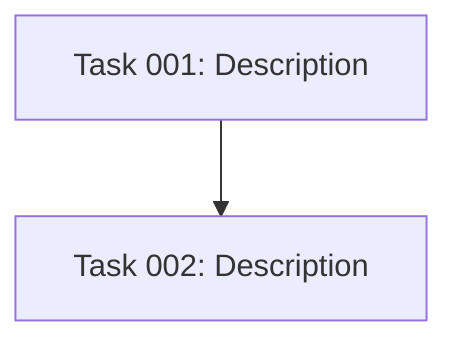

# POST_TASK_GENERATION_ALL Hook

After all tasks have been generated, update the plan with the execution blueprint.

## 1. Update Plan with Blueprint

Append to the plan document:

### Dependency Diagram

If tasks have dependencies, add a Mermaid graph:

Verify there are no circular dependencies.

### Execution Phases

Group tasks into phases:
- **Phase 1**: Tasks with no dependencies (run in parallel)
- **Phase N**: Tasks whose dependencies are all in earlier phases

Use the template in `.ai/strikethroo/config/templates/BLUEPRINT_TEMPLATE.md` for structure.

Before finalizing, verify:
- Every task is in exactly one phase
- No task runs before its dependencies complete
- Phase 1 has only zero-dependency tasks
