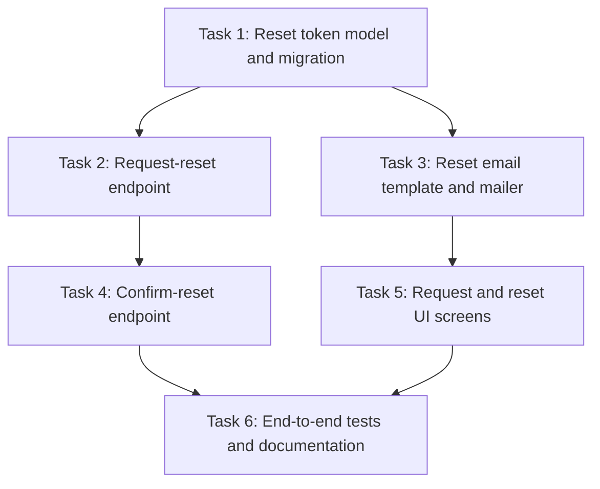

# Plan: Self-Service Password Reset Flow

## Original Work Order

> Users currently have to email support to get their password reset, which is
> slow and creates a support burden. I want a normal self-service flow: a "forgot
> password?" link that emails a reset link, a page to set a new password from
> that link, and it needs to be secure — links should expire and not be
> reusable. Wire it into the existing auth system and add tests.

## Plan Clarifications

| Question | Answer |
| --- | --- |
| Should the request endpoint reveal whether an email is registered? | No. The request endpoint always returns the same success response to avoid leaking which addresses have accounts. |
| How long should reset tokens stay valid, and can they be reused? | Tokens expire after 30 minutes and are single-use — consumed on a successful reset and invalidated. |
| Should resetting the password invalidate existing sessions? | Yes. A successful reset revokes all active sessions for that user, forcing re-authentication everywhere. |
| Do we need a brand-new mailer, or is there an existing one? | Reuse the existing transactional mailer; this plan adds one new templated email, not new mail infrastructure. |
| Is backwards compatibility a concern? | The change is additive — new table, new endpoints, new screens. No existing auth route changes shape, so existing clients are unaffected. |

## Executive Summary

Account recovery today is a manual, support-driven process: a user who forgets
their password must contact support and wait for a human to reset it. This plan
replaces that with a standard, secure, self-service flow built on top of the
existing authentication system and transactional mailer.

The flow has three legs. First, a user requests a reset from a "forgot password?"
form; the backend issues a hashed, time-limited, single-use token and emails a
reset link, always responding identically whether or not the address is
registered (so the endpoint cannot be used to enumerate accounts). Second, the
user follows the link to a reset page, submits a new password, and the backend
validates the token, updates the credential, consumes the token, and revokes all
of that user's active sessions. Third, the whole path is covered end to end and
documented.

The work is deliberately decomposed so the token foundation lands first, the two
independent backend/email pieces build on it in parallel, the confirmation
endpoint and the user-facing screens build in parallel on top of those, and a
final verification-and-docs pass closes the plan. Security is the throughline:
tokens are stored hashed, expire quickly, are single-use, and the request
endpoint is non-enumerable.

## Context

### Current State vs Target State

| Current State | Target State | Why? |
| --- | --- | --- |
| Password resets are handled manually by support. | Users reset their own password through an emailed, time-limited link. | Removes support burden and shortens recovery time. |
| There is no token model for password recovery. | A hashed, expiring, single-use reset-token record exists. | A secure flow needs a server-side token it can validate and consume. |
| The transactional mailer sends other emails but has no reset template. | A dedicated reset-link email template is sent through the existing mailer. | Users need the link delivered; reuse mail infra rather than rebuild it. |
| Auth exposes login/logout but no recovery endpoints. | Request-reset and confirm-reset endpoints exist and are wired into auth. | The flow needs server endpoints for both legs. |
| There is no UI entry point for recovery. | A "forgot password?" request form and a token-driven reset form exist. | Users need screens to start and complete the flow. |

### Background

- Authentication, session management, and the user credential store already
  exist; this plan extends them and does not replace them.
- A transactional mailer is already configured and used for other system emails.
  This plan adds one new templated message rather than new mail infrastructure.
- Per clarifications, the request endpoint must be **non-enumerable** (identical
  response regardless of whether the email is registered), tokens are valid for
  **30 minutes** and **single-use**, and a successful reset **revokes all active
  sessions** for the user.

## Architectural Approach

The work divides into a token **foundation**, two parallel pieces that build on
it (the **request endpoint** and the **reset email**), two parallel pieces that
complete the flow (the **confirm endpoint** and the **UI screens**), and a final
**verification and documentation** pass.

## Execution Blueprint

### Phase 1: Token Foundation
- Task 1 — Reset token model and migration

### Phase 2: Token Issuance
- Task 2 — Request-reset API endpoint
- Task 3 — Reset email template and mailer integration

### Phase 3: Reset Completion
- Task 4 — Confirm-reset API endpoint
- Task 5 — Request and reset UI screens

### Phase 4: Verification and Documentation
- Task 6 — End-to-end tests and documentation

## Risk Considerations and Mitigation Strategies

Security Risks

- **Reset tokens leak if stored in plaintext.**
  - **Mitigation**: store only a hash of the token; the raw token lives only in
    the emailed link and is never persisted.
- **The request endpoint becomes an account-enumeration oracle.**
  - **Mitigation**: return an identical success response for known and unknown
    addresses; do the per-address work without changing the response shape.
- **A token is replayed after a successful reset.**
  - **Mitigation**: tokens are single-use and consumed atomically on success;
    expired or already-consumed tokens are rejected.

Implementation Risks

- **Sessions survive a password reset, leaving a compromised session valid.**
  - **Mitigation**: a successful reset revokes all active sessions for the user.
- **Scope creep into MFA, account lockout, or a mailer rewrite.**
  - **Mitigation**: clarifications fixed scope to the three-leg reset flow over
    the existing mailer; those are explicitly out of scope.

## Success Criteria

### Primary Success Criteria

1. A user can request a reset from the UI and receives an email containing a
   working, time-limited reset link.
2. The request endpoint returns an identical response for registered and
   unregistered addresses (non-enumerable).
3. Following a valid link lets the user set a new password; the token is then
   single-use and expired, and all of the user's active sessions are revoked.
4. Expired, malformed, and already-consumed tokens are rejected with a clear
   error and no password change.
5. The flow is covered by end-to-end tests and documented for both users and
   maintainers.

## Self Validation

After all tasks are complete, an LLM should execute these concrete checks:

1. Run the migration and confirm the reset-token table exists with a hashed-token
   column, an expiry column, and a consumed/used marker.
2. Exercise the request endpoint with a registered and an unregistered email and
   confirm the responses are byte-for-byte identical.
3. Complete a full happy-path reset and confirm the new password authenticates,
   the token can no longer be reused, and prior sessions are invalidated.
4. Attempt resets with an expired token, a malformed token, and a
   previously-consumed token; confirm each is rejected and no credential changes.
5. Run the end-to-end test suite and confirm it covers the happy path and the
   rejection cases above.

## Documentation

- **User-facing**: a short help-center entry describing how to reset a forgotten
  password.
- **Maintainer-facing**: notes on the token lifecycle (hashing, 30-minute expiry,
  single-use, session revocation) and the non-enumeration guarantee, added to the
  auth module's docs.

## Resource Requirements

### Development Skills

- Backend/API development and the existing authentication and session model.
- Database schema migration.
- Transactional email templating against the existing mailer.
- Frontend form development and validation.
- End-to-end testing and technical writing.

### Technical Infrastructure

- The existing auth system, session store, user credential store, and
  transactional mailer.
- A test environment capable of running the migration and intercepting outbound
  email for end-to-end assertions.
