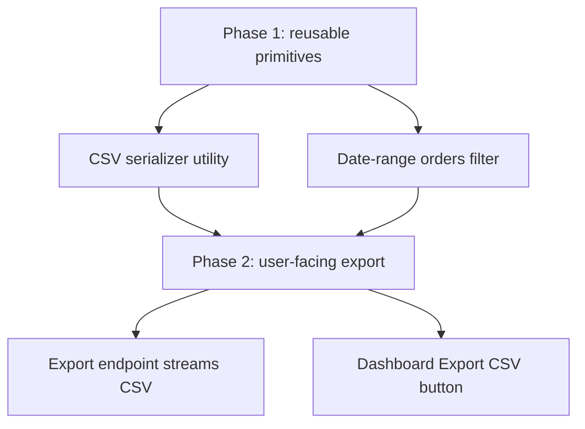
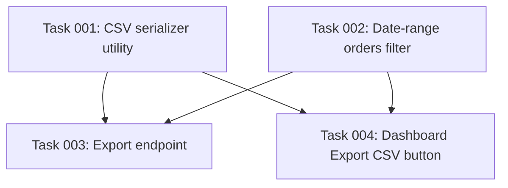

# Plan: Add CSV Export to the Orders Dashboard

## Original Work Order

> Operators keep asking us to get their order list into a spreadsheet. Can we
> add an "Export CSV" button to the orders dashboard that downloads exactly the
> orders they are currently looking at, including whatever date range they have
> filtered to? It should respect the filters, not just dump the whole table.

## Plan Clarifications

| Question | Answer |
| --- | --- |
| Should the export respect the dashboard's active filters? | Yes. The download must reflect the same date range the operator currently has applied, not the entire orders table. |
| Which columns belong in the file? | Order ID, customer, status, total, and the order date — the columns already shown in the dashboard table. |
| Server-side or client-side generation? | Server-side. A dedicated endpoint streams the CSV so large result sets do not have to be held in the browser. |
| Is a new permission required? | No. Any user who can view the orders dashboard can export what they can already see. |

## Executive Summary

Operators can view their orders in the dashboard but cannot get them out of the
application without copy-pasting rows by hand. This plan adds a one-click
**Export CSV** action that downloads exactly the orders currently in view,
honoring the active date-range filter, with the same columns the table already
shows.

The work is split so the two reusable building blocks — a pure CSV serializer
and a date-range-aware orders query — are built first and independently, then
the user-facing endpoint and dashboard button are layered on top. This keeps
the serialization logic unit-testable in isolation and lets the export reuse the
exact filtering the dashboard already performs, guaranteeing the file matches
what the operator sees on screen.

Generation is server-side behind a dedicated endpoint so large exports stream
to the client instead of being assembled in the browser, and no new permission
is introduced: if you can see the orders, you can export them.

## Context

### Current State vs Target State

| Current State | Target State | Why? |
| --- | --- | --- |
| Operators copy order rows out of the table by hand. | A single **Export CSV** button downloads the current view. | Manual copying is slow and error-prone. |
| Order data lives only behind the paginated dashboard API. | A dedicated export endpoint streams the filtered orders as CSV. | Spreadsheets need a flat file, not a paginated UI response. |
| Date-range filtering is applied only in the dashboard query path. | The same date-range filter is reused by the export so the file matches the screen. | The export must reflect exactly what the operator sees. |
| There is no shared CSV formatting in the codebase. | A small, tested CSV serializer handles escaping and column order. | Hand-rolled string joins break on commas, quotes, and newlines. |

### Background

- The orders dashboard already renders Order ID, customer, status, total, and
  order date; the export reuses this column set so the file matches the table.
- A correct CSV serializer must quote fields containing commas, double quotes,
  or newlines and escape embedded quotes by doubling them — the single most
  common source of broken exports.
- The export endpoint must set `Content-Type: text/csv` and a
  `Content-Disposition: attachment` header so the browser triggers a download
  rather than rendering the payload inline.

## Architectural Approach

The work divides into four tasks across two phases. Phase 1 builds two
independent, reusable primitives — the CSV serializer and the date-range query
filter. Phase 2 composes them into the user-facing export endpoint and wires the
dashboard button that calls it.

### CSV Serializer Utility
**Objective**: Provide a single, well-tested function that turns an array of
order records into RFC-4180-correct CSV text, so escaping rules live in exactly
one place.

The serializer accepts the ordered column set and an array of orders and returns
a string with a header row followed by one row per order. It quotes any field
containing a comma, double quote, or newline and escapes embedded quotes by
doubling them. It is pure and synchronous, making it trivial to unit-test
against the tricky inputs (commas in customer names, quotes in notes).

### Date-Range Orders Filter
**Objective**: Make the dashboard's date-range filtering reusable outside the
paginated UI path so the export and the screen apply identical criteria.

The filtering predicate currently embedded in the dashboard query is extracted
into a reusable function that takes a `from`/`to` range and returns the matching
orders. Both the dashboard and the export call it, guaranteeing the file and the
table agree.

### Export Endpoint
**Objective**: Expose `GET /api/orders/export` that streams the filtered orders
as a CSV download.

The endpoint reads the same `from`/`to` query parameters the dashboard uses,
applies the Phase 1 filter, serializes the result with the Phase 1 serializer,
and responds with `text/csv` plus an `attachment` `Content-Disposition` so the
browser saves the file.

### Dashboard Export Button
**Objective**: Add an **Export CSV** control to the dashboard toolbar that
downloads the current view.

The button reads the dashboard's active date range and navigates the browser to
the export endpoint with the matching query parameters, triggering the download.
It is disabled while the orders list is still loading and shows a brief
in-progress state while the download is requested.

## Risk Considerations and Mitigation Strategies

Technical Risks

- **CSV injection / malformed rows from unescaped fields.**
  - **Mitigation**: centralize escaping in the Phase 1 serializer and unit-test
    it against commas, quotes, and newlines before anything consumes it.
- **Large exports exhausting memory if assembled in the browser.**
  - **Mitigation**: generate server-side and stream from the endpoint.

Implementation Risks

- **Export drifting from the on-screen list if filtering is duplicated.**
  - **Mitigation**: extract one shared date-range filter and have both the
    dashboard and the export call it.

## Success Criteria

### Primary Success Criteria

1. Clicking **Export CSV** downloads a `.csv` file containing exactly the orders
   matching the dashboard's active date range.
2. The file contains the Order ID, customer, status, total, and order-date
   columns, with correct quoting/escaping for fields containing commas, quotes,
   or newlines.
3. The endpoint responds with `text/csv` and an `attachment`
   `Content-Disposition`, and the dashboard and export return the same orders
   for the same date range.

## Self Validation

1. Start the app, apply a date range on the orders dashboard, and click
   **Export CSV**; confirm the browser downloads a file whose rows match the
   visible table for that range.
2. Open the downloaded file in a spreadsheet tool and confirm the header row and
   the five expected columns, including a row whose customer name contains a
   comma renders as a single quoted field.
3. `curl` the export endpoint with `from`/`to` parameters and confirm the
   `Content-Type: text/csv` and `Content-Disposition: attachment` headers and a
   matching row count against the dashboard API for the same range.

## Documentation

- Update the dashboard user guide with a short "Exporting orders" subsection.
- Note the new `GET /api/orders/export` endpoint and its `from`/`to` parameters
  in the API reference.

## Resource Requirements

### Development Skills

- Backend request handling and streaming responses.
- Frontend dashboard/toolbar work and browser download triggering.
- Unit testing of pure serialization logic.

### Technical Infrastructure

- The existing orders API and dashboard codebase.
- The project's existing test runner for the serializer unit tests.

## Execution Blueprint

**Validation Gates:**
- Reference: `/config/hooks/POST_PHASE.md`

### Dependency Diagram

No circular dependencies; the graph is acyclic.

### ✅ Phase 1: Reusable primitives
**Parallel Tasks:**
- ✔️ Task 001: Build the pure CSV serializer utility with correct quoting/escaping
- ✔️ Task 002: Extract the date-range orders filter into a reusable function

### Phase 2: User-facing export
**Parallel Tasks:**
- Task 003: Add the `GET /api/orders/export` endpoint that streams filtered CSV (depends on: 001, 002)
- Task 004: Add the dashboard **Export CSV** toolbar button and download flow (depends on: 001, 002)

### Post-phase Actions
Run the `POST_PHASE.md` validation gate after each phase: the build and test
suite must pass before advancing.

### Execution Summary
- Total Phases: 2
- Total Tasks: 4

## Notes

The two Phase 1 primitives are intentionally independent so they can be built in
parallel; both Phase 2 tasks depend on both primitives because the endpoint
serializes filtered rows and the button is coded against the agreed endpoint
contract.
