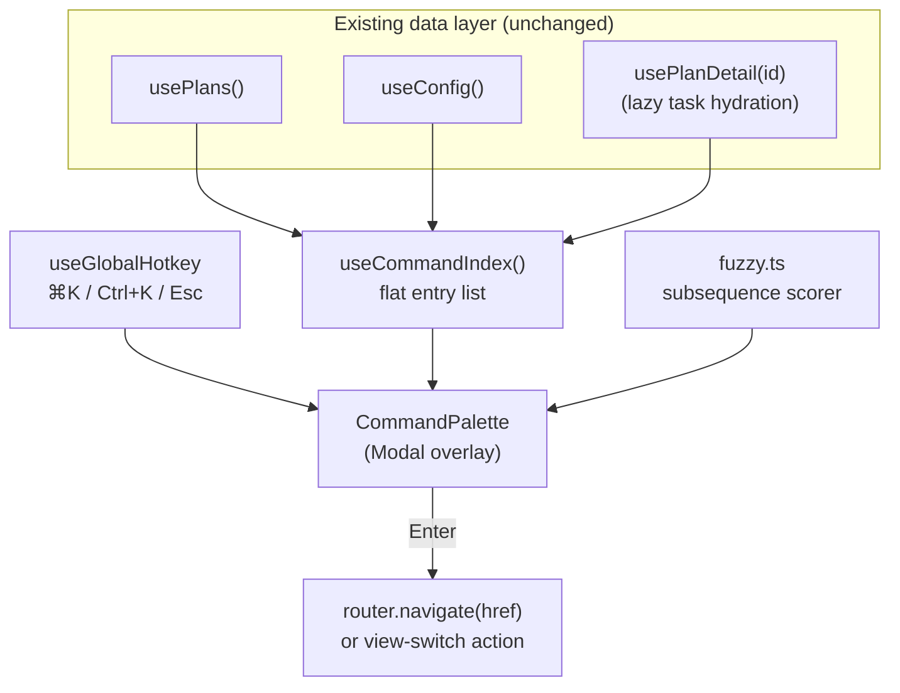

# Plan: Command Palette / Quick Switcher for the Web App

## Original Work Order

> The web app is great once you know where everything is, but getting to a specific plan or task means a lot of clicking through the sidebar and lists. I want a ⌘K-style command palette that lets me fuzzy-search every plan, every task, and the customize files, jump straight to them, and also trigger the common view switches (Board/Cards, Plan/Graph/Tasks) from the keyboard. Keep it read-only and don't add any runtime dependencies.

## Plan Clarifications

| Question | Answer |
| --- | --- |
| What should the palette be able to navigate to? | Every plan (active + archived), every task within every plan, and every customize hook/template file. Plus a handful of static "actions" for the view switches and top-level routes. |
| Where does the index come from — a new endpoint or existing data? | Reuse the data already on the wire. `usePlans()` and `useConfig()` cover plans and config; task entries are sourced from each plan's `tasks` array, hydrated lazily from `usePlanDetail` as the user drills in. No new server endpoint. |
| Fuzzy matching library? | None. A small in-tree subsequence-scoring matcher (≈40 lines) keeps the no-runtime-dependency invariant. The corpus is small (low hundreds of entries), so this is more than fast enough. |
| How is it opened? | Global `⌘K` / `Ctrl+K` keydown, plus a clickable search affordance in the `Chrome` header. `Esc` closes; `↑`/`↓` move; `Enter` activates. |
| Is backwards compatibility required? | Not applicable. This is purely additive UI built on the existing `Modal` primitive and router; no route, API shape, or persisted data changes. |

## Executive Summary

The `serve` web app organizes everything behind a persistent sidebar and a set
of list/board screens, which is fine for browsing but slow for the common case
of "take me to plan 84" or "open the PRE_PLAN hook." This plan adds a
**command palette** — the familiar `⌘K` quick-switcher — that overlays the app,
fuzzy-searches a flat index of every plan, task, and customize file, and routes
to the chosen entry on `Enter`. It also exposes the frequent view switches
(Board ↔ Cards on the Plans home; Plan ↔ Graph ↔ Tasks on a plan) as keyboard
actions, so power users can drive the whole viewer without reaching for the
mouse.

The approach deliberately reuses what already exists rather than adding
machinery. The palette is rendered through the vendored `Modal` primitive, its
data comes from the same `usePlans()` / `useConfig()` resources the screens
already consume (task rows are folded in lazily via `usePlanDetail` as plans are
expanded), and navigation goes through the existing History-API router. Fuzzy
matching is a tiny in-tree subsequence scorer, preserving the project's
**no-frontend-runtime-dependency** rule. The result is a single new overlay
component plus a global keybinding hook — additive, read-only, and consistent
with the viewer's architecture where the guarded archive and config-write
routes remain the only sanctioned mutations.

## Context

### Current State vs Target State

| Current State | Target State | Why? |
| --- | --- | --- |
| Reaching a specific plan/task means navigating the sidebar then scanning a list or board. | Any plan, task, or customize file is one `⌘K` and a few keystrokes away. | The work order asks for fast keyboard-first navigation. |
| View switches (Board/Cards, Plan/Graph/Tasks) are mouse-only tab clicks. | The same switches are triggerable as palette actions from the keyboard. | The work order explicitly wants the view switches available without the mouse. |
| There is no global keyboard listener in the SPA. | A single `useGlobalHotkey` hook owns `⌘K`/`Ctrl+K` and `Esc`, scoped to avoid clobbering input fields. | A command palette needs a global open affordance. |
| The `Chrome` header carries breadcrumbs only. | The header gains an inert search affordance that opens the palette on click (discoverability for non-keyboard users). | Power features still need a visible entry point. |

### Background

- **All the data is already client-side.** `usePlans()` returns every plan
  summary (active and archived); `useConfig()` returns every hook and template
  file with its `relPath`; and each plan's `tasks` array is serialized into the
  `GET /api/plans/:id` payload. The palette therefore needs **no new endpoint** —
  task entries are hydrated from `usePlanDetail(id)` the first time a plan is
  touched and memoized thereafter.
- **The `Modal` primitive is in-tree and non-portaled.** `components/primitives.tsx`
  already exports a `Modal` used by the archive confirmation; the palette reuses
  it so theming (the `.dark` class reaches it) and focus styling come for free.
- **No fuzzy library may be added.** Per `AGENTS.md`, the SPA ships zero
  frontend runtime dependencies. A subsequence scorer (match-on-initials,
  contiguous-run bonus, case-insensitive) lives in a new
  `src/web/palette/fuzzy.ts` and is unit-tested in isolation.
- **Routing is already keyboard-safe.** The History-API router (`router.tsx`)
  exposes a `navigate(href)` imperative; the palette calls it directly, so
  back/forward and deep-linking keep working.

## Architectural Approach

The feature is one overlay component, one data-aggregation hook, one fuzzy
matcher, and one global-hotkey hook — wired into the existing `App.tsx` shell.
No server, model, or build-pipeline changes are in scope.

### Command Index
**Objective**: Produce one flat, searchable list of everything the user can jump to.

Each entry is `{ kind, label, sublabel, href?, action? }` where `kind` is one of
`plan | task | config | action`. Plans and config files map to `href`s; tasks map
to their `/plans/:id/tasks/:taskId` route; actions (e.g. "Switch to Graph view")
carry an `action` thunk instead. The index is assembled once from the cached
resources and recomputed only when those resources change.

### Fuzzy Matcher
**Objective**: Rank entries against the query with zero dependencies.

A subsequence scorer awards points for contiguous runs, start-of-word matches,
and initialisms, then sorts descending and truncates to the top N. Pure and
synchronous, it is the one piece with meaningful unit-test value.

### Palette Overlay
**Objective**: Render results and handle keyboard interaction.

Built on `Modal`, it owns the query input, the result list with a highlighted
active row, and the `↑`/`↓`/`Enter`/`Esc` handlers. Activating an entry either
calls `router.navigate(entry.href)` or invokes `entry.action()`, then closes.

## Risk Considerations and Mitigation Strategies

Technical Risks

- **Global hotkey clobbers native browser/input shortcuts**: `⌘K` could interfere with typing in the future config editor.
    - **Mitigation**: The hotkey hook ignores events whose target is an editable element and calls `preventDefault` only when the palette actually opens.
- **Task hydration latency**: tasks aren't in the initial corpus until their plan is opened.
    - **Mitigation**: Plans and config are searchable immediately; a background pass hydrates task entries for the most-recent plans, and the palette shows a subtle "indexing tasks…" hint until complete.

Quality Risks

- **Fuzzy ranking feels arbitrary**: a bad scorer erodes trust in the feature.
    - **Mitigation**: The scorer is unit-tested against a fixed corpus with asserted top-result expectations for representative queries.

## Success Criteria

### Primary Success Criteria
1. Pressing `⌘K` (macOS) or `Ctrl+K` (Linux/Windows) anywhere in the app opens the palette, focused and ready for input.
2. Typing a fuzzy query surfaces matching plans, tasks, and customize files, ranked sensibly, within one frame on the repo's own workspace.
3. `Enter` on a result navigates to the correct route (verified by URL + rendered screen); `Esc` closes the palette and restores focus.
4. The Board/Cards and Plan/Graph/Tasks view switches are invocable as palette actions.
5. `npm run build:web` succeeds and the published runtime `dependencies` gain no new frontend package.

## Self Validation

- Run `npm run build && node dist/cli.js serve`, then use the Playwright CLI to open the app, press `Meta+K`, type `customize`, and assert the palette lists the hook/template files; screenshot the open palette.
- Drive `Enter` on a plan result and assert `page.url()` matches `/plans/<id>` and the Plan Detail heading renders.
- Open the palette, run a view-switch action ("Switch to Graph view") on a plan detail page, and screenshot the resulting mermaid graph to confirm the action fired.
- `grep` the built `package.json` `dependencies` block to confirm no fuzzy/search library was added.

## Documentation

- Add a "Keyboard navigation" subsection to the web-app docs page describing `⌘K` and the available actions.
- Note the palette in `AGENTS.md` under the `src/web/` section, including the no-dependency fuzzy matcher and the `useGlobalHotkey` boundary.

## Resource Requirements

### Development Skills
- React + TypeScript (hooks, controlled inputs, keyboard event handling)
- Light algorithm work for the subsequence scorer

### Technical Infrastructure
- The existing Vite/React SPA toolchain and `Modal` primitive — no new libraries.

## Notes

This is an **example plan** included to populate the web app's "plan without
tasks" state in documentation screenshots. It has no `tasks/` directory by
design; running task generation against it is not intended.
